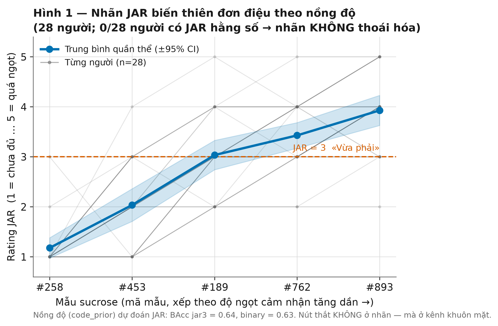
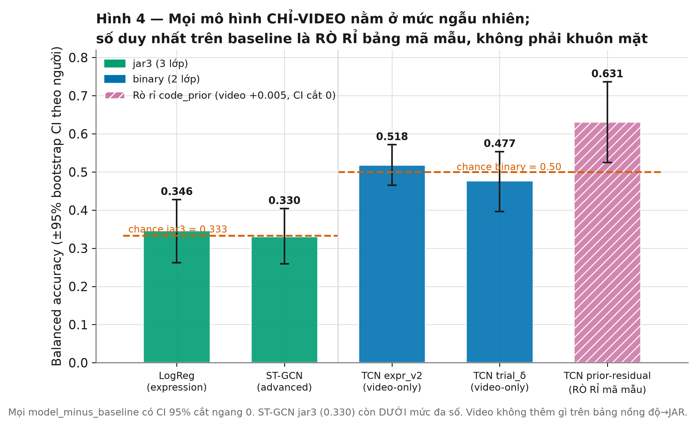
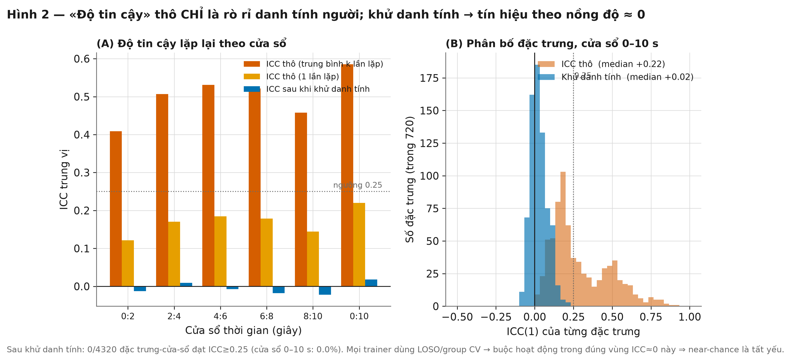
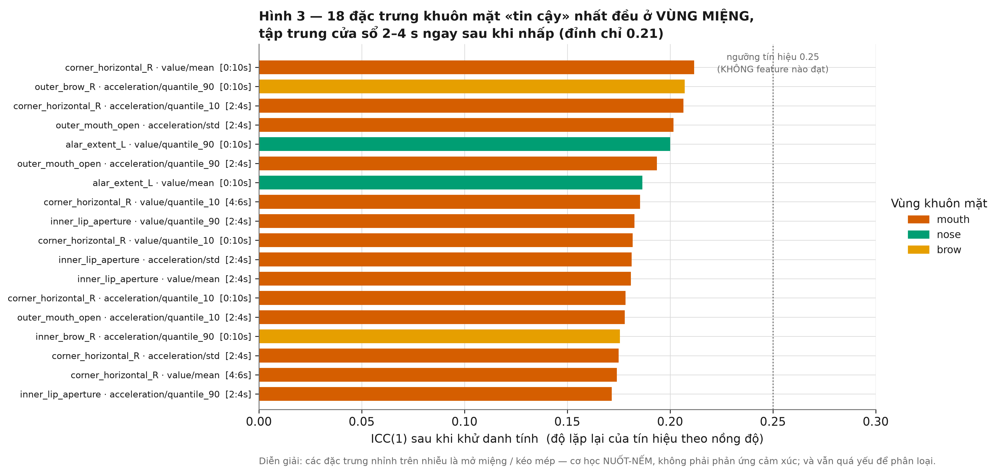
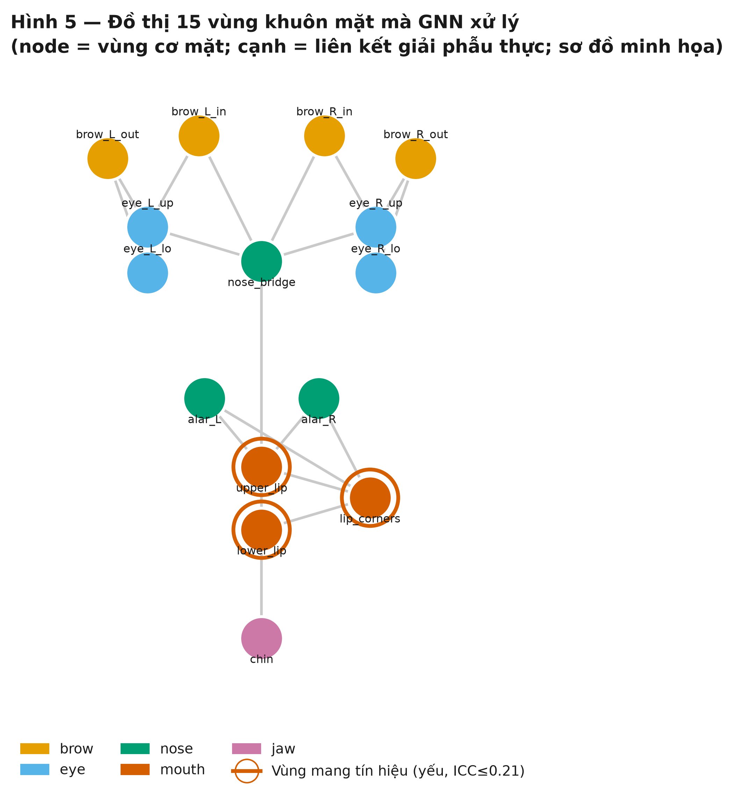
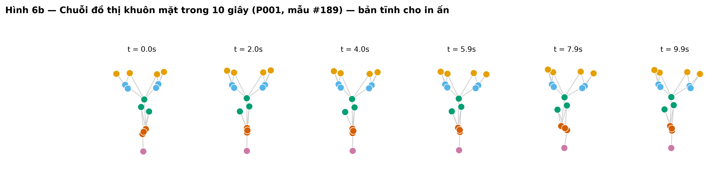
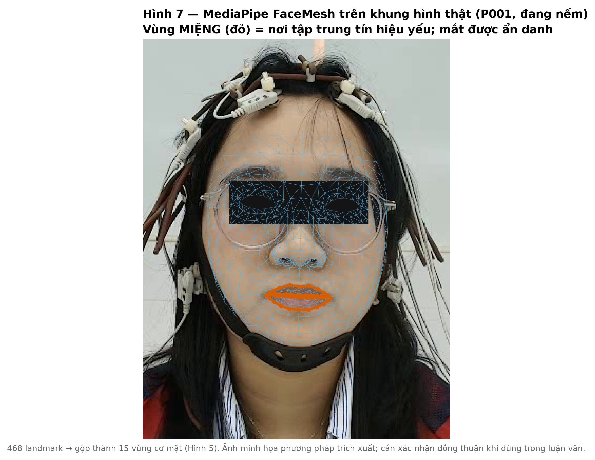

# Phân tích kênh Video (ST-GCN khuôn mặt) trong dự đoán JAR độ ngọt
### Báo cáo phục vụ luận văn tốt nghiệp — kèm hình minh họa

> **Kết luận một dòng.** Hình học biểu cảm khuôn mặt **không** dự đoán được rating
> JAR độ ngọt của sucrose: sau khi khử danh tính người, tín hiệu lặp lại theo nồng
> độ ≈ 0 và mọi mô hình đều ở mức ngẫu nhiên. Đây là một **kết quả âm tính có căn
> cứ** (hard ceiling) — có giá trị khoa học như một *negative control* và một *cảnh
> báo phương pháp luận*, không phải một thất bại kỹ thuật.

---

## 1. Bối cảnh và mục tiêu

Nghiên cứu chính đo phản ứng thần kinh (EEG/gERP) với vị ngọt sucrose ở 5 nồng độ,
gắn với rating **JAR (Just-About-Right)**: 1 = «chưa đủ ngọt» … 3 = «vừa phải» …
5 = «quá ngọt». Song song, mỗi phiên được **quay video khuôn mặt (60 fps)**. Câu
hỏi của kênh video: *biểu cảm khuôn mặt khi nếm có mã hóa được JAR không?*

Pipeline `video_jar_gnn/` trích khuôn mặt bằng **MediaPipe FaceMesh**, gộp 468
landmark thành **đồ thị 15–20 vùng cơ mặt theo thời gian**, rồi huấn luyện GNN/TCN
(ST-GCN) phân loại JAR theo **nested cross-validation tách hoàn toàn theo người
(LOSO / group k-fold)**.

**Ba nguồn dữ liệu** nối bằng khóa `(subject_id, ma_mau, repeat)`; EEG **chỉ** cung
cấp nhãn JAR (không có mẫu EEG nào đi vào mô hình video):

| Nguồn | Vai trò |
|---|---|
| `data/data_video/Nxx_vid-001.mp4` | 28 video khuôn mặt (60 fps) |
| `data/data_video (2)/Nxx_vid.csv` | nhãn frame `ma_mau`, `lan_lap`, `t_lsl` |
| `data/datadone/sub-Pxxx_..._eeg.csv` | nguồn chuẩn của rating JAR |

Cỡ mẫu: 28 người × 6 mẫu × 5 lần lặp = 840 trial. Loại nước (`605`) còn **140 rating
JAR độc lập** cho 5 mẫu ngọt (5 lần lặp của cùng người/mẫu chia sẻ **một** rating).

---

## 2. Kết quả

### 2.1. Nhãn JAR không thoái hóa — biến thiên đơn điệu theo nồng độ



Mỗi người có 2–5 mức JAR khác nhau qua 5 nồng độ (**0/28 người** có JAR hằng số).
JAR tăng đơn điệu theo độ ngọt cảm nhận (thứ tự thực nghiệm theo JAR trung bình:
`#258 (1.18) < #453 (2.04) < #189 (3.04) < #762 (3.43) < #893 (3.93)`). Cân bằng lớp
ở mức điều kiện: JAR3 = 55/44/41, binary = 96/44.

**→ Ý nghĩa:** nhãn giàu thông tin. Bằng chứng phụ: chỉ cần biết **mã nồng độ**
(`code_prior`) đã dự đoán JAR khá tốt (BAcc jar3 = 0.638, binary = 0.626). Vậy
**nút thắt không nằm ở nhãn** — mà ở kênh khuôn mặt.

### 2.2. Mọi mô hình chỉ-video đều ở mức ngẫu nhiên



| Mô hình | Bài toán | Balanced acc | 95% CI (bootstrap theo người) | Baseline | Kết luận |
|---|---|---|---|---|---|
| LogReg (expression_v2) | jar3 | 0.346 | [0.262, 0.428] | majority 0.333 | ≈ ngẫu nhiên |
| ST-GCN (advanced) | jar3 | **0.330** | [0.260, 0.404] | majority 0.333 | **dưới** đa số |
| TCN expr_v2 (video-only) | binary | 0.518 | [0.465, 0.572] | majority 0.500 | ≈ ngẫu nhiên |
| TCN trial-δ (video-only) | binary | 0.477 | [0.396, 0.554] | majority 0.500 | ≈ ngẫu nhiên |
| TCN prior-residual | binary | 0.631 | [0.525, 0.736] | **code_prior 0.626** | **RÒ RỈ mã mẫu** |

Mọi thống kê `model − baseline` có **CI 95% cắt ngang 0**. Con số duy nhất trên
baseline (0.631) là do mô hình được bơm bảng tra `ma_mau → JAR`; so với chính
`code_prior`, video **cộng thêm chỉ +0.005** (CI [−0.059, +0.071]). **Khuôn mặt
không thêm gì ngoài mã mẫu.**

### 2.3. Vì sao ngẫu nhiên: «độ tin cậy» thô chỉ là rò rỉ danh tính người



Audit *không dùng nhãn* (`audit-expression`) đo độ lặp lại của biểu diễn khuôn mặt
giữa 5 lần lặp của cùng điều kiện:

- **ICC thô** dương (median 1-lần-lặp 0.12–0.22; trung bình-k-lần-lặp 0.41–0.58) →
  *nhìn như* có độ tin cậy.
- **ICC sau khi khử danh tính ≈ 0** trên cả 6 cửa sổ thời gian (−0.022 … +0.018).
  **0/4320** đặc trưng-cửa-sổ đạt ICC ≥ 0.25.
- Khoảng cách trong-điều-kiện / giữa-điều-kiện = 0.96–0.98; **pair-AUC = 0.52–0.54**
  — và các con số này đã được tính *sau khi khử danh tính bằng oracle*, tức là
  **cận trên** của những gì LOSO có thể đạt.

**Diễn giải (điểm phương pháp luận quan trọng cho luận văn):** ICC thô dương hoàn
toàn vì mỗi ô `(người × nồng độ)` thuộc đúng một người, nên phương sai bị chi phối
bởi **hình thái khuôn mặt cá nhân ổn định** — tức *«đây có phải cùng một khuôn mặt
không»*, chứ không phải *«nồng độ này có tái tạo một biểu cảm không»*. Vì mọi trainer
dùng LOSO/group CV (không được phép dùng danh tính), chúng **buộc phải hoạt động
trong đúng vùng ICC ≈ 0** → near-chance là **tất yếu**, không phải lỗi.

> **Cảnh báo cho người sau:** nếu train mà **không** tách người (k-fold thường), sẽ
> nhận accuracy cao **giả** — đó là nhận diện khuôn mặt, không phải giải mã vị giác.
> **Bắt buộc LOSO/group CV.**

### 2.4. Tín hiệu yếu ỏi (nếu có) nằm ở vùng miệng, ngay sau khi nhấp



18 đặc trưng «tin cậy» nhất (ICC sau khử danh tính cao nhất) hầu hết ở **vùng
miệng** (`corner_horizontal`, `outer_mouth_open`, `inner_lip_aperture`), tập trung
cửa sổ **2–4 s ngay sau khi nhấp**. Nhưng **đỉnh chỉ 0.21**, và **95.3%** đặc trưng
< 0.1.

**→ Diễn giải:** các đặc trưng nhỉnh trên nhiễu là **cơ học nuốt–nếm** (mở miệng,
kéo mép), **không** phải phản ứng cảm xúc; và vẫn quá yếu để phân loại.

### 2.5. Cấu trúc đồ thị khuôn mặt (GNN) và biểu diễn động



Mỗi khung hình → đồ thị các vùng cơ mặt (node) nối bằng cạnh giải phẫu; GNN/TCN học
động lực học thời gian của đồ thị này. Vùng miệng (viền đỏ) là nơi duy nhất mang
tín hiệu — nhưng rất yếu.



Chuỗi đồ thị trong 10 giây của một trial (P001, mẫu #189, JAR=3). Bản động đầy đủ:
**`figures/fig6_gnn_animation.gif`**.



MediaPipe FaceMesh trên khung hình thật (người đội mũ EEG, đang nếm): 468 landmark
được gộp thành 15–20 vùng cơ mặt; vùng miệng (đỏ) là nơi tập trung tín hiệu yếu.
*(Mắt đã ẩn danh; cần xác nhận đồng thuận trước khi in trong luận văn.)*

---

## 3. Thảo luận — diễn giải khoa học

**(a) Kết quả âm tính này hợp lý về mặt sinh lý.** Phản xạ vị-mặt (gustofacial
reactivity, Steiner) mạnh và nhất quán với vị **đắng** (nhăn mặt, gaping) và **chua**
(mím/chu môi), nhưng **yếu với vị ngọt** ở nồng độ uống được — vốn là kích thích
khoái cảm nhẹ, phản ứng tinh vi và bị kiểm soát chủ ý che lấp ở người lớn tỉnh táo.
Việc khuôn mặt gần như «im lặng» với sucrose **củng cố** tính hợp lệ của thí nghiệm.

**(b) Nút thắt đã được định vị chắc chắn ở kênh khuôn mặt.** Nhãn JAR giàu thông
tin và đơn điệu theo nồng độ (Mục 2.1); mô hình toàn chuỗi (bỏ qua bước tóm tắt đặc
trưng) cũng ngẫu nhiên; giao thức CV không rò rỉ (balanced accuracy = macro-recall
nên không thể ngụy trang majority-collapse; có bootstrap theo cụm người). Do đó
near-chance **không** đến từ nhãn, biểu diễn thô, hay lỗi giao thức.

**(c) «Đổi mục tiêu» không cứu được.** JAR ≈ hàm đơn điệu của nồng độ, nên chuyển
sang dự đoán nồng độ / thứ hạng / |JAR−3| đều bị chặn bởi cùng một đầu vào yếu
(bất đẳng thức xử lý dữ liệu). Audit đã đo *chống lại chính nồng độ (`ma_mau`)*, nên
đã bao trùm luôn các mục tiêu này.

---

## 4. Kết luận

Trên cohort và thiết kế này, **hình học khuôn mặt (MediaPipe) → JAR chủ quan là một
trần cứng**: không mô hình subject-invariant nào vượt được mức ngẫu nhiên. Kết luận
này được củng cố hội tụ từ (i) ICC sau khử danh tính ≈ 0, (ii) 0/4320 đặc trưng đạt
ngưỡng, (iii) pair-AUC ≈ 0.52 kể cả khi khử danh tính bằng oracle, và (iv) mọi mô
hình toàn chuỗi ở mức ngẫu nhiên với CI cắt 0.

**Giá trị đóng góp của kênh video trong luận văn:**
1. **Kết quả âm tính có định lượng** về giới hạn của biểu cảm khuôn mặt với vị ngọt.
2. **Negative control / discriminant validity cho EEG:** EEG dự đoán JAR mà video
   thì không ⇒ mạnh mẽ hơn cho luận điểm «EEG bắt xử lý vị giác thực sự».
3. **Cảnh báo phương pháp luận** về rò rỉ danh tính người khi không tách người.
4. Kênh **QC/onset** tiềm năng: sự kiện mở miệng (2–4 s) có thể làm mốc onset thật
   để tinh chỉnh epoching/realign EEG.

---

## 5. Hạn chế và hướng phát triển (đã qua kiểm tra đối kháng)

Trong 20 đòn bẩy cải thiện được đánh giá đối kháng qua 3 lăng kính (độ-tin-cậy tín
hiệu, sức mạnh thống kê, tính khả thi), **không đòn nào** được cả hội đồng khuyến
nghị nâng accuracy chỉ-video. Tóm tắt:

| Nhóm | Hành động | Payoff thực | Khuyến nghị |
|---|---|---|---|
| **Vệ sinh / trung thực** | Bóc con số rò rỉ `code_prior`; sửa ordinal-decode jar3 | Sửa *tính trung thực* của báo cáo, không phải accuracy | **Làm ngay** |
| **Chẩn đoán 1 lần** | Contrast nồng độ cực trị; re-audit neo theo onset + baseline trước-trial | Đóng nốt các khoảng logic; kỳ vọng xác nhận trần | **Chạy 1 lần** |
| **Đa phương thức** | Hợp nhất muộn với EEG gERP | Above-chance **nhưng do EEG gánh**; EEG cũng bị chặn bởi cùng trần ~140 nhãn | Chỉ nếu đổi mục tiêu sang mô hình đa phương thức |
| **Nghiên cứu tương lai** | Cảm biến texture/FACS-AU, marker onset vị giác, nhiều người độc lập hơn (thay vì 5 lần lặp trùng) | Dư địa mềm *duy nhất*, còn suy đoán | Cho vòng thu dữ liệu sau |
| **Không đáng làm** | Hoán đổi biểu diễn hình học (3DMM, raw landmark, GRL, optical-flow); đổi nhãn cùng trial; tinh chỉnh data-power | ≈ 0 (đã được đo, hoặc bị bao trùm về toán học, hoặc inert); một số làm generalization *tệ hơn* | **Không** |

---

## Phụ lục A — Số liệu chính (trích dẫn được)

- Người / rating độc lập: **28 / 140** (5 mẫu ngọt); JAR3 điều kiện = 55/44/41.
- ICC thô (median): 1-lần 0.12–0.22, k-lần 0.41–0.58. **ICC khử danh tính (median):
  −0.022 … +0.018**. Số đặc trưng ICC≥0.25 sau khử danh tính: **0/4320**.
- pair-AUC (khử danh tính, oracle): 0.519–0.543.
- Đặc trưng tin cậy nhất: `corner_horizontal_R · value/mean` = **0.21** (vùng miệng).
- `code_prior` (chỉ dùng mã nồng độ): jar3 BAcc 0.638, binary 0.626.

## Phụ lục B — Tái lập hình ảnh

```bash
PY=/home/gpu1/miniconda3/envs/video-jar-gnn/bin/python
cd output/video_jar_gnn/report/scripts
$PY make_figures.py     # Hình 1–5 (từ audit CSV + JAR + npz cache)
$PY make_dynamic.py     # Hình 6 (GIF + tĩnh) + Hình 7 (khung hình thật + FaceMesh)
```

Nguồn số liệu: `output/video_jar_gnn/expression_audit/run_d33bb95400/` (audit),
`output/video_jar_gnn/runs*/**/summary.json` (metrics + bootstrap CI),
`data/datadone/*.csv` (JAR), cache đồ thị `output/video_jar_gnn/graphs*/`.

## Phụ lục C — Cần tự xác nhận trước khi trích dẫn

Các con số **phía EEG** dùng để so sánh EEG↔video (nếu đưa vào bài) chưa được kiểm
tra trực tiếp trong báo cáo này và nên được verify lại từ pipeline EEG trước khi
trích dẫn. Mọi con số **phía video** ở trên đã được kiểm chứng từ audit CSV và
`summary.json` của các run.
