# BÁO CÁO TỔNG HỢP — Phân tích EEG Vị giác (gERP vị ngọt)

> **Đề tài:** Gustatory Event-Related Potentials — phản ứng thần kinh với vị ngọt sucrose
> **Dữ liệu:** 28 người (P001–P030, trừ P012 & P022) · 16 kênh EEG · 100 Hz · 6 nồng độ × 5 lần lặp = **840 trial**
> **Ngày tổng hợp:** 2026-07-28
> **Phạm vi:** Từ dữ liệu thô → tiền xử lý → epoching/căn onset → ERP → thống kê → Machine Learning → Deep Learning → kết luận.

Toàn bộ hình nằm trong thư mục `figures/` cùng cấp với báo cáo này.

---

## 0. Tóm tắt điều hành (đọc cái này trước)

| Câu hỏi | Trả lời ngắn |
|---|---|
| **Có tín hiệu ERP vị giác không?** | **Có** — grand-average tách rõ 4 thành phần P1/N1/P2/N400 với latency đúng kỳ vọng. |
| **Nồng độ ngọt có tạo khác biệt ERP có ý nghĩa không?** | **Yếu** — không thành phần nào khác biệt so với nước (tất cả `ns`, \|d\|<0.52). Chỉ vài kênh riêng lẻ chạm p<0.05, không kênh nào qua Bonferroni. |
| **Đánh giá JAR (độ vừa ngọt) có phản ánh trên EEG không?** | **Có tín hiệu cấp kênh** — C4·P2 (p=0.0068), F7·N400 (p=0.0115) khác biệt theo nhóm JAR. |
| **Phân loại: ML hay DL cho kết quả cao nhất?** | **Xem Mục 11.** Theo *balanced accuracy* (metric công bằng): **DL (ShallowConvNet) = 0.674** là kết quả đáng tin cao nhất, nhỉnh hơn ML ổn định (GradBoost = 0.649). Có một cấu hình ML thô đạt 0.722 nhưng **kém ổn định (K=2)**. |
| **Trần dữ liệu?** | ~**0.67–0.72 balanced_acc** — 5 phương pháp khác nhau đều hội tụ về đây → giới hạn do **n nhỏ + mất cân bằng**, không phải do model. |

**Bảng kết quả phân loại tốt nhất (bài toán chính: Vua_phai vs Others, chance balanced_acc = 0.50):**

| Hạng | Phương pháp | Loại | balanced_acc | accuracy | recall_Vua_phai |
|---|---|:---:|:---:|:---:|:---:|
| ⚠️ | XGBoost + SMOTE, chỉ 2 feature | ML | **0.722** | 0.696 | 0.769 | *(cao nhất nhưng chỉ 2 feature → kém ổn định, không đáng tin)* |
| ★ | **ShallowConvNet (CNN nông)** | **DL** | **0.674** | 0.639 | 0.746 | *(best ổn định toàn bộ)* |
| ★ | GradBoost + hạ ngưỡng (0.5→0.21) | ML | 0.649 | 0.681 | 0.586 | *(best ML ổn định)* |

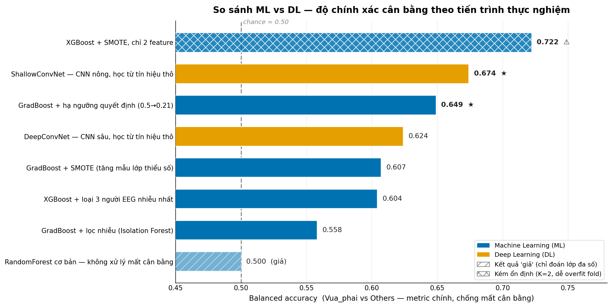
*Hình 0 — Xếp hạng 8 mô hình theo balanced accuracy. Xanh = ML, cam = DL. Thanh gạch chéo `//` = kết quả "giả" (chỉ đoán lớp đa số); gạch caro `xx` = kém ổn định (chỉ 2 feature). Sau khi loại 2 loại này, hai mô hình đáng tin nhất là ShallowConvNet (DL, 0.674) và GradBoost + hạ ngưỡng (ML, 0.649).*

### 📖 Chú giải thuật ngữ (đọc để hiểu các hình & bảng)

Các mô hình được **đặt tên theo phương pháp** (không dùng "v1/v2/v3" — đó chỉ là tên file script nội bộ như `run_ml_vuaphai_v2.py`). Ý nghĩa các thuật ngữ:

| Thuật ngữ | Nghĩa dễ hiểu |
|---|---|
| **balanced_acc** | Độ chính xác **cân bằng** = trung bình recall của cả 2 lớp. Metric **chính** vì không bị "ăn gian" bởi lớp đa số. |
| **accuracy thô** | Tỉ lệ đúng chung. **Dễ thổi phồng**: chỉ cần đoán toàn "Others" đã đạt ~0.74–0.76. |
| **chance / majority** | Mốc ngẫu nhiên (balanced_acc=0.50) / mốc đoán lớp đa số (accuracy=0.756). |
| **LOSO-CV** | Leave-One-Subject-Out: train 27 người → test người còn lại, lặp 28 lần (đánh giá khả năng tổng quát sang người mới). |
| **SMOTE** | Sinh thêm mẫu "giả" cho lớp thiểu số (Vua_phai) để cân bằng dữ liệu. |
| **hạ ngưỡng** *(threshold tuning)* | Hạ ngưỡng quyết định từ 0.5 xuống 0.21 để buộc model chịu bắt lớp thiểu số. |
| **pos_weight** *(pw)* | Trọng số phạt lỗi ở lớp thiểu số trong mạng DL — pw càng cao, model càng "chịu khó" bắt Vua_phai. |
| **CNN nông/sâu** | ShallowConvNet (ít lớp) / DeepConvNet (nhiều lớp) — mạng học **trực tiếp từ tín hiệu EEG thô**, không cần trích đặc trưng thủ công. |
| **feature (đặc trưng)** | Số đại lượng trích từ EEG (biên độ ERP, bandpower…) đưa vào model ML. "Chỉ 2 feature" = quá ít → dễ khớp nhiễu (overfit). |
| **recall_Vua_phai** | % mẫu Vua_phai thực sự được bắt đúng. |

---

## 1. Bối cảnh & mục tiêu

Nghiên cứu **gERP (gustatory ERP)** nhằm xác định **khi nào** (động học thời gian) và **ở đâu** (vùng não) bộ não xử lý thông tin vị ngọt, và liên kết các thành phần ERP với đánh giá chủ quan **JAR (Just-About-Right)** về độ ngọt.

**Ý nghĩa 4 thành phần ERP trong vị giác** (theo `insight_report.txt`):

| Thành phần | Cửa sổ | ROI | Ý nghĩa thần kinh |
|---|---|---|---|
| **P1** | 90–150 ms | F3,F4,C3,C4 | Xử lý hướng tâm sớm (vỏ vị giác sơ cấp / Insula). Biên độ ↑ theo cường độ kích thích. |
| **N1** | 140–240 ms | F7,F8,T7,T8 | Chú ý / phân biệt kích thích (gần Insula nhất). |
| **P2** | 230–350 ms | C3,C4,P3,P4 | **Quan trọng nhất** — đánh giá chất lượng vị, tương quan với độ "ngon/dễ chịu". |
| **N400** | 350–550 ms | broad centro-frontal | Xử lý muộn / ngữ nghĩa vị, sự không khớp giữa kỳ vọng và thực tế. |

---

## 2. Dữ liệu

- **28 người** (P001–P030, loại P012 và P022).
- **6 mẫu:** 5 nồng độ sucrose + 1 nước nền — Water/605, Low/258, MedLow/453, Medium/189, MedHigh/762, High/893.
- **5 lần lặp** mỗi mẫu → **30 trial/người → 840 trial** tổng.
- **Thiết bị:** 14/16 kênh Emotiv-style (Fp1, Fp2, F3, F4, C3, C4, P3, P4, O1, O2, F7, F8, T7, T8), 100 Hz, ~11 s/trial thô.
- **Nhãn:** cột `ma_mau` (mã nồng độ), `repeat` (1–5), `JAR` (1–5 → Khong_du / Vua_phai / Qua_nhieu).

---

## 3. Pipeline xử lý

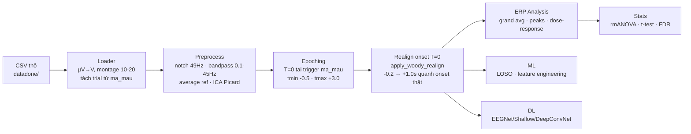
```mermaid
flowchart LR
    A[CSV thô<br/>datadone/] --> B[Loader<br/>µV→V, montage 10-20<br/>tách trial từ ma_mau]
    B --> C[Preprocess<br/>notch 49Hz · bandpass 0.1-45Hz<br/>average ref · ICA Picard]
    C --> D[Epoching<br/>T=0 tại trigger ma_mau<br/>tmin -0.5 · tmax +3.0]
    D --> E[Realign onset T=0<br/>apply_woody_realign<br/>-0.2 → +1.0s quanh onset thật]
    E --> F[ERP Analysis<br/>grand avg · peaks · dose-response]
    F --> G[Stats<br/>rmANOVA · t-test · FDR]
    E --> H[ML<br/>LOSO · feature engineering]
    E --> I[DL<br/>EEGNet/Shallow/DeepConvNet]
```

*(Nếu trình xem không render Mermaid: CSV → Loader → Preprocess → Epoching → **Realign onset** → {ERP → Stats} và {ML, DL}.)*

---

## 4. Tiền xử lý (`pipeline/preprocess.py`)

| Bước | Thiết lập |
|---|---|
| Notch filter | 49 Hz (điện lưới Việt Nam) |
| Bandpass | 0.1 – 45 Hz |
| Reference | Average reference |
| Montage | standard_1020 (đổi tên T3→T7, T4→T8, T5→P7, T6→P8) |
| ICA | Picard, 15 thành phần, tự loại EOG qua proxy Fp1/Fp2 (z>2.0); ECG tắt (không có cảm biến) |

---

## 5. Epoching & Căn chỉnh điểm T=0 (onset) — ⚠️ điểm kỹ thuật quan trọng

Cơ chế **T=0 gồm 2 bước**, cần hiểu đúng:

**Bước 1 — Tạo epoch (`create_epochs`):** T=0 đặt tại **trigger `ma_mau`** (marker "đưa cốc"), cửa sổ rộng `tmin=-0.5s → tmax=+3.0s`, baseline `[-0.5,-0.3]s`, reject 800 µV. Epoch lưu trên đĩa = **351 mẫu (3.51 s)**, **chưa** căn về onset thật.

**Bước 2 — Căn onset thật (`apply_woody_realign`, gọi lúc phân tích):** đọc `realign_offsets.csv`, dịch T=0 về **onset vị giác thật** (`new_onset = trigger + offset_final`), cắt lại cửa sổ `[-0.2s, +1.0s]` = **121 mẫu** quanh onset. Mọi phân tích ERP/ML/DL đều chạy qua bước này.

> **Vì sao cần bước 2?** Marker "đưa cốc" xảy ra **trước** khi vị ngọt thực sự chạm lưỡi; độ trễ onset lớn và biến thiên mạnh (xem hình dưới), nên phải căn lại để ERP không bị "nhòe".

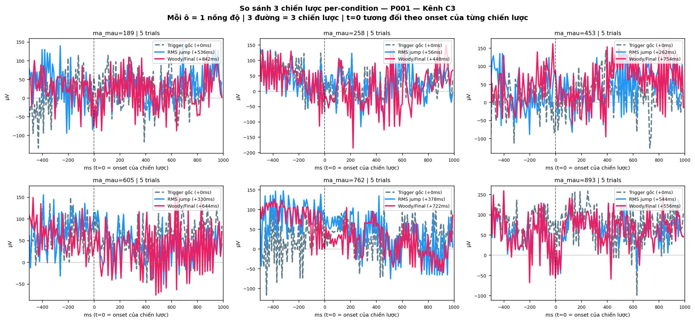
*Hình 1 — P001, kênh C3, 6 nồng độ. So sánh 3 chiến lược căn onset: Trigger gốc (xám đứt), RMS-jump (xanh), Woody/Final (đỏ). Offset của RMS và Woody khác nhau rõ theo từng nồng độ.*

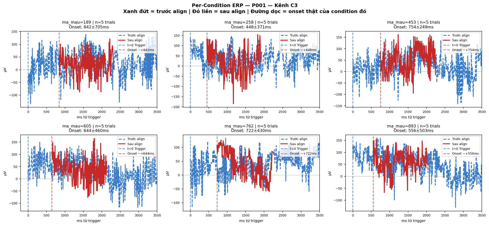
*Hình 2 — Tín hiệu trước (xanh đứt) vs sau (đỏ liền) khi căn. Onset thật lệch **hàng trăm ms** so với trigger và độ biến thiên (SD) rất cao: 189=842±705ms, 453=754±249ms, 762=722±430ms… → độ trễ onset không ổn định, khẳng định sự cần thiết của realign.*

**Lưu ý kỹ thuật đã kiểm chứng:**
- Hàm `load_realign_offsets()` trong `epoching.py` là **dead code** (không được gọi) — dễ gây hiểu nhầm rằng epoching tự realign.
- Nếu load thẳng `.fif`/`.npy` mà **không** gọi `apply_woody_realign` → T=0 vẫn là trigger gốc (chưa căn).
- `apply_woody_realign` map offset theo **vị trí** (`iloc[ep_i]`); hiện **an toàn** vì cả 28 người đều đủ 30 epoch (reject 800 µV không loại trial nào), nhưng sẽ lệch nếu về sau siết ngưỡng reject → nên map theo khóa `(subject_id, trial_ix)`.

---

## 6. Kiểm định chất lượng ERP (`run_erp_quality_check.py`)

Mỗi **người × nồng độ** được chấm qua 4 chỉ số (avg_SNR, số component detect, morphology, signal/noise-floor).

| Nhãn | Số | % |
|---|:---:|:---:|
| GOOD | 90 | 54% |
| WEAK | 29 | 17% |
| **BAD** | **49** | **29%** |

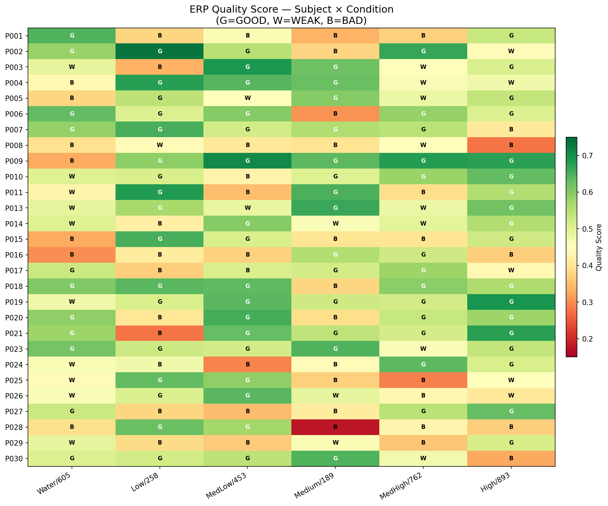
*Hình 3 — Điểm chất lượng (thang đỏ→xanh) mỗi người × nồng độ, nhãn G/W/B. Chất lượng dao động mạnh; nhiều ô GOOD nhưng cũng rải rác BAD.*

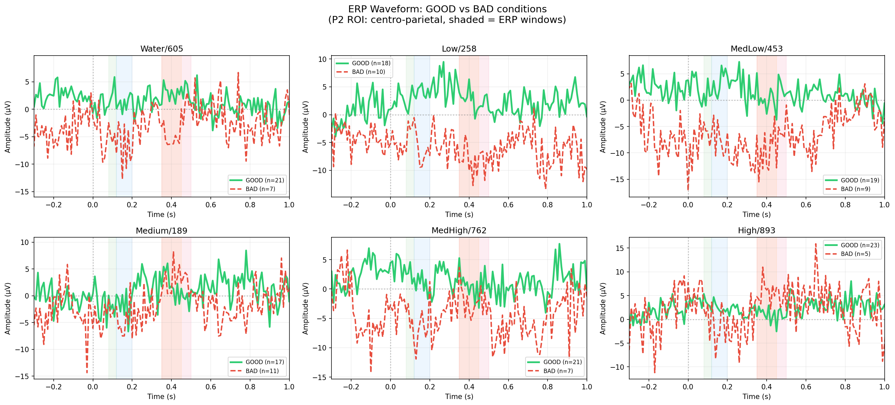
*Hình 4 — ERP ROI-P2 theo nồng độ: sóng GOOD (xanh) ổn định quanh/trên 0, sóng BAD (đỏ) lệch âm mạnh & nhiễu.*

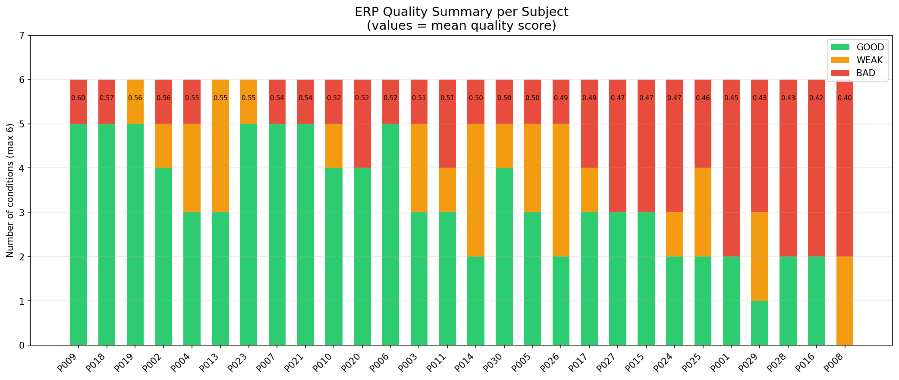
*Hình 5 — Cột chồng GOOD/WEAK/BAD mỗi người. Tốt nhất: P009 (0.60), P018 (0.57). Kém nhất: P008 (0.40, không có ô GOOD nào), P016, P028, P029.*

> **Tác dụng của lọc BAD:** P2 mọi nồng độ trở về dương (đúng sinh lý); Cohen's d (High vs Water) tăng 0.35 → 0.49. Nhưng lọc strict khiến còn quá ít người đủ 6 nồng độ → rmANOVA không chạy được (dùng data đầy đủ cho ANOVA).

---

## 7. Phân tích ERP (`run_erp_insight.py`)

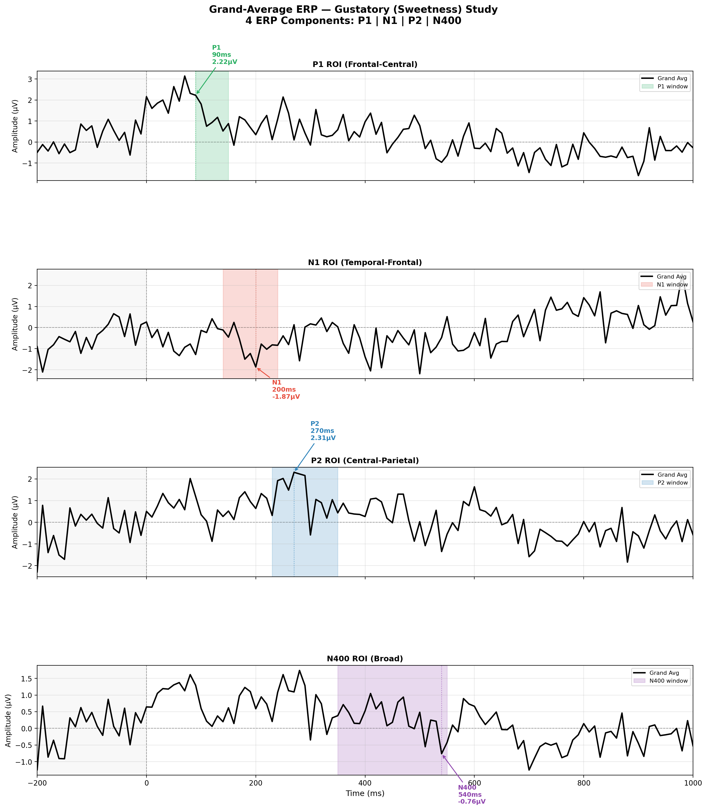
*Hình 6 — Grand-average ERP. Bốn đỉnh xác định rõ: **P1 ~90ms (+2.22µV)**, **N1 ~200ms (−1.87µV)**, **P2 ~270ms (+2.31µV)**, **N400 ~540ms (−0.76µV)** — đúng cửa sổ kỳ vọng.*

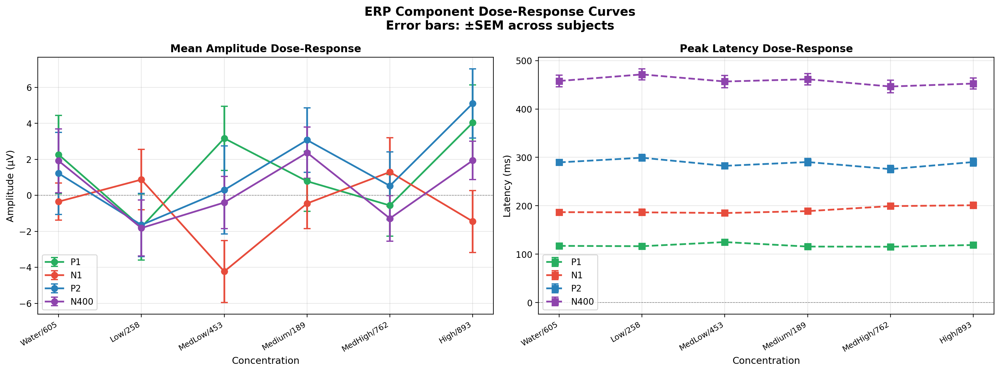
*Hình 7 — Đường dose-response theo 6 nồng độ. **Biên độ** dao động mạnh, error bar lớn, **không đơn điệu** theo nồng độ. **Latency** rất ổn định và đúng thứ bậc (N400>P2>N1>P1).*

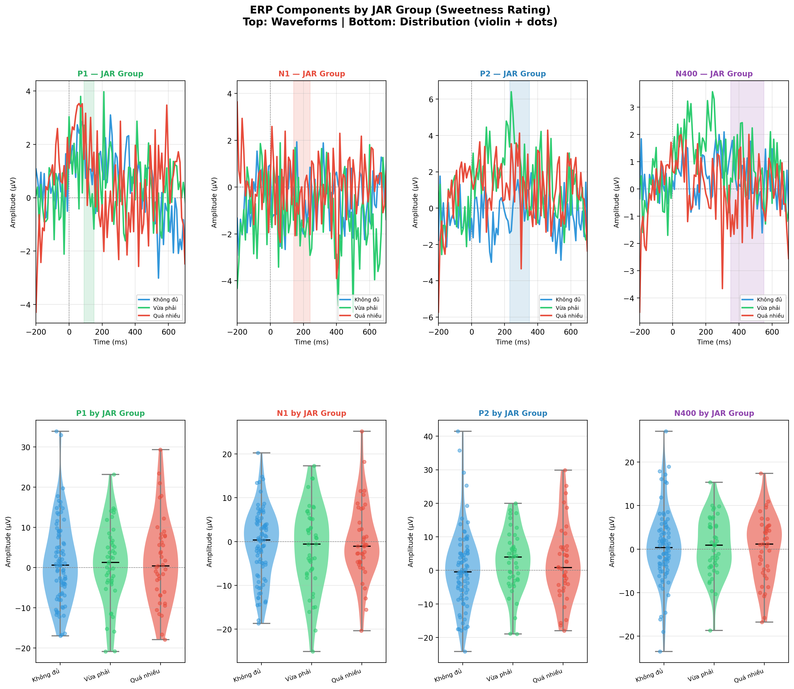
*Hình 8 — ERP overlay (trên) và violin (dưới) theo 3 nhóm JAR cho 4 thành phần. Ở cấp ROI, ba nhóm chồng lấp nhiều, trung vị gần nhau → khác biệt JAR **không tách bạch ở cấp ROI**.*

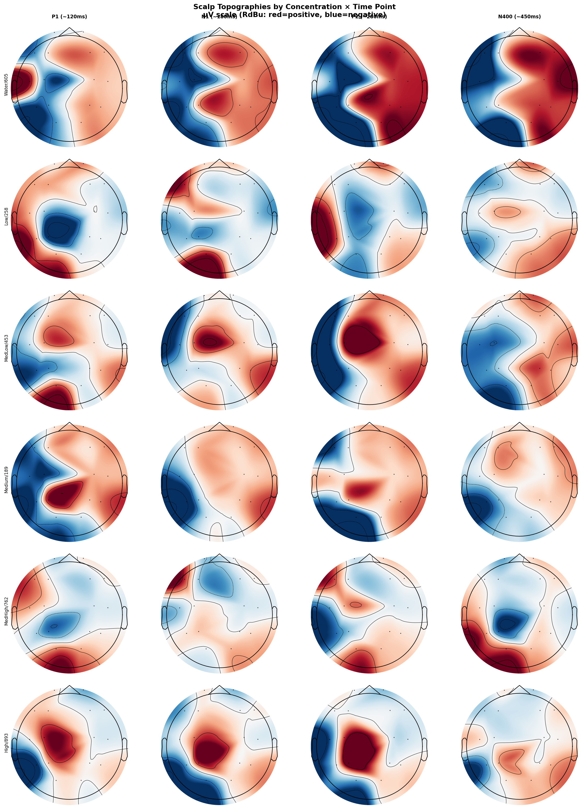
*Hình 9 — Bản đồ điện thế da đầu (6 nồng độ × 4 thành phần). Phân bố thay đổi giữa các điều kiện nhưng **không có gradient dose-response nhất quán**. (Lưu ý: hình gốc bị chồng nhãn cột N1/P2 và thiếu colorbar — chỉ dùng để minh họa định tính.)*

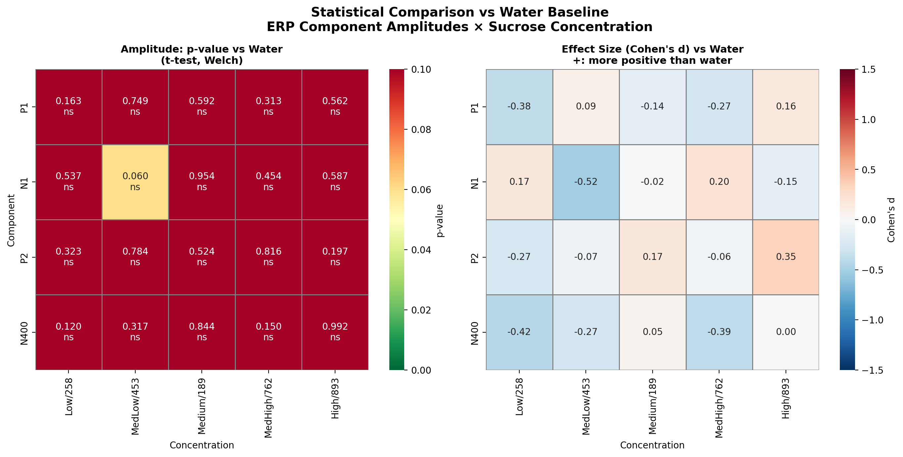
*Hình 10 — So với baseline nước: **tất cả 20 ô đều `ns`** (p>0.05), effect size nhỏ (\|d\|<0.52). Gần ngưỡng nhất: N1×MedLow (p=0.060, d=−0.52).*

**Kết luận Mục 7:** tín hiệu ERP tồn tại và đúng hình thái, nhưng **hiệu ứng nồng độ ở cấp gộp ROI rất yếu** — cần phân tích cấp kênh.

---

## 8. Phân tích theo từng kênh (`run_per_channel_anova.py`)

Thay vì gộp ROI, phân tích **từng kênh riêng lẻ** → phát hiện tín hiệu bị "loãng" khi gộp.

**Hiệu ứng JAR (1-way, n=168) — các kênh có ý nghĩa (p<0.05):**

| Kênh · Thành phần | F | p | Vùng não |
|---|:---:|:---:|---|
| **C4 · P2 peak** | **5.14** | **0.0068** | Trung tâm phải ← mạnh nhất |
| **F7 · N400 peak** | 4.59 | 0.0115 | Trán dưới trái |
| F7 · N400 mean | 4.11 | 0.0181 | Trán dưới trái |
| P4 · N400 mean | 3.30 | 0.0394 | Đỉnh phải |
| C3 · P1 peak | 3.40 | 0.0359 | Trung tâm trái |

**Hiệu ứng nồng độ (rmANOVA, n=28):** C4·P2 (p=0.048), P3·P1 (p=0.047), F7·N1 (p=0.041).

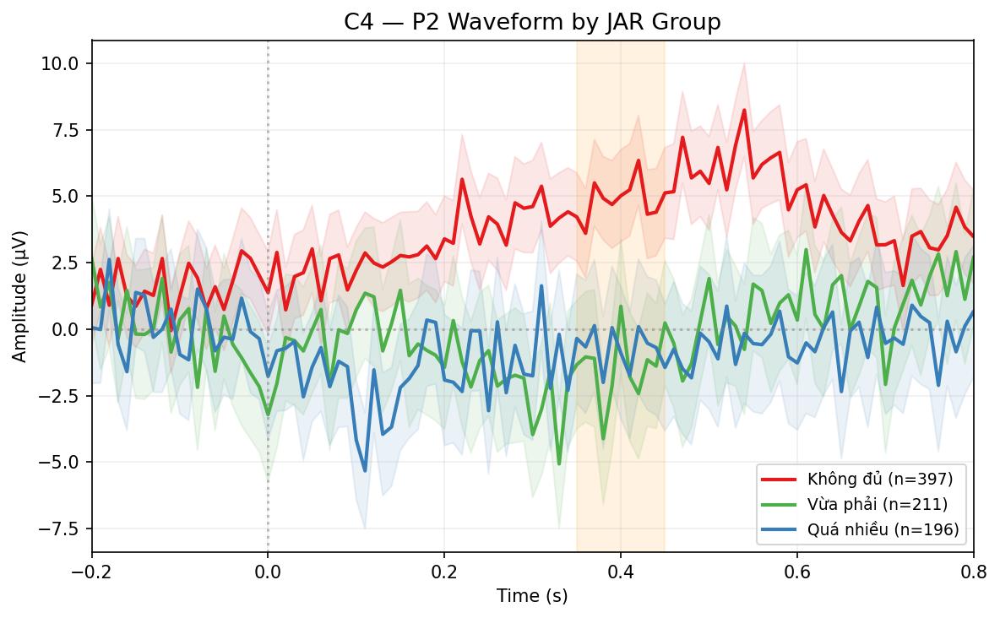
*Hình 11 — Waveform tại **C4** (cửa sổ P2). Ba nhóm JAR tách biệt rõ trong cửa sổ P2 (dải vàng) — đây là kênh có hiệu ứng JAR mạnh nhất (p=0.0068).*

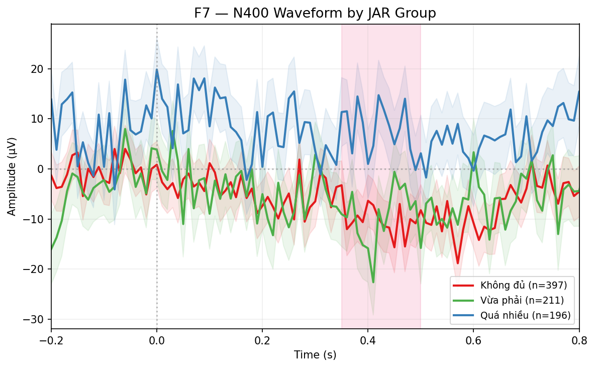
*Hình 12 — Waveform tại **F7** (cửa sổ N400). Trong cửa sổ N400 (dải hồng), nhóm Qua_nhieu tách khỏi Khong_du/Vua_phai — phù hợp F7·N400 có ý nghĩa (p=0.0115).*

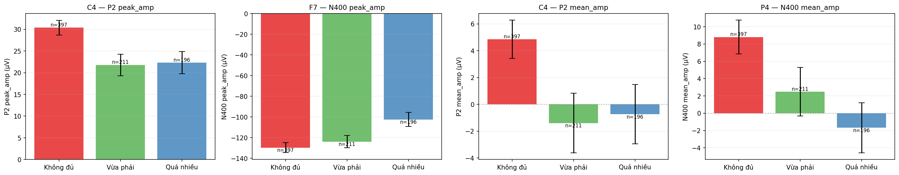
*Hình 13 — Cột (±error) 4 đo lường chủ chốt (C4·P2 peak/mean, F7·N400 peak, P4·N400 mean) theo 3 nhóm JAR — trực quan hóa các khác biệt cấp kênh có ý nghĩa thống kê.*

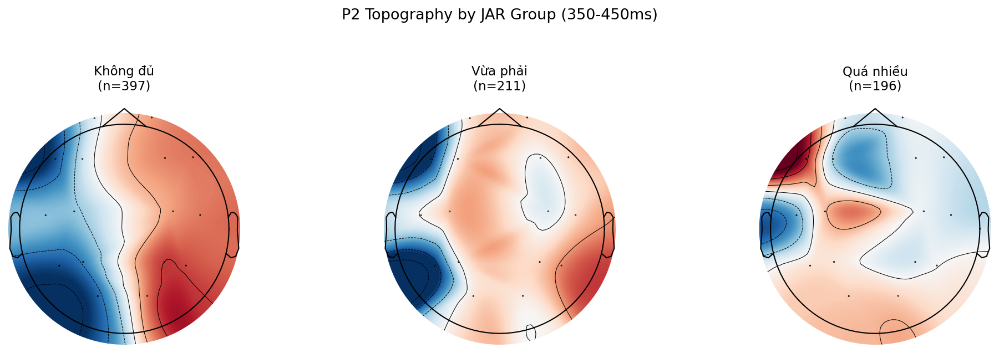
*Hình 14 — Bản đồ P2 (350–450ms) theo 3 nhóm JAR. Phân bố khác nhau rõ giữa các nhóm (Khong_du lưỡng cực mạnh, Vua_phai dịu & đối xứng hơn). Lưu ý cỡ mẫu chênh lệch và không có colorbar.*

> ⚠️ **Không hiệu ứng nào qua Bonferroni** (128 test, α=0.00039). Effect size nhỏ (η²p≈0.05–0.07) → cần N lớn hơn để khẳng định chắc chắn.

---

## 9. Machine Learning (`run_ml_top_features.py`, `run_ml_vuaphai_v2/v3.py`)

**Feature pool:** 144 features (64 ERP mean_amp + 80 bandpower log10) → chọn top-K bằng Mutual Information → LOSO-CV.

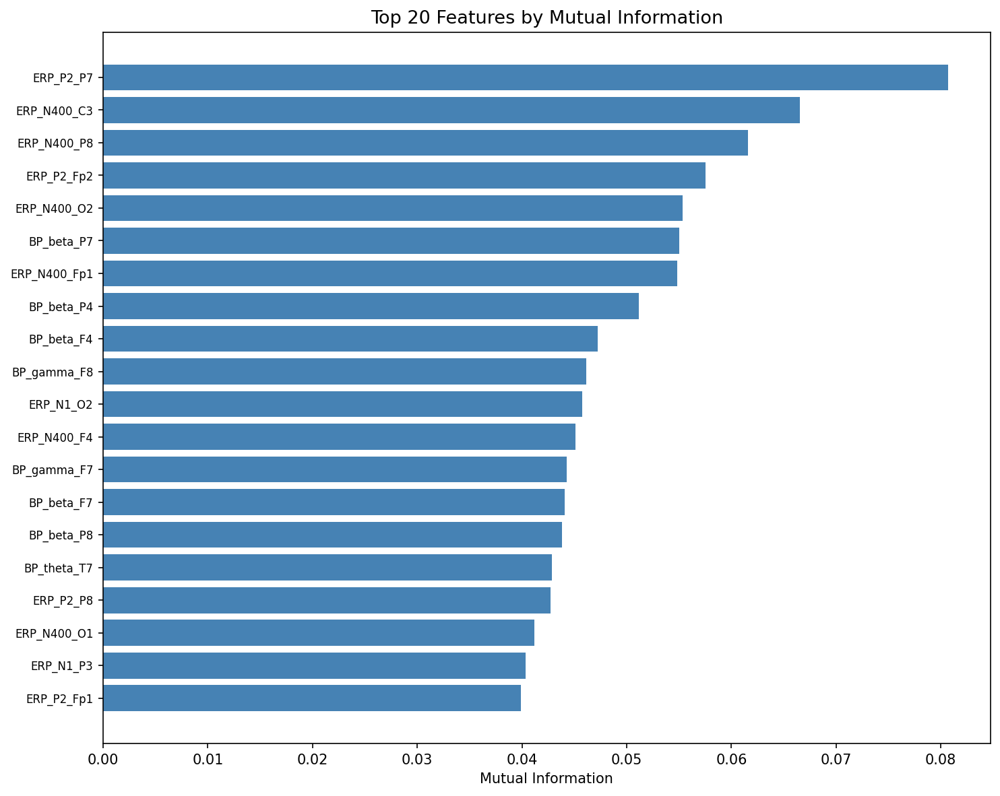
*Hình 15 — Top-20 feature theo MI: chủ yếu **ERP P2 & N400** ở vùng đỉnh/thái dương (P7, C3, P8) + bandpower beta. Giá trị MI tuyệt đối đều nhỏ (<0.09) → tín hiệu yếu.*

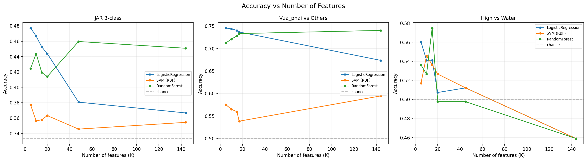
*Hình 16 — Accuracy vs K cho 3 bài toán. **K=5 là tối ưu** — thêm feature làm giảm accuracy (curse of dimensionality). JAR3 ~0.34–0.48; High-vs-Water quanh chance.*

**Kết quả ML tốt nhất (theo accuracy thô, run_ml_top_features):**

| Bài toán | Model | K | Accuracy | vs chance |
|---|:---:|:---:|:---:|:---:|
| JAR 3-class | LogisticReg | 5 | 47.7% | +14.4% |
| Vua_phai vs Others | LogisticReg | 5 | 74.6%* | +24.6% |
| High vs Water | RandomForest | 15 | 57.5% | +7.5% |

\* *74.6% accuracy ≈ mức majority baseline (73.8%) → cần nhìn balanced_acc.*

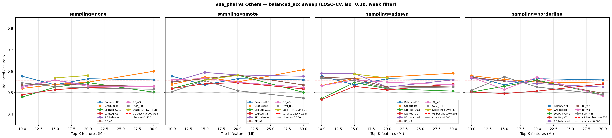
*Hình 17 — Balanced_acc theo K × 4 kiểu lấy mẫu (none/smote/adasyn/borderline). Đa số model bám baseline 0.558, chỉ nhỉnh hơn chance; không cấu hình nào cải thiện đột phá.*

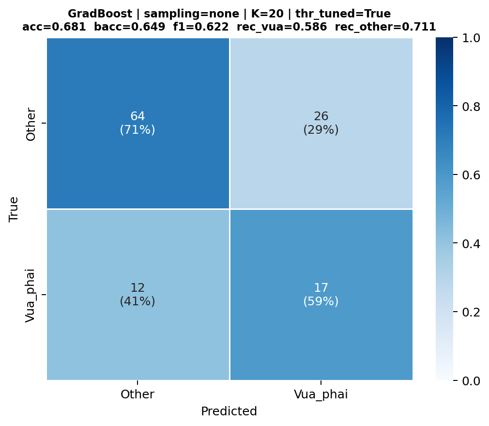
*Hình 18 — Model ML tốt nhất (GradBoost + hạ ngưỡng 0.21): acc=0.681, **bacc=0.649**, recall_Vua=0.586, recall_Other=0.711. **Hạ ngưỡng quyết định (0.21 thay vì 0.5)** là yếu tố then chốt để model chịu bắt lớp thiểu số.*

---

## 10. Deep Learning (`run_dl_vuaphai.py`, `run_dl_vuaphai_v2.py`)

**Input:** raw epoch (16ch × 351tp), **không** feature engineering. LOSO 28 folds. GPU RTX 4090. Xử lý mất cân bằng bằng WeightedRandomSampler + BCE pos_weight.

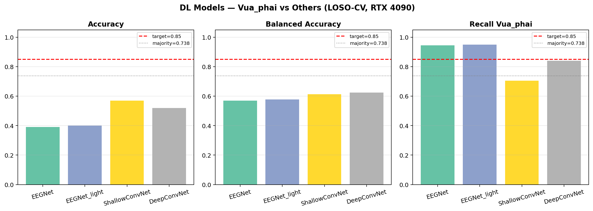
*Hình 19 — 4 model DL. **Không model nào đạt target 0.85**. EEGNet recall_Vua rất cao (~0.95) nhưng acc chỉ ~0.39 (bias mạnh về lớp thiểu số); ShallowConvNet/DeepConvNet cân bằng tốt nhất (bacc ~0.61–0.62).*

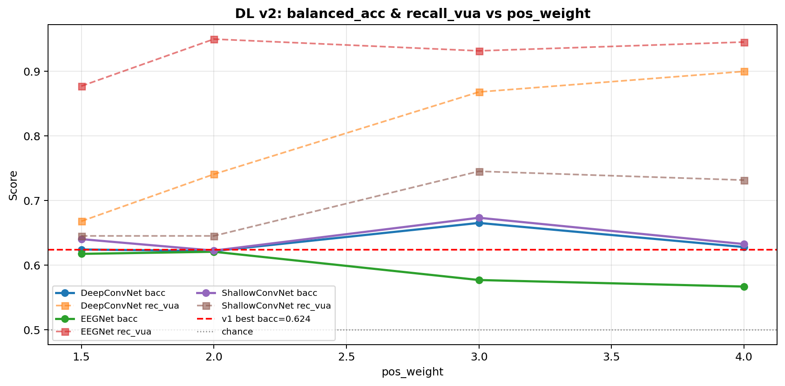
*Hình 20 — Quét pos_weight {1.5,2,3,4}. Tăng pos_weight ↑ recall_Vua rõ nhưng balanced_acc gần như không cải thiện. **ShallowConvNet pw=3 đạt đỉnh bacc ≈ 0.67**.*

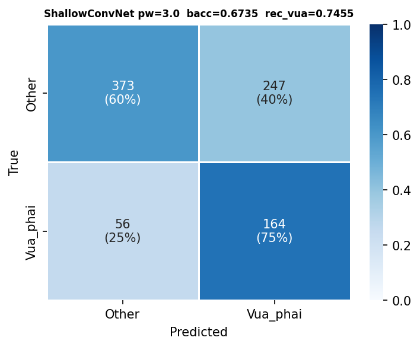
*Hình 21 — Model tốt nhất toàn bộ: **ShallowConvNet pw=3**, **bacc=0.6735**, recall_Vua=0.746 (bắt đúng 164/220 Vua_phai) nhưng recall_Other=0.60 (báo động giả 40%).*

---

## 11. ML vs DL — kết quả phân loại cao nhất

**Trả lời trực tiếp câu hỏi "ML hay DL cao nhất":** phụ thuộc **metric**.

- Bài toán mất cân bằng nặng (Vua_phai chỉ ~24–26%) → **balanced_acc** là metric chính; accuracy thô dễ bị "thổi phồng" (chỉ cần đoán toàn "Others" đã đạt 0.738–0.756).

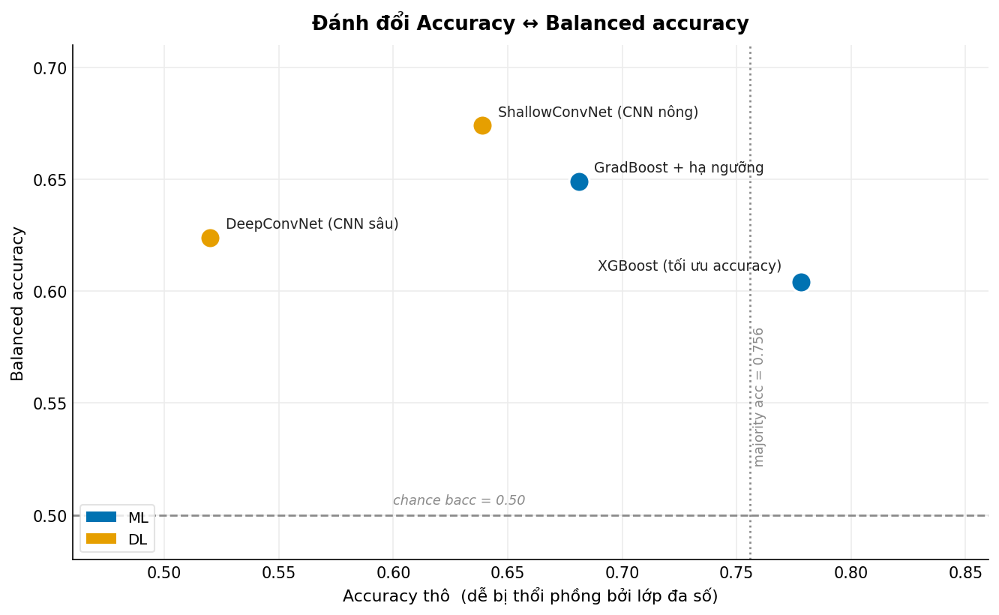
*Hình 22 — Model có accuracy thô cao nhất (XGBoost tối ưu accuracy ~0.78, sát mức đoán lớp đa số 0.756) lại có balanced_acc thấp (0.604). **ShallowConvNet (DL)** đạt cân bằng tốt nhất → minh họa accuracy thô gây hiểu lầm.*

| Xét theo | Cao nhất | Con số | Ghi chú |
|---|---|:---:|---|
| **balanced_acc — kết luận đáng tin** | **DL ShallowConvNet** | **0.674** | Ổn định, best toàn bộ |
| balanced_acc — max thô trong CSV | ML: XGBoost + SMOTE (2 feature) | 0.722 | ⚠️ chỉ 2 feature → dễ overfit fold, **không đáng tin** |
| balanced_acc — best ML ổn định | ML: GradBoost + hạ ngưỡng | 0.649 | |
| accuracy thô | ML: LGBM/XGBoost | ~0.78 (oracle 0.82) | Thổi phồng bởi lớp đa số |

**Kết luận:** với metric công bằng và cấu hình đáng tin, **DL (ShallowConvNet) cho kết quả phân loại cao nhất (0.674)**, nhỉnh hơn ML tốt nhất ổn định (0.649). Cả hai đều hội tụ về **trần dữ liệu ~0.67–0.72**.

---

## 12. Kết luận & khuyến nghị

**Phát hiện chính:**
1. Tín hiệu ERP vị giác **tồn tại và đúng hình thái** (P1/N1/P2/N400), nhưng **hiệu ứng nồng độ yếu** ở cấp gộp ROI (tất cả `ns` so với nước).
2. **Phân tích cấp kênh mạnh hơn gộp ROI:** C4·P2 và F7·N400 mang tín hiệu JAR có ý nghĩa (nhưng không qua Bonferroni).
3. **Chất lượng dữ liệu là nút thắt:** 29% điều kiện BAD; realign onset là bắt buộc vì độ trễ onset lớn & biến thiên cao.
4. **Phân loại chạm trần ~0.67–0.72 balanced_acc** — 5 phương pháp hội tụ → giới hạn do **n nhỏ (119 mẫu, 29 Vua_phai) + mất cân bằng**, không phải model.
5. Per-trial thất bại (bacc≈0.50): EEG đơn-trial quá nhiễu, **phải average** để có ERP rõ; DL học được trực tiếp từ raw nên nhỉnh hơn.

**Khuyến nghị:**
- **Ưu tiên #1: thu thêm subject (50+)** — đòn bẩy lớn nhất cho mọi mô hình.
- Cải thiện chất lượng EEG (ICA thủ công), cân nhắc transfer learning từ dataset EEG lớn.
- Dùng **balanced_acc** làm metric báo cáo, không dùng accuracy thô.
- **Sửa 2 điểm kỹ thuật ở Mục 5** (dead code `load_realign_offsets`; map offset theo khóa thay vì vị trí).

---

## 13. Phụ lục — cấu trúc thư mục báo cáo

```
report_eeg/
├── BAO_CAO_TONG_HOP_EEG.md        ← báo cáo này
├── make_summary_fig.py            ← script tạo Hình 0 & 22
└── figures/                       ← 23 hình
    ├── 02_realign_*               (căn onset T=0)
    ├── 03_*                       (chất lượng ERP)
    ├── 04_*                       (phân tích ERP)
    ├── 05_*                       (per-channel / JAR)
    ├── 06_ml_*                    (Machine Learning)
    ├── 07_dl_*                    (Deep Learning)
    └── 08_*                       (tổng hợp ML vs DL)
```

**Nguồn số liệu:** `docs/report_analysis.md`, `REPORT_ML_DL.md`, `output/results/**` (đã kiểm chứng lại từ CSV thô), `output/results/erp/insight_report.txt`. Caption hình được kiểm chứng trực quan từng file.

*— Hết —*
