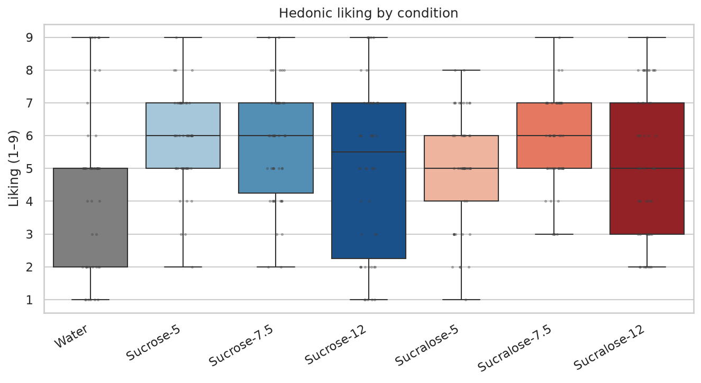
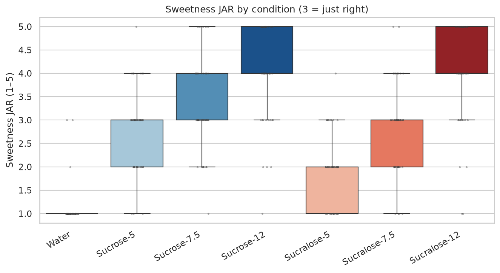
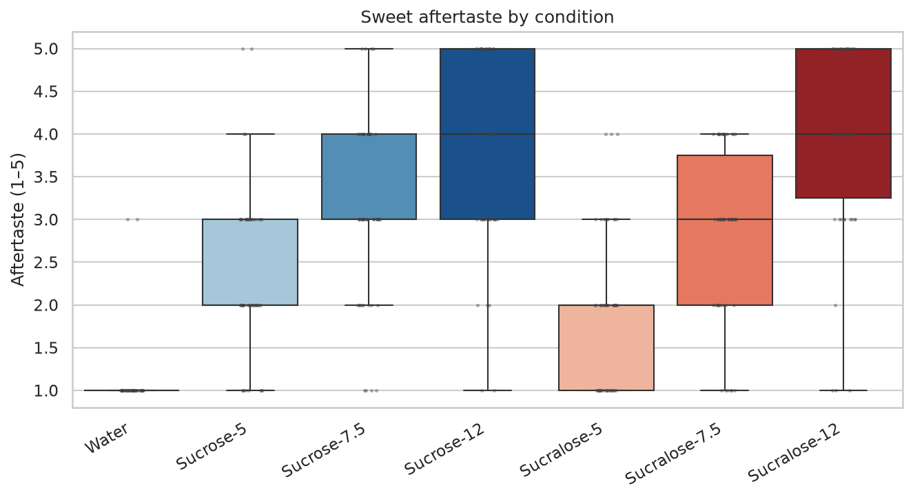
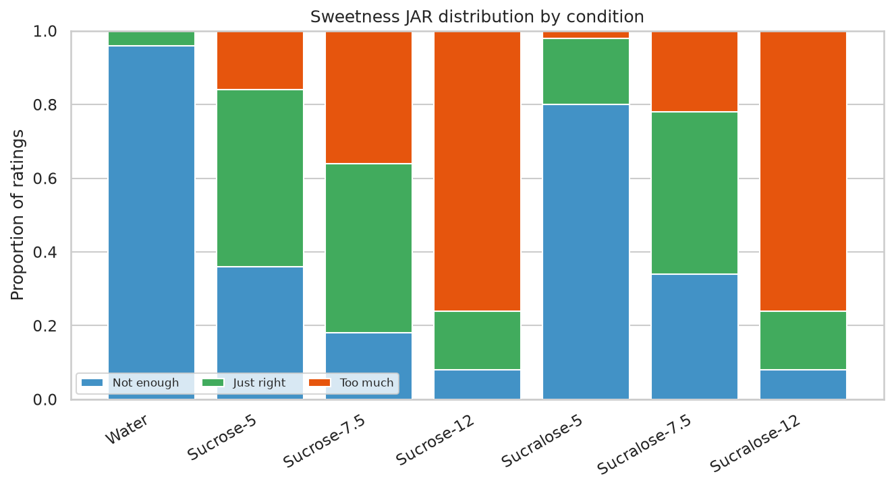
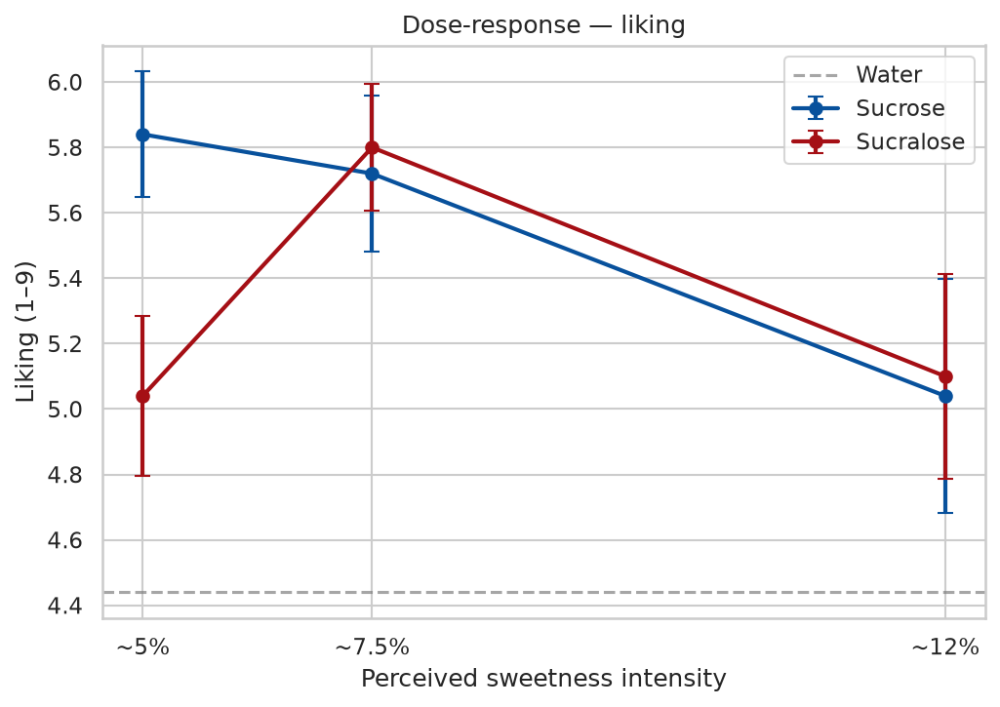
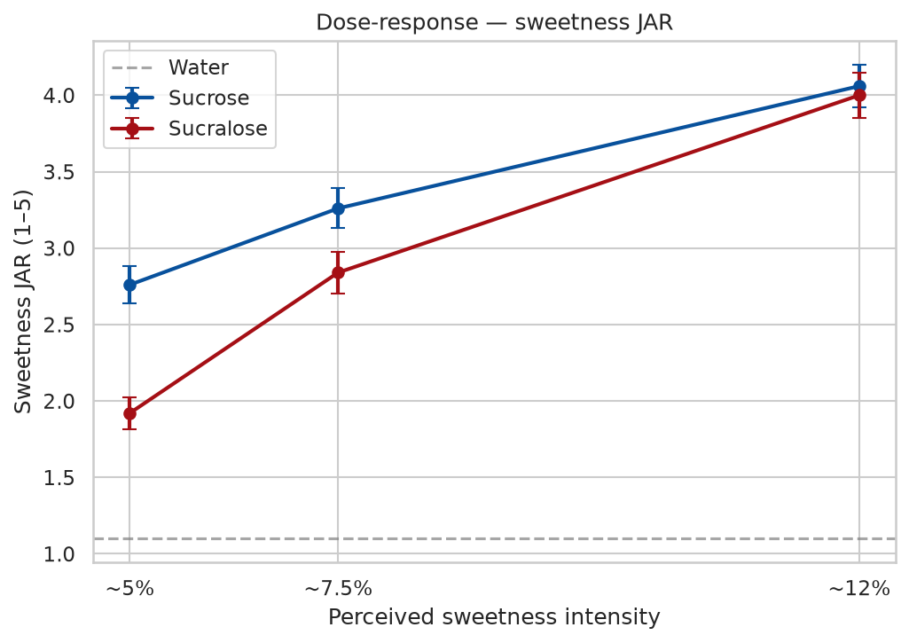
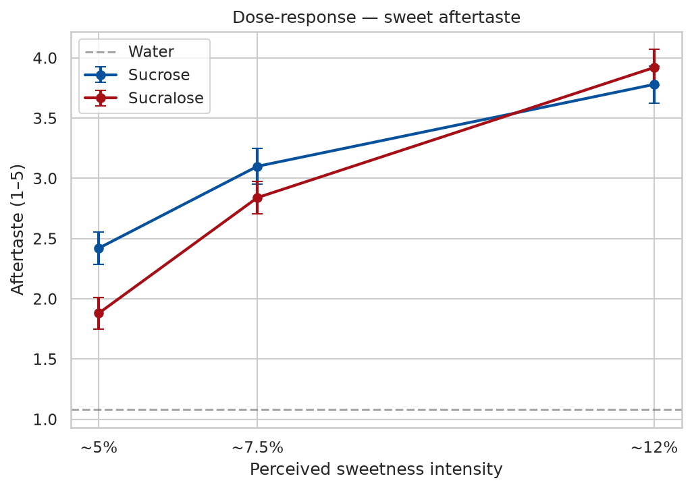
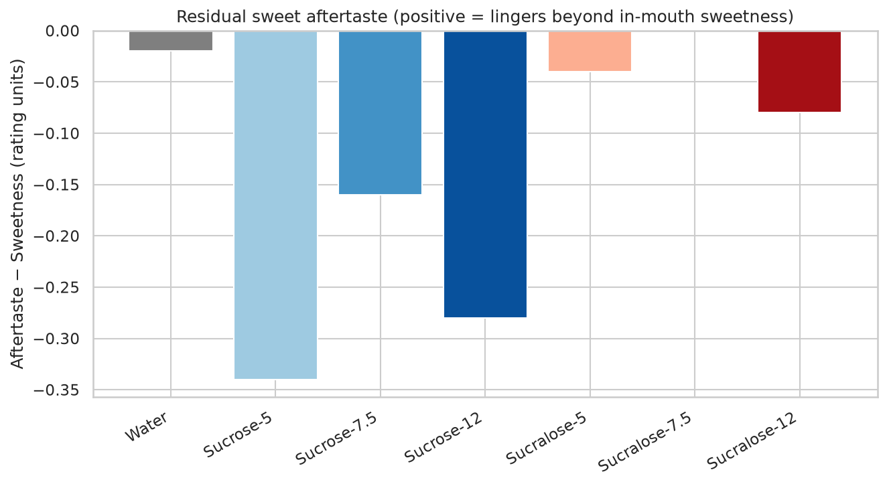

# Stage 01 — Behavioral (Sensory) Analysis

Liking (9-point hedonic), sweetness Just-About-Right (JAR, 1–5, 3 = just right) and sweet aftertaste (1–5) for sucrose (S1) and sucralose (S2) at three iso-sweet intensities (~5 / 7.5 / 12 % sucrose), plus water.

- Participants: **25**, sample ratings: **350**

## Condition summary (mean ± SEM)

| condition     | substance   |   intensity |   n |   liking_mean |   liking_sem |   sweetness_jar_mean |   sweetness_jar_sem |   aftertaste_mean |   aftertaste_sem |
|:--------------|:------------|------------:|----:|--------------:|-------------:|---------------------:|--------------------:|------------------:|-----------------:|
| Sucralose-5   | Sucralose   |           5 |  50 |          5.04 |        0.246 |                 1.92 |               0.106 |              1.88 |            0.13  |
| Sucralose-7.5 | Sucralose   |           7 |  50 |          5.8  |        0.194 |                 2.84 |               0.135 |              2.84 |            0.135 |
| Sucralose-12  | Sucralose   |          12 |  50 |          5.1  |        0.312 |                 4    |               0.146 |              3.92 |            0.151 |
| Sucrose-5     | Sucrose     |           5 |  50 |          5.84 |        0.192 |                 2.76 |               0.12  |              2.42 |            0.134 |
| Sucrose-7.5   | Sucrose     |           7 |  50 |          5.72 |        0.237 |                 3.26 |               0.13  |              3.1  |            0.146 |
| Sucrose-12    | Sucrose     |          12 |  50 |          5.04 |        0.357 |                 4.06 |               0.141 |              3.78 |            0.155 |
| Water         | Water       |           0 |  50 |          4.44 |        0.336 |                 1.1  |               0.059 |              1.08 |            0.056 |

## Liking, sweetness & aftertaste by condition

*Hedonic liking by condition*

*Sweetness JAR by condition*

*Sweet aftertaste by condition*

*JAR category distribution*

## Dose-response (sucrose vs sucralose)

*Liking vs intensity*

*Sweetness JAR vs intensity*

*Aftertaste vs intensity*

## Lingering aftertaste (key sucralose hypothesis)

The residual = *aftertaste − in-mouth sweetness*. A positive value means sweetness persists after expectoration — the lingering aftertaste sucralose is known for.

*Residual sweet aftertaste*

## Sucrose vs sucralose contrasts (paired t-test, FDR-corrected)

**liking**

|   intensity |   n |      t |     p |   mean_sucrose |   mean_sucralose |   mean_diff |   p_fdr |
|------------:|----:|-------:|------:|---------------:|-----------------:|------------:|--------:|
|           5 |  25 |  3.006 | 0.006 |           5.84 |             5.04 |        0.8  |   0.018 |
|           7 |  25 | -0.249 | 0.805 |           5.72 |             5.8  |       -0.08 |   0.82  |
|          12 |  25 | -0.23  | 0.82  |           5.04 |             5.1  |       -0.06 |   0.82  |

**sweetness_jar**

|   intensity |   n |     t |     p |   mean_sucrose |   mean_sucralose |   mean_diff |   p_fdr |
|------------:|----:|------:|------:|---------------:|-----------------:|------------:|--------:|
|           5 |  25 | 6.725 | 0     |           2.76 |             1.92 |        0.84 |   0     |
|           7 |  25 | 2.201 | 0.038 |           3.26 |             2.84 |        0.42 |   0.056 |
|          12 |  25 | 0.405 | 0.689 |           4.06 |             4    |        0.06 |   0.689 |

**aftertaste**

|   intensity |   n |      t |     p |   mean_sucrose |   mean_sucralose |   mean_diff |   p_fdr |
|------------:|----:|-------:|------:|---------------:|-----------------:|------------:|--------:|
|           5 |  25 |  3.674 | 0.001 |           2.42 |             1.88 |        0.54 |   0.004 |
|           7 |  25 |  1.341 | 0.193 |           3.1  |             2.84 |        0.26 |   0.244 |
|          12 |  25 | -1.193 | 0.244 |           3.78 |             3.92 |       -0.14 |   0.244 |

## Two-way repeated-measures ANOVA (substance × intensity)

**liking**

| Source                |     SS |   ddof1 |   ddof2 |    MS |     F |   p_unc |   p_GG_corr |   ng2 |   eps |
|:----------------------|-------:|--------:|--------:|------:|------:|--------:|------------:|------:|------:|
| substance             |  1.815 |       1 |      24 | 1.815 | 0.939 |   0.342 |       0.342 | 0.005 | 1     |
| intensity             | 11.923 |       2 |      48 | 5.962 | 1.581 |   0.216 |       0.222 | 0.03  | 0.643 |
| substance * intensity |  6.31  |       2 |      48 | 3.155 | 5.801 |   0.006 |       0.009 | 0.016 | 0.833 |

**sweetness_jar**

| Source                |    SS |   ddof1 |   ddof2 |     MS |      F |   p_unc |   p_GG_corr |   ng2 |   eps |
|:----------------------|------:|--------:|--------:|-------:|-------:|--------:|------------:|------:|------:|
| substance             |  7.26 |       1 |      24 |  7.26  | 24.633 |   0     |       0     | 0.078 | 1     |
| intensity             | 72.01 |       2 |      48 | 36.005 | 93.892 |   0     |       0     | 0.457 | 0.931 |
| substance * intensity |  3.81 |       2 |      48 |  1.905 |  6.053 |   0.005 |       0.006 | 0.043 | 0.929 |

**aftertaste**

| Source                |     SS |   ddof1 |   ddof2 |     MS |      F |   p_unc |   p_GG_corr |   ng2 |   eps |
|:----------------------|-------:|--------:|--------:|-------:|-------:|--------:|------------:|------:|------:|
| substance             |  1.815 |       1 |      24 |  1.815 |  5.349 |    0.03 |        0.03 | 0.018 | 1     |
| intensity             | 72.28  |       2 |      48 | 36.14  | 62.959 |    0    |        0    | 0.418 | 0.848 |
| substance * intensity |  2.92  |       2 |      48 |  1.46  |  5.098 |    0.01 |        0.01 | 0.028 | 0.986 |
