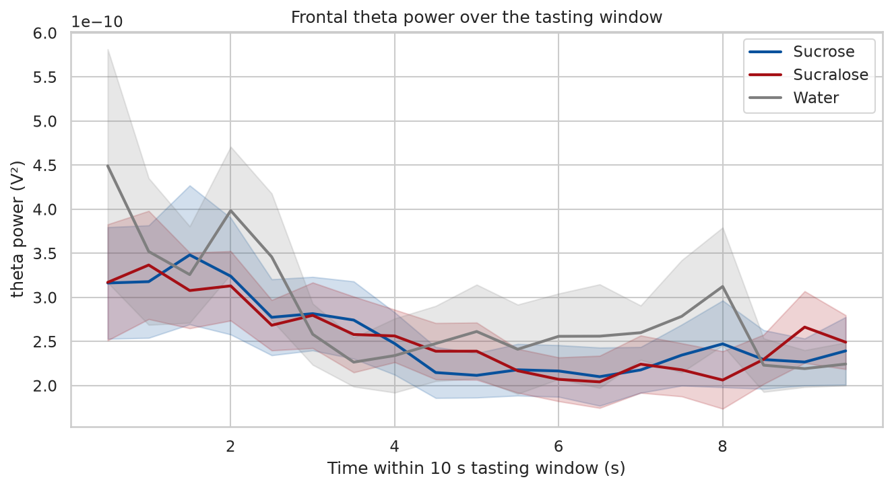
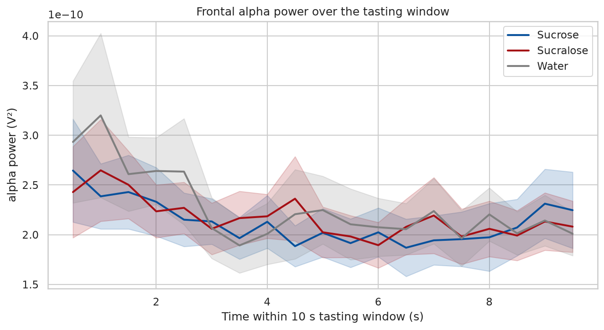
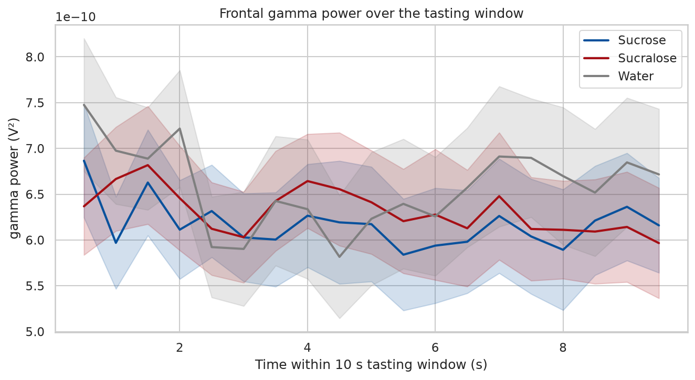
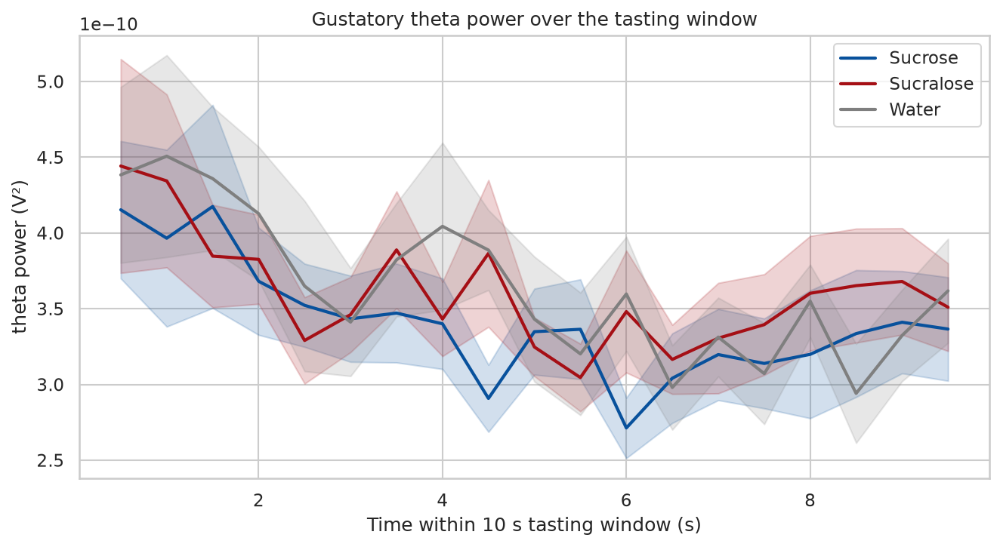
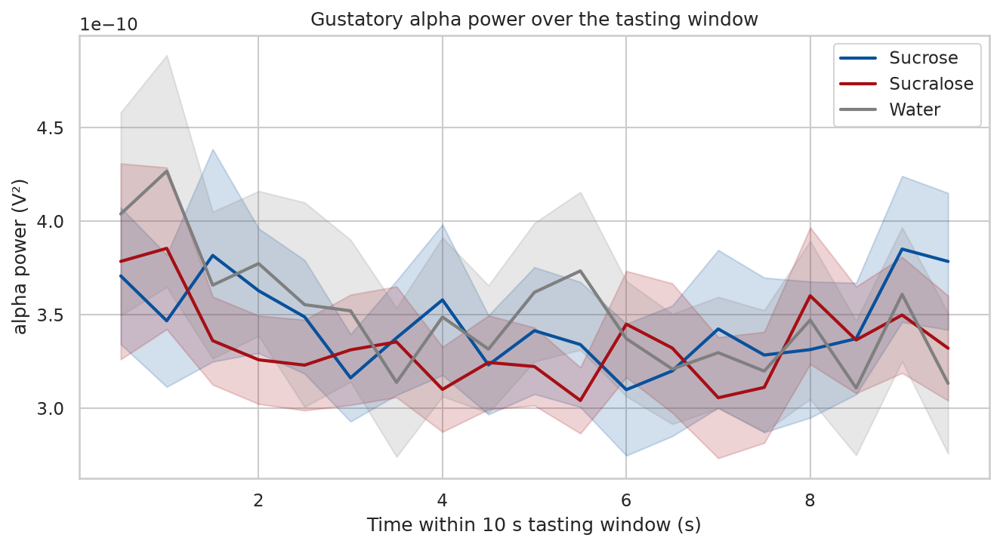
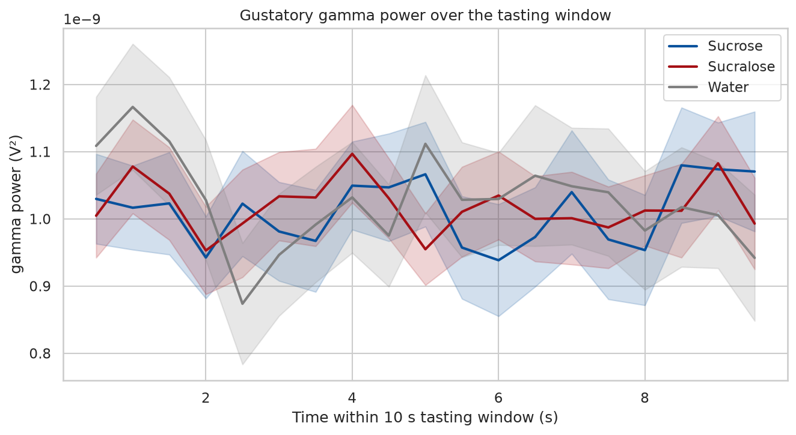
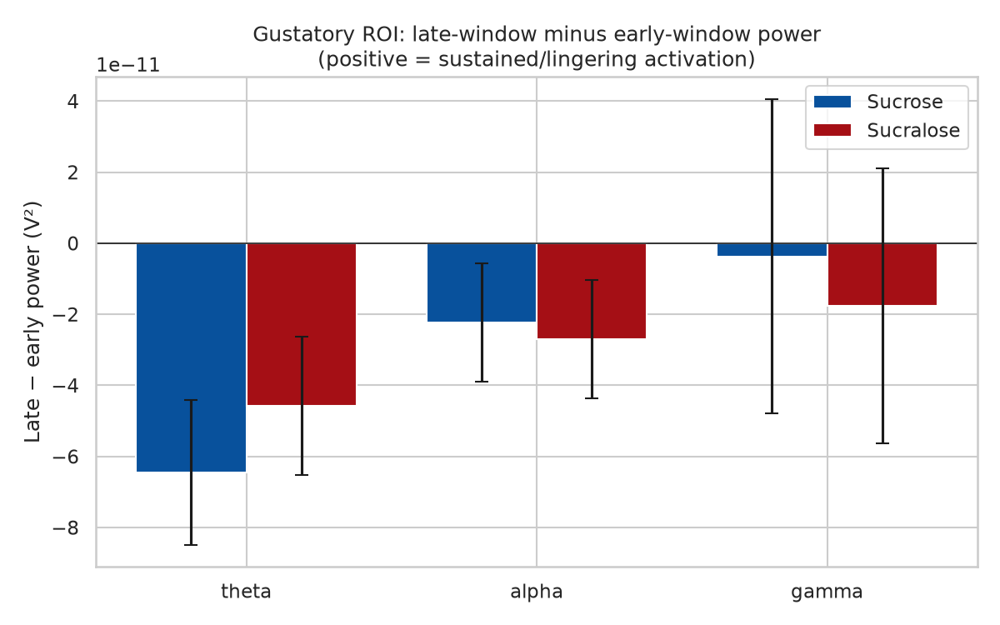
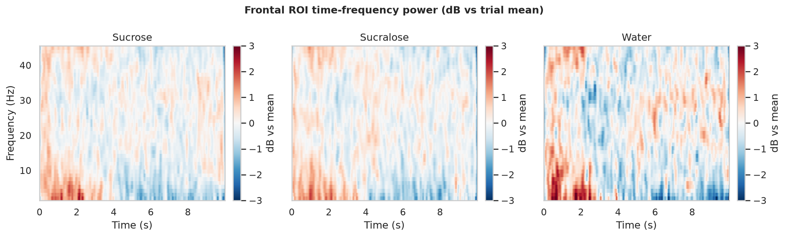

# Stage 04 — Temporal Dynamics & Time-Frequency

Time-resolved band power (1 s windows, 0.5 s step), early ([0.0, 3.0] s) vs late ([6.0, 9.99] s) contrasts in the Gustatory ROI, and Morlet TFR per substance. The late-window contrast probes the *prolonged activation* expected for sucralose's lingering aftertaste.

## Time-resolved band power

*Frontal theta over time*

*Frontal alpha over time*

*Frontal gamma over time*

*Gustatory theta over time*

*Gustatory alpha over time*

*Gustatory gamma over time*

## Aftertaste: late vs early window (Gustatory ROI)

*Late − early power by substance*

Sucrose vs sucralose paired contrasts on *late − early* power:

**theta**

|   intensity |   n |      t |     p |   mean_sucrose |   mean_sucralose |   mean_diff |   p_fdr |
|------------:|----:|-------:|------:|---------------:|-----------------:|------------:|--------:|
|           5 |  23 |  0.115 | 0.909 |      -4.14e-11 |        -4.62e-11 |    4.74e-12 |   0.909 |
|           7 |  23 | -0.351 | 0.729 |      -6.87e-11 |        -5.08e-11 |   -1.8e-11  |   0.909 |
|          12 |  23 | -1.269 | 0.218 |      -8.34e-11 |        -4.03e-11 |   -4.31e-11 |   0.653 |

**alpha**

|   intensity |   n |      t |     p |   mean_sucrose |   mean_sucralose |   mean_diff |   p_fdr |
|------------:|----:|-------:|------:|---------------:|-----------------:|------------:|--------:|
|           5 |  23 | -0.353 | 0.728 |      -1.25e-11 |         3.25e-12 |   -1.57e-11 |   0.868 |
|           7 |  23 |  1.081 | 0.292 |      -1.48e-11 |        -4.96e-11 |    3.48e-11 |   0.868 |
|          12 |  23 | -0.169 | 0.868 |      -3.99e-11 |        -3.45e-11 |   -5.39e-12 |   0.868 |

**gamma**

|   intensity |   n |      t |     p |   mean_sucrose |   mean_sucralose |   mean_diff |   p_fdr |
|------------:|----:|-------:|------:|---------------:|-----------------:|------------:|--------:|
|           5 |  23 |  0.623 | 0.54  |       1.92e-11 |        -4.32e-11 |    6.24e-11 |   0.991 |
|           7 |  23 |  0.012 | 0.991 |      -4.42e-11 |        -4.5e-11  |    7.61e-13 |   0.991 |
|          12 |  23 | -0.322 | 0.75  |       1.4e-11  |         3.53e-11 |   -2.13e-11 |   0.991 |

## Time-frequency (Frontal ROI)

*TFR per substance*

