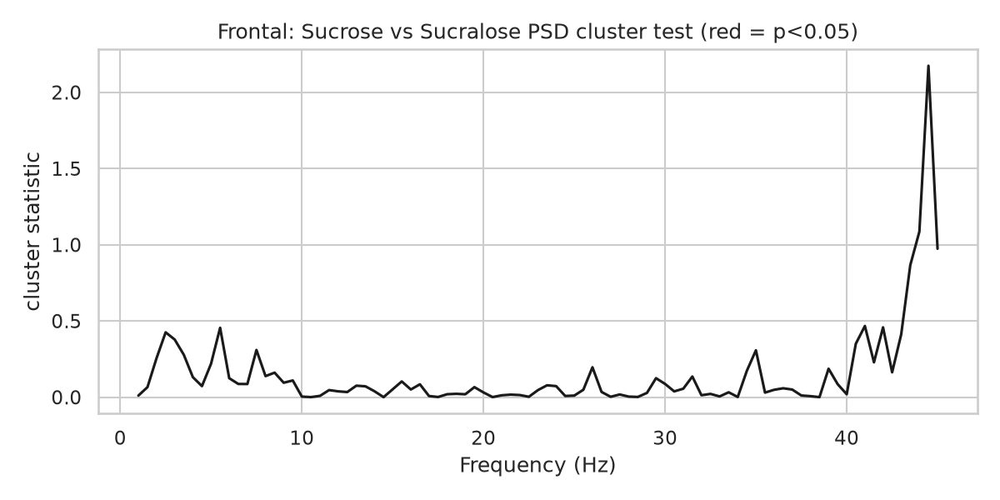
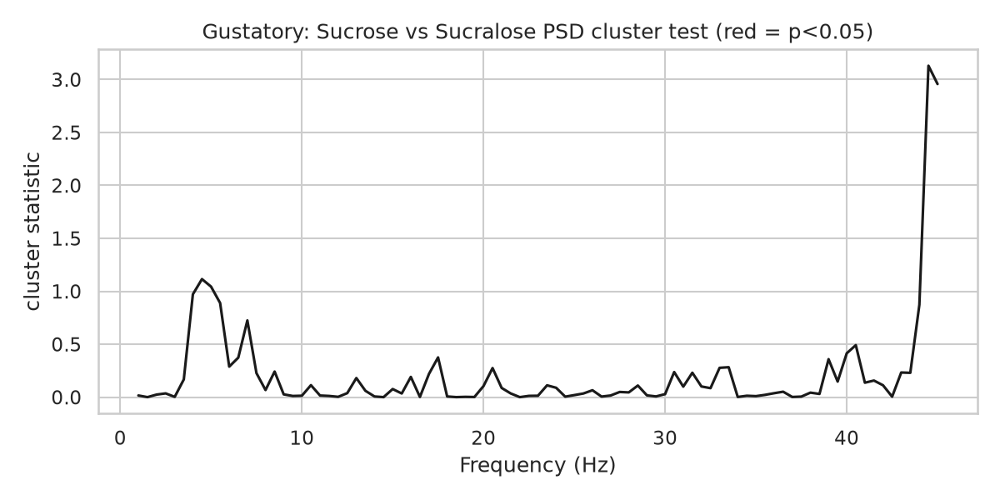

# Stage 05 — Statistics

Two-way repeated-measures ANOVA (substance × intensity, sweet conditions, subjects with complete cells), paired sucrose-vs-sucralose contrasts (FDR-corrected), condition-vs-water tests, and cluster permutation on the ROI PSD.

## rmANOVA p-values per band × ROI (relative power)

| roi       | band   | p_substance   | p_intensity   | p_substance*intensity   |
|:----------|:-------|:--------------|:--------------|:------------------------|
| Frontal   | delta  |               |               |                         |
| Frontal   | theta  |               |               |                         |
| Frontal   | alpha  |               |               |                         |
| Frontal   | beta   |               |               |                         |
| Frontal   | gamma  |               |               |                         |
| Gustatory | delta  |               |               |                         |
| Gustatory | theta  |               |               |                         |
| Gustatory | alpha  |               |               |                         |
| Gustatory | beta   |               |               |                         |
| Gustatory | gamma  |               |               |                         |
| Central   | delta  |               |               |                         |
| Central   | theta  |               |               |                         |
| Central   | alpha  |               |               |                         |
| Central   | beta   |               |               |                         |
| Central   | gamma  |               |               |                         |
| Temporal  | delta  |               |               |                         |
| Temporal  | theta  |               |               |                         |
| Temporal  | alpha  |               |               |                         |
| Temporal  | beta   |               |               |                         |
| Temporal  | gamma  |               |               |                         |
| Parietal  | delta  |               |               |                         |
| Parietal  | theta  |               |               |                         |
| Parietal  | alpha  |               |               |                         |
| Parietal  | beta   |               |               |                         |
| Parietal  | gamma  |               |               |                         |
| Occipital | delta  |               |               |                         |
| Occipital | theta  |               |               |                         |
| Occipital | alpha  |               |               |                         |
| Occipital | beta   |               |               |                         |
| Occipital | gamma  |               |               |                         |

## Sucrose vs sucralose contrasts (relative power)

| roi       | band   |   intensity |   n |      t |     p |   mean_sucrose |   mean_sucralose |   mean_diff |   p_fdr |
|:----------|:-------|------------:|----:|-------:|------:|---------------:|-----------------:|------------:|--------:|
| Frontal   | theta  |           5 |  23 | -2.139 | 0.044 |          0.101 |            0.109 |      -0.008 |   0.131 |
| Frontal   | theta  |           7 |  23 |  0.7   | 0.491 |          0.104 |            0.102 |       0.002 |   0.491 |
| Frontal   | theta  |          12 |  23 |  1.006 | 0.325 |          0.105 |            0.101 |       0.003 |   0.488 |
| Frontal   | alpha  |           5 |  23 |  1.051 | 0.305 |          0.087 |            0.084 |       0.003 |   0.506 |
| Frontal   | alpha  |           7 |  23 |  0.737 | 0.469 |          0.085 |            0.083 |       0.002 |   0.506 |
| Frontal   | alpha  |          12 |  23 |  0.676 | 0.506 |          0.087 |            0.085 |       0.002 |   0.506 |
| Frontal   | gamma  |           5 |  23 |  0.544 | 0.592 |          0.263 |            0.26  |       0.003 |   0.819 |
| Frontal   | gamma  |           7 |  23 | -0.232 | 0.819 |          0.264 |            0.265 |      -0.001 |   0.819 |
| Frontal   | gamma  |          12 |  23 |  0.56  | 0.581 |          0.265 |            0.263 |       0.003 |   0.819 |
| Gustatory | theta  |           5 |  23 | -2.253 | 0.035 |          0.102 |            0.111 |      -0.009 |   0.104 |
| Gustatory | theta  |           7 |  23 |  0.161 | 0.874 |          0.101 |            0.101 |       0.001 |   0.874 |
| Gustatory | theta  |          12 |  23 | -1.233 | 0.231 |          0.101 |            0.105 |      -0.004 |   0.346 |
| Gustatory | alpha  |           5 |  23 |  2.178 | 0.04  |          0.096 |            0.09  |       0.006 |   0.121 |
| Gustatory | alpha  |           7 |  23 |  1.308 | 0.204 |          0.094 |            0.09  |       0.004 |   0.306 |
| Gustatory | alpha  |          12 |  23 |  0.822 | 0.42  |          0.095 |            0.093 |       0.002 |   0.42  |
| Gustatory | gamma  |           5 |  23 |  1.03  | 0.314 |          0.287 |            0.282 |       0.005 |   0.909 |
| Gustatory | gamma  |           7 |  23 | -0.523 | 0.606 |          0.283 |            0.286 |      -0.003 |   0.909 |
| Gustatory | gamma  |          12 |  23 | -0.047 | 0.963 |          0.284 |            0.284 |      -0     |   0.963 |

## Sweet conditions vs water

| roi       | band   | condition   |   n |      t |     p |   mean_diff |   p_fdr |
|:----------|:-------|:------------|----:|-------:|------:|------------:|--------:|
| Frontal   | theta  | S1_5        |  23 | -1.583 | 0.128 |      -0.006 |   0.32  |
| Frontal   | theta  | S1_7        |  23 | -0.7   | 0.491 |      -0.003 |   0.586 |
| Frontal   | theta  | S1_12       |  23 | -0.553 | 0.586 |      -0.002 |   0.586 |
| Frontal   | theta  | S2_5        |  23 |  0.619 | 0.542 |       0.002 |   0.586 |
| Frontal   | theta  | S2_7        |  23 | -1.455 | 0.16  |      -0.005 |   0.32  |
| Frontal   | theta  | S2_12       |  23 | -1.918 | 0.068 |      -0.005 |   0.32  |
| Frontal   | alpha  | S1_5        |  23 |  0.999 | 0.329 |       0.003 |   0.935 |
| Frontal   | alpha  | S1_7        |  23 |  0.37  | 0.715 |       0.001 |   0.935 |
| Frontal   | alpha  | S1_12       |  23 |  1.038 | 0.311 |       0.003 |   0.935 |
| Frontal   | alpha  | S2_5        |  23 | -0.082 | 0.935 |      -0     |   0.935 |
| Frontal   | alpha  | S2_7        |  23 | -0.276 | 0.785 |      -0.001 |   0.935 |
| Frontal   | alpha  | S2_12       |  23 |  0.355 | 0.726 |       0.001 |   0.935 |
| Gustatory | theta  | S1_5        |  23 | -0.787 | 0.44  |      -0.004 |   0.528 |
| Gustatory | theta  | S1_7        |  23 | -0.836 | 0.412 |      -0.004 |   0.528 |
| Gustatory | theta  | S1_12       |  23 | -0.84  | 0.41  |      -0.004 |   0.528 |
| Gustatory | theta  | S2_5        |  23 |  1.699 | 0.103 |       0.006 |   0.528 |
| Gustatory | theta  | S2_7        |  23 | -1.285 | 0.212 |      -0.004 |   0.528 |
| Gustatory | theta  | S2_12       |  23 | -0.026 | 0.979 |      -0     |   0.979 |
| Gustatory | alpha  | S1_5        |  23 |  0.755 | 0.458 |       0.002 |   0.776 |
| Gustatory | alpha  | S1_7        |  23 |  0.063 | 0.95  |       0     |   0.995 |
| Gustatory | alpha  | S1_12       |  23 |  0.658 | 0.517 |       0.002 |   0.776 |
| Gustatory | alpha  | S2_5        |  23 | -1.44  | 0.164 |      -0.003 |   0.492 |
| Gustatory | alpha  | S2_7        |  23 | -1.829 | 0.081 |      -0.004 |   0.486 |
| Gustatory | alpha  | S2_12       |  23 | -0.007 | 0.995 |      -0     |   0.995 |

## Cluster-based permutation tests on PSD

**Frontal** — no significant clusters

*Frontal cluster test*

**Gustatory** — no significant clusters

*Gustatory cluster test*

