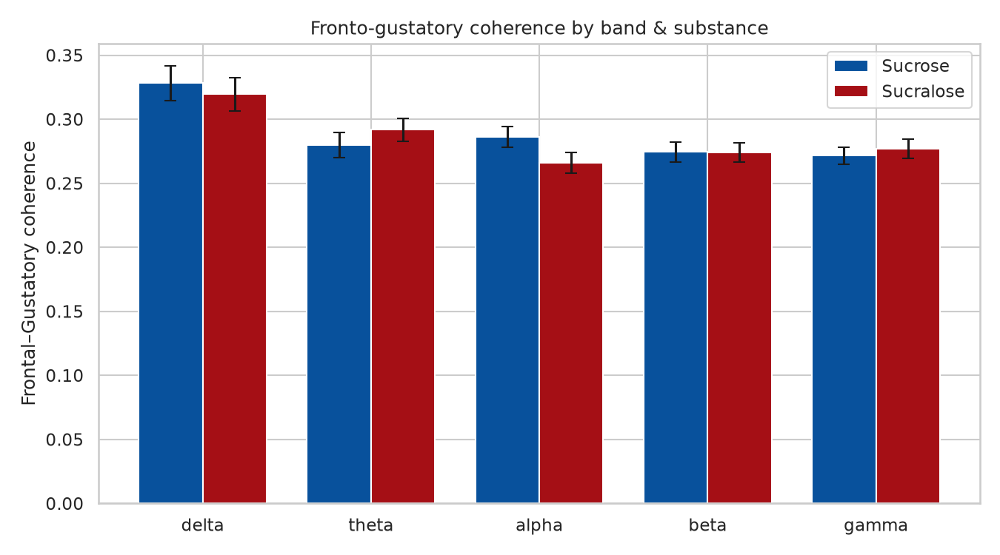

# Stage 07 — Frontal–Gustatory Connectivity (supplementary)

Magnitude-squared coherence between the Frontal ROI (reward/hedonic) and the Gustatory ROI (insular/opercular scalp proxy), per band, sucrose vs sucralose.

*Coherence by band & substance*

## Sucrose vs sucralose coherence contrasts (FDR-corrected)

| band   |   intensity |   n |      t |     p |   mean_sucrose |   mean_sucralose |   mean_diff |   p_fdr |
|:-------|------------:|----:|-------:|------:|---------------:|-----------------:|------------:|--------:|
| delta  |           5 |  23 |  0.394 | 0.697 |          0.324 |            0.315 |       0.009 |   0.719 |
| delta  |           7 |  23 | -0.365 | 0.719 |          0.313 |            0.321 |      -0.008 |   0.719 |
| delta  |          12 |  23 |  0.991 | 0.332 |          0.348 |            0.323 |       0.025 |   0.719 |
| theta  |           5 |  23 | -0.429 | 0.672 |          0.272 |            0.28  |      -0.008 |   0.672 |
| theta  |           7 |  23 | -0.87  | 0.394 |          0.285 |            0.304 |      -0.02  |   0.672 |
| theta  |          12 |  23 | -0.444 | 0.661 |          0.283 |            0.291 |      -0.008 |   0.672 |
| alpha  |           5 |  23 |  3.162 | 0.005 |          0.296 |            0.249 |       0.047 |   0.014 |
| alpha  |           7 |  23 |  0.229 | 0.821 |          0.285 |            0.281 |       0.004 |   0.821 |
| alpha  |          12 |  23 |  0.864 | 0.397 |          0.277 |            0.267 |       0.01  |   0.595 |
| beta   |           5 |  23 |  1.751 | 0.094 |          0.281 |            0.26  |       0.021 |   0.282 |
| beta   |           7 |  23 | -1.18  | 0.251 |          0.271 |            0.286 |      -0.015 |   0.376 |
| beta   |          12 |  23 | -0.469 | 0.644 |          0.272 |            0.276 |      -0.004 |   0.644 |
| gamma  |           5 |  23 |  1.082 | 0.291 |          0.268 |            0.258 |       0.011 |   0.436 |
| gamma  |           7 |  23 | -1.638 | 0.116 |          0.272 |            0.291 |      -0.019 |   0.347 |
| gamma  |          12 |  23 | -0.769 | 0.45  |          0.274 |            0.282 |      -0.008 |   0.45  |
