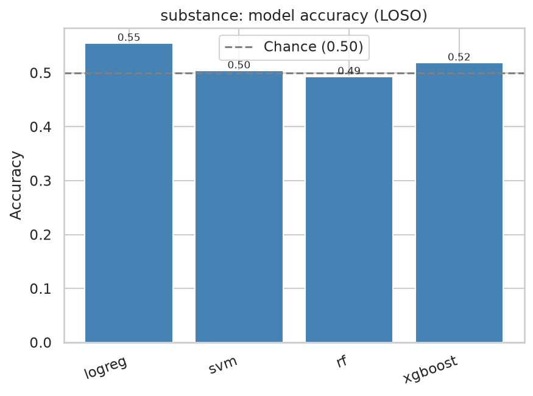
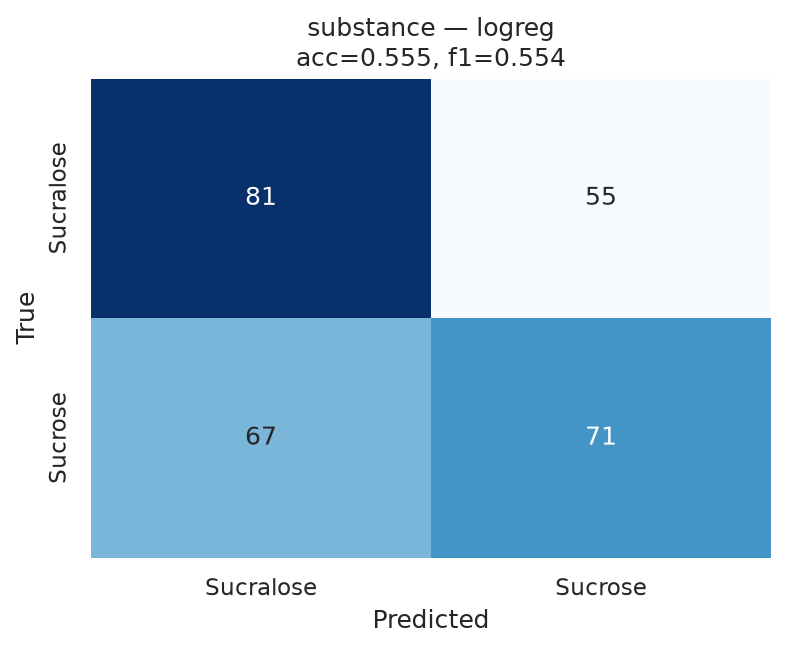
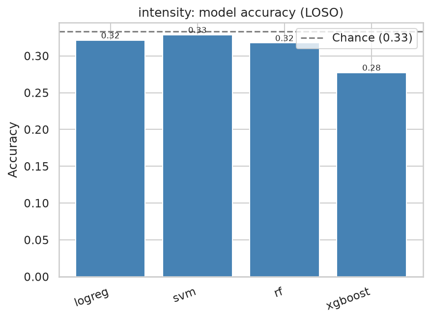
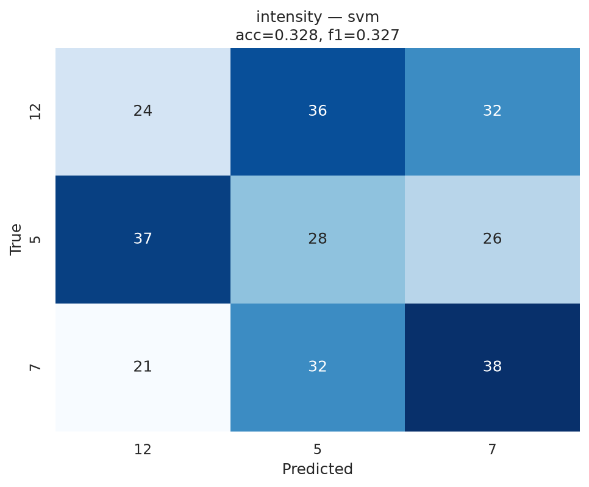

# Stage 08 — Machine-Learning Classification (LOSO)

Features: per-trial relative band power (per channel) + ROI absolute/relative band power. Leave-One-Subject-Out cross-validation; class-balanced models. Chance = 1/n_classes.

## Summary

| task      | model   |   accuracy |   f1_macro |   mean_fold_acc |   std_fold_acc |   chance |
|:----------|:--------|-----------:|-----------:|----------------:|---------------:|---------:|
| substance | logreg  |      0.555 |      0.554 |           0.555 |          0.135 |    0.5   |
| substance | svm     |      0.504 |      0.5   |           0.503 |          0.113 |    0.5   |
| substance | rf      |      0.493 |      0.493 |           0.493 |          0.142 |    0.5   |
| substance | xgboost |      0.518 |      0.518 |           0.518 |          0.145 |    0.5   |
| intensity | logreg  |      0.321 |      0.322 |           0.321 |          0.111 |    0.333 |
| intensity | svm     |      0.328 |      0.327 |           0.328 |          0.114 |    0.333 |
| intensity | rf      |      0.318 |      0.316 |           0.317 |          0.08  |    0.333 |
| intensity | xgboost |      0.277 |      0.278 |           0.278 |          0.093 |    0.333 |

## Task: substance  (classes = ['Sucralose', 'Sucrose'], n_trials = 274, chance = 0.50)

*substance model accuracy*

*Best model (logreg) confusion matrix*

## Task: intensity  (classes = ['12', '5', '7'], n_trials = 274, chance = 0.33)

*intensity model accuracy*

*Best model (svm) confusion matrix*

