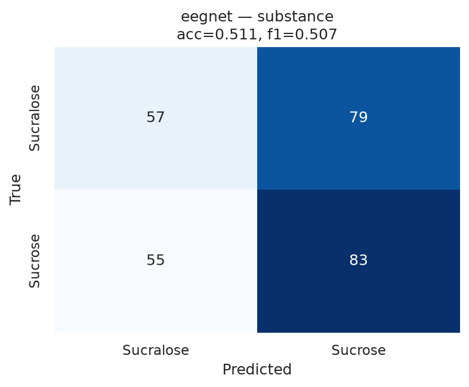
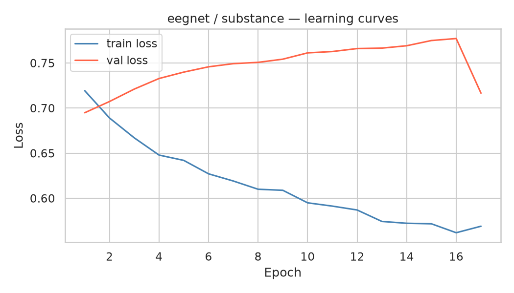
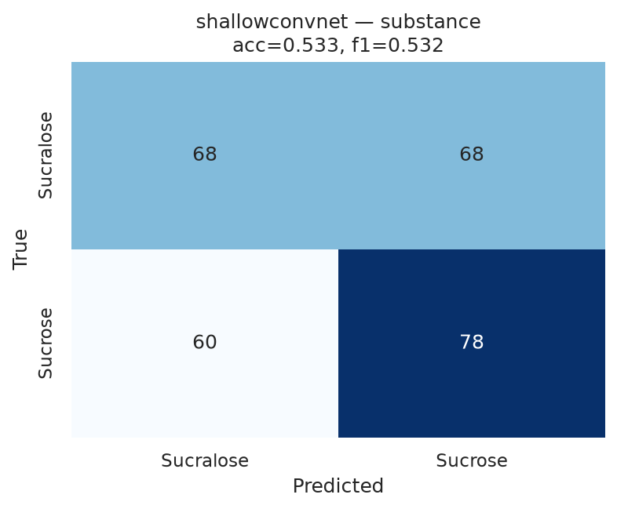
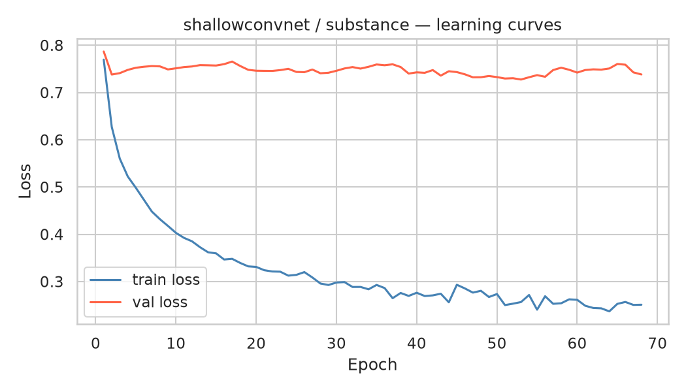
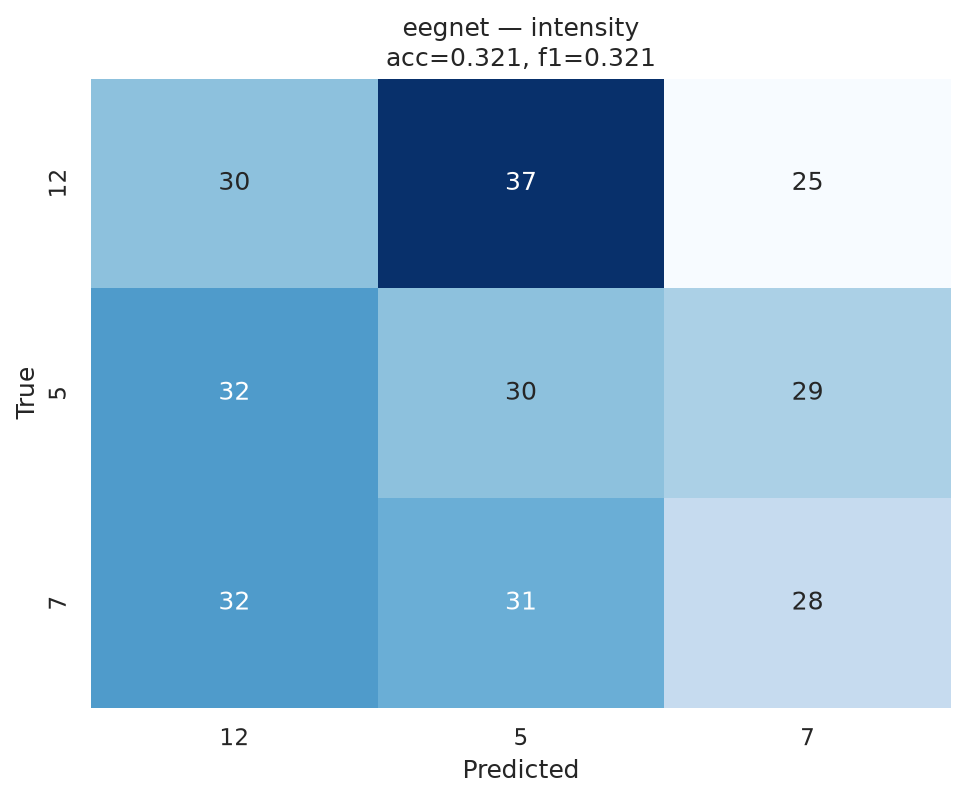
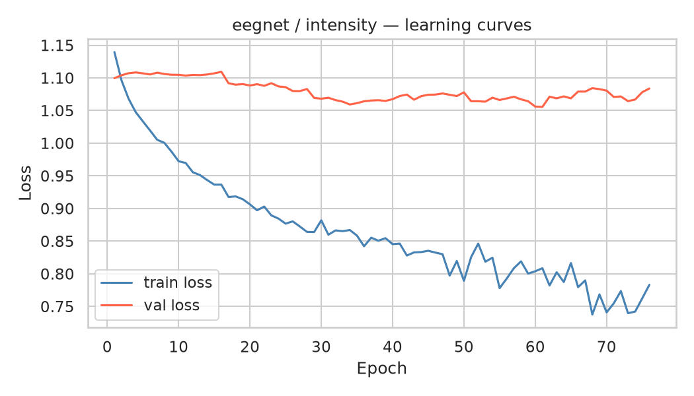
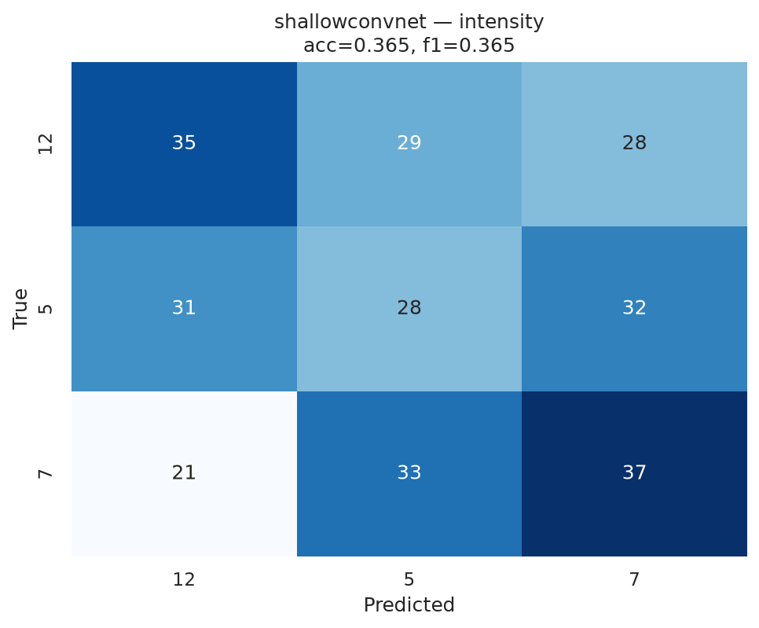
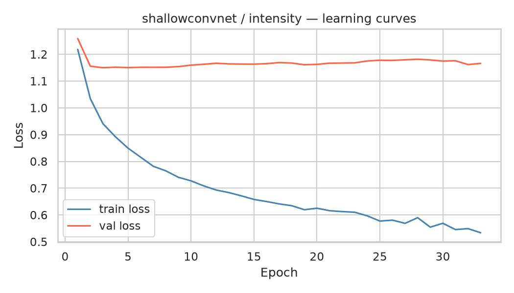

# Stage 09 — Deep-Learning Classification (LOSO)

Input: raw 10 s epochs (16 channels × 1000 samples), per-fold channel standardisation, early stopping on a held-out validation split. Models: EEGNet, ShallowConvNet.

## Summary

| task      | model          |   accuracy |   f1_macro |   mean_fold_acc |   std_fold_acc |   chance |
|:----------|:---------------|-----------:|-----------:|----------------:|---------------:|---------:|
| substance | eegnet         |      0.511 |      0.507 |           0.512 |          0.122 |    0.5   |
| substance | shallowconvnet |      0.533 |      0.532 |           0.533 |          0.116 |    0.5   |
| intensity | eegnet         |      0.321 |      0.321 |           0.322 |          0.153 |    0.333 |
| intensity | shallowconvnet |      0.365 |      0.365 |           0.366 |          0.111 |    0.333 |

## substance — eegnet (acc=0.511, chance=0.50)

*Confusion matrix*

*Learning curves*

## substance — shallowconvnet (acc=0.533, chance=0.50)

*Confusion matrix*

*Learning curves*

## intensity — eegnet (acc=0.321, chance=0.33)

*Confusion matrix*

*Learning curves*

## intensity — shallowconvnet (acc=0.365, chance=0.33)

*Confusion matrix*

*Learning curves*

