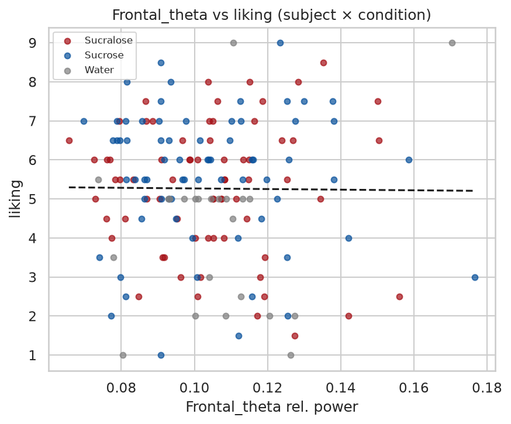
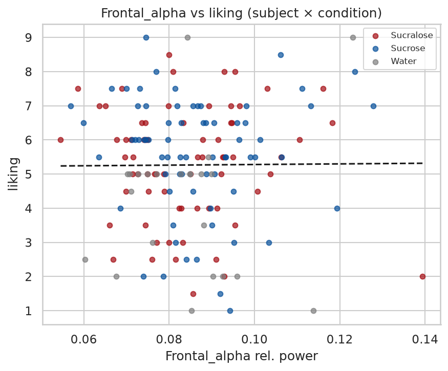
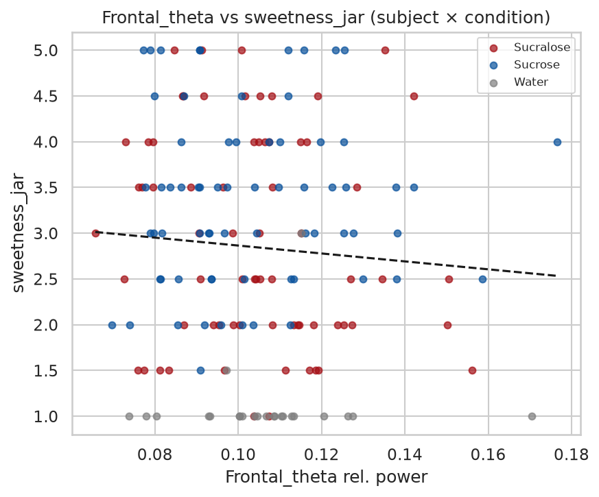
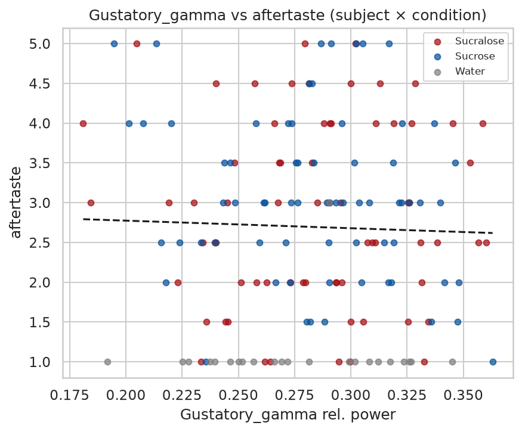

# Stage 10 — EEG ↔ Behavior Correlation

Frontal θ/α and gustatory γ relative power linked to liking, sweetness JAR and sweet aftertaste. EEG↔behavior join: PXXX ↔ Excel id XXX. Joined **23/23** EEG subjects.

## Correlation table

| eeg_metric      | behavior      | level           |   n |      r |     p |
|:----------------|:--------------|:----------------|----:|-------:|------:|
| Frontal_theta   | liking        | within_subject  | 161 | -0.009 | 0.91  |
| Frontal_theta   | sweetness_jar | within_subject  | 161 | -0.071 | 0.37  |
| Frontal_theta   | aftertaste    | within_subject  | 161 | -0.076 | 0.336 |
| Frontal_alpha   | liking        | within_subject  | 161 |  0.007 | 0.927 |
| Frontal_alpha   | sweetness_jar | within_subject  | 161 | -0.028 | 0.725 |
| Frontal_alpha   | aftertaste    | within_subject  | 161 | -0.003 | 0.972 |
| Gustatory_gamma | liking        | within_subject  | 161 |  0.14  | 0.077 |
| Gustatory_gamma | sweetness_jar | within_subject  | 161 | -0.05  | 0.533 |
| Gustatory_gamma | aftertaste    | within_subject  | 161 | -0.031 | 0.693 |
| Frontal_theta   | liking        | group_condition |   7 | -0.626 | 0.133 |
| Frontal_theta   | sweetness_jar | group_condition |   7 | -0.594 | 0.159 |
| Frontal_theta   | aftertaste    | group_condition |   7 | -0.573 | 0.178 |
| Frontal_alpha   | liking        | group_condition |   7 |  0.246 | 0.595 |
| Frontal_alpha   | sweetness_jar | group_condition |   7 |  0.544 | 0.207 |
| Frontal_alpha   | aftertaste    | group_condition |   7 |  0.442 | 0.321 |
| Gustatory_gamma | liking        | group_condition |   7 |  0.825 | 0.022 |
| Gustatory_gamma | sweetness_jar | group_condition |   7 |  0.67  | 0.1   |
| Gustatory_gamma | aftertaste    | group_condition |   7 |  0.638 | 0.123 |

## Headline scatter plots

*Frontal_theta vs liking*

*Frontal_alpha vs liking*

*Frontal_theta vs sweetness_jar*

*Gustatory_gamma vs aftertaste*

