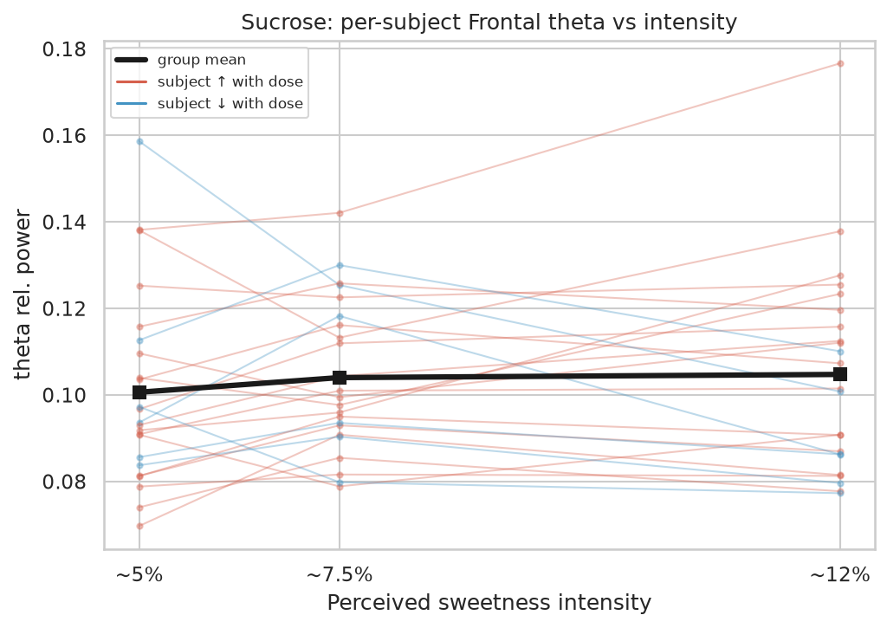
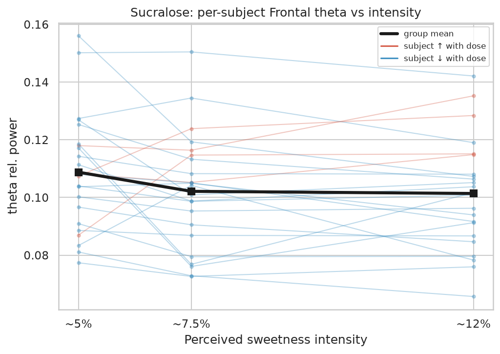
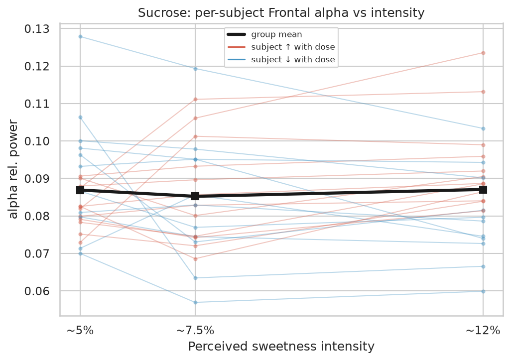
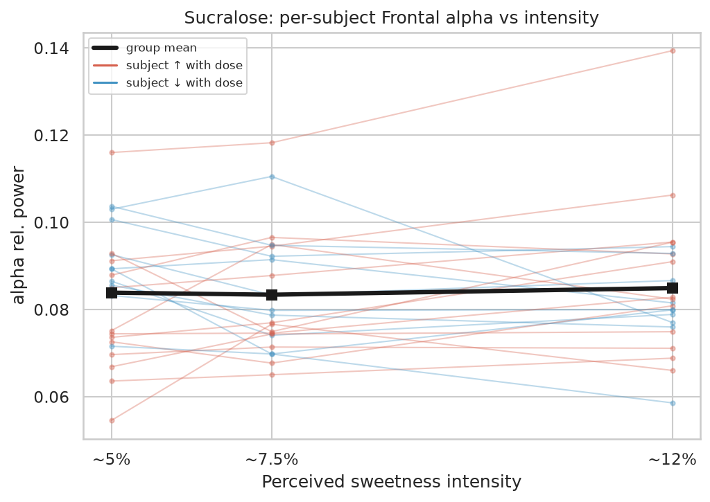
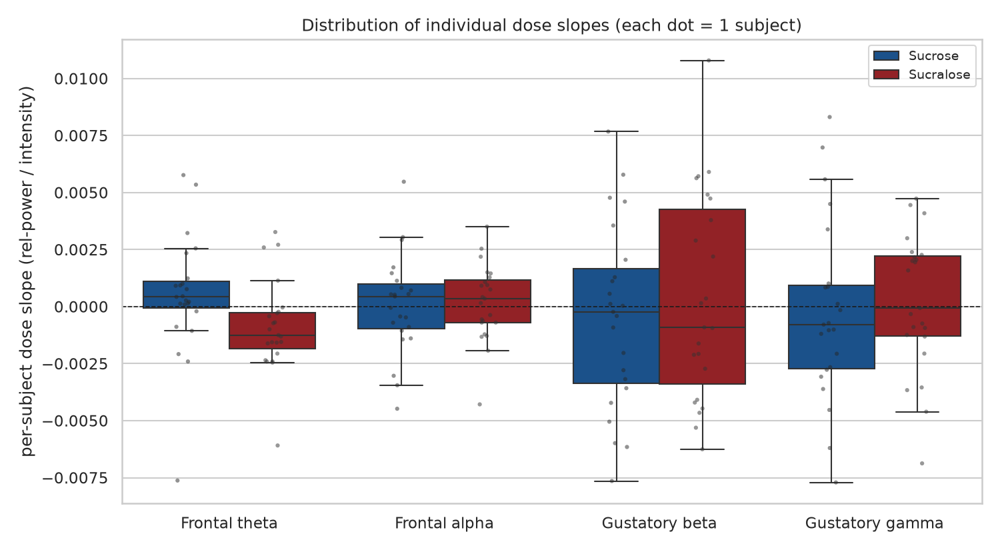
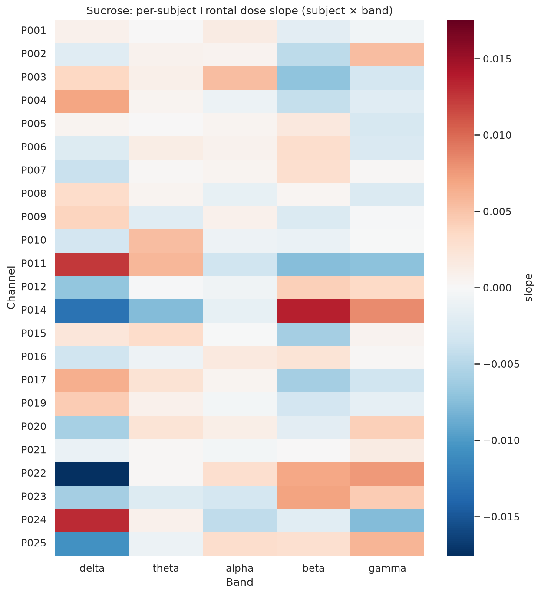
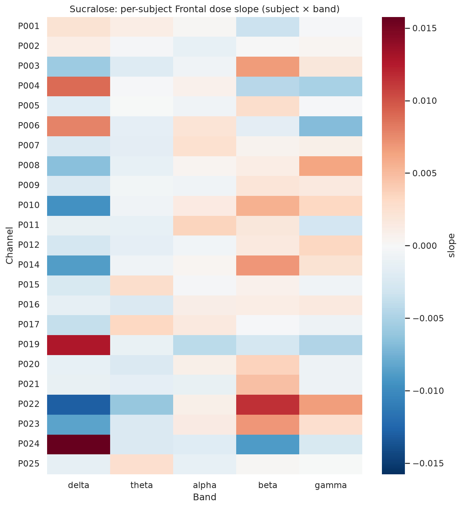
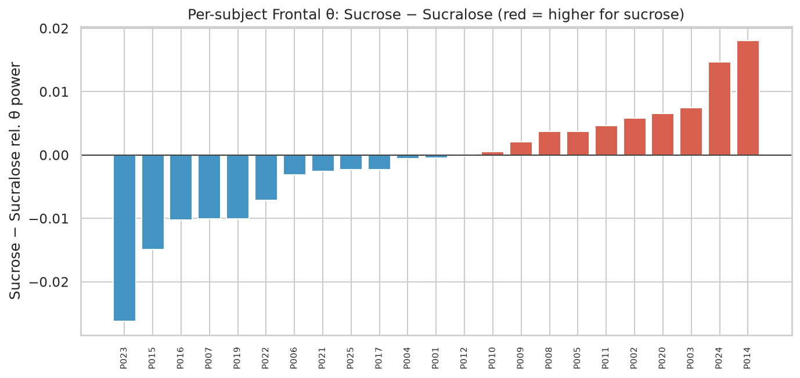
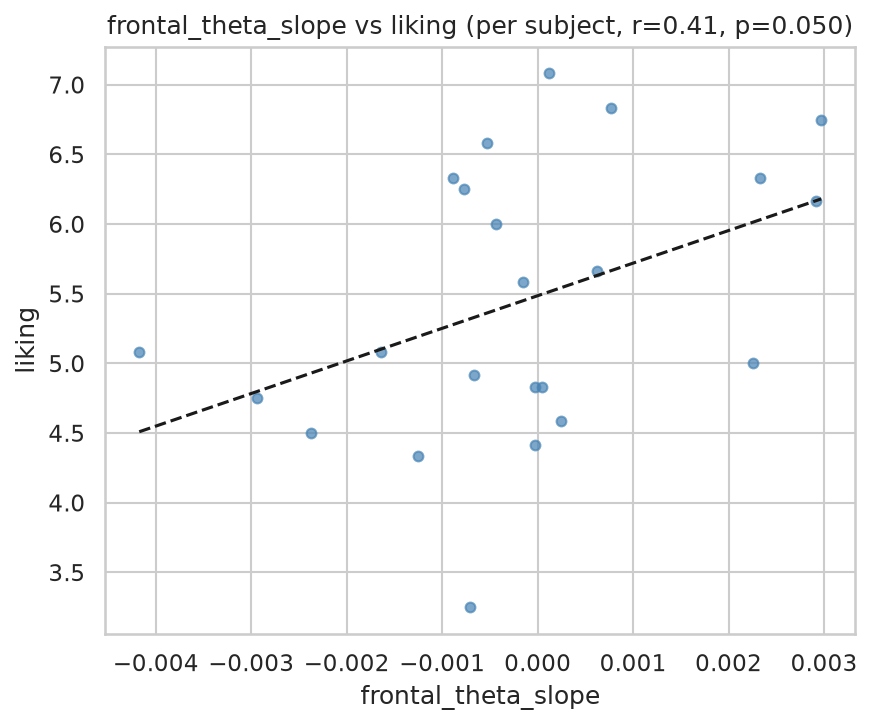

# Stage 12 — Individual (per-subject) analysis & insights

Group means hide individual variability. Here every subject stays visible: individual dose trajectories, the spread of per-subject dose slopes, responder sub-groups, individual substance preference, and whether a person's EEG dose response tracks their own ratings.

## Key insights

- **23 subjects** analysed individually; each contributes one dose slope per ROI × band × substance.

- **Frontal theta, Sucrose**: 17/23 subjects rise with concentration (6 opposite); mean slope +5.04e-04 (one-sample t=0.91, p=0.371). Direction is *not* consistent across people — the group effect is driven by a subset / cancels out.

- **Frontal theta, Sucralose**: 19/23 subjects fall with concentration (4 opposite); mean slope -8.80e-04 (one-sample t=-2.11, p=0.046). **Consistent across subjects.**

- **Frontal alpha, Sucrose**: 12/23 subjects rise with concentration (11 opposite); mean slope +8.67e-05 (one-sample t=0.19, p=0.850). Direction is *not* consistent across people — the group effect is driven by a subset / cancels out.

- **Frontal alpha, Sucralose**: 13/23 subjects rise with concentration (10 opposite); mean slope +1.79e-04 (one-sample t=0.51, p=0.612). Direction is *not* consistent across people — the group effect is driven by a subset / cancels out.

- **Strongest Frontal-θ Sucralose responders**: P022 (-6.09e-03), P017 (+3.27e-03), P015 (+2.71e-03).

- **Substance preference (Frontal θ)**: 10/23 subjects show higher θ for sucrose, 13 for sucralose — no single substance dominates at the individual level.

- **Individual EEG↔behaviour**: strongest link is frontal_theta_slope vs liking (r=+0.41, p=0.050, n=23) — not significant. Subjects whose frontal θ responds more to dose do tend to differ in their ratings.

## Individual dose trajectories (frontal θ / α)

Each thin line is one subject (red = power rises with dose, blue = falls); the black line is the group mean.

*Sucrose — Frontal theta per-subject trajectories*

*Sucralose — Frontal theta per-subject trajectories*

*Sucrose — Frontal alpha per-subject trajectories*

*Sucralose — Frontal alpha per-subject trajectories*

## Distribution of individual dose slopes

*Each dot = one subject. Spread crossing zero ⇒ subjects disagree in direction.*

## Responder sub-groups (subject × band slope)

*Sucrose: per-subject Frontal dose slope by band*

*Sucralose: per-subject Frontal dose slope by band*

## Individual substance preference (Frontal θ)

*Sucrose − Sucralose frontal θ per subject (sorted)*

## Individual EEG ↔ behaviour

| eeg_metric          | behavior      |   n |      r |     p |
|:--------------------|:--------------|----:|-------:|------:|
| frontal_theta_slope | liking        |  23 |  0.413 | 0.05  |
| frontal_theta_slope | sweetness_jar |  23 | -0.122 | 0.58  |
| frontal_theta_slope | aftertaste    |  23 | -0.088 | 0.689 |
| frontal_theta_pref  | liking        |  23 |  0.108 | 0.625 |
| frontal_theta_pref  | sweetness_jar |  23 | -0.247 | 0.256 |
| frontal_theta_pref  | aftertaste    |  23 | -0.101 | 0.646 |

*Strongest per-subject EEG↔behaviour link*

