# Neural Signatures of Sweetness Perception — Sucrose vs Sucralose (EEG)

*Self-contained analysis of the `data/datamoi/` recordings. Generated by the
`sweetness_eeg/` pipeline; legacy `pipeline/` and `src/` code is untouched.*

## Overview

Twenty-three participants tasted sucrose (S1) and sucralose (S2) at three iso-sweet
intensities (~5 / 7.5 / 12 % sucrose-equivalent) plus water, each presented twice for
10 s while 16-channel EEG (100 Hz) was recorded. This report reproduces the analyses
of the reference protocol — power spectral density of the five canonical bands
(δ, θ, α, β, γ) over **frontal** (reward/hedonic) and **gustatory** (insular/opercular
scalp-proxy) regions in both **time and frequency** domains, EEG **topographies**, the
contrast between **sucralose and sucrose**, the modulation of **frontal θ/α** by
sweetness intensity, and the **prolonged activation** linked to sucralose's lingering
aftertaste — and adds machine-/deep-learning classification, fronto-gustatory
connectivity, and EEG↔behaviour correlation.

## Sample mapping

| Label | Substance | Perceived intensity | Blind codes |
|:------|:----------|:--------------------|:------------|
| S1_5 / S1_7 / S1_12 | Sucrose | ~5 / 7.5 / 12 % | 119,452 / 781,299 / 873,777 |
| S2_5 / S2_7 / S2_12 | Sucralose | iso-sweet to 5 / 7.5 / 12 % | 563,453 / 336,122 / 257,644 |
| H2O | Water | baseline | 681, 575 |

## Methods (summary)

- **Loading**: robust to mixed CSV delimiters/decimals; channels T3/T4/T5/T6 renamed to
  T7/T8/P7/P8 (10-20 montage); µV → V.
- **Preprocessing**: average reference → 49 Hz notch → 0.5–45 Hz band-pass; 1000 µV
  peak-to-peak trial rejection.
- **Spectral**: Welch PSD (2 s, 50 % overlap); absolute & relative band power; ROI
  aggregation; Morlet TFR; sliding-window time-resolved power.
- **Statistics**: two-way rmANOVA (substance × intensity), FDR-corrected paired
  contrasts, cluster-based permutation on PSD.
- **Decoding**: LOSO cross-validation for ML (band-power features) and DL (raw epochs).

---

# Stage 01 — Behavioral (Sensory) Analysis

Liking (9-point hedonic), sweetness Just-About-Right (JAR, 1–5, 3 = just right) and sweet aftertaste (1–5) for sucrose (S1) and sucralose (S2) at three iso-sweet intensities (~5 / 7.5 / 12 % sucrose), plus water.

- Participants: **23**, sample ratings: **322**

## Condition summary (mean ± SEM)

| condition     | substance   |   intensity |   n |   liking_mean |   liking_sem |   sweetness_jar_mean |   sweetness_jar_sem |   aftertaste_mean |   aftertaste_sem |
|:--------------|:------------|------------:|----:|--------------:|-------------:|---------------------:|--------------------:|------------------:|-----------------:|
| Sucralose-5   | Sucralose   |           5 |  46 |         5.022 |        0.259 |                1.891 |               0.109 |             1.826 |            0.129 |
| Sucralose-7.5 | Sucralose   |           7 |  46 |         5.804 |        0.203 |                2.87  |               0.141 |             2.848 |            0.139 |
| Sucralose-12  | Sucralose   |          12 |  46 |         5.065 |        0.335 |                4     |               0.158 |             3.913 |            0.164 |
| Sucrose-5     | Sucrose     |           5 |  46 |         5.87  |        0.198 |                2.783 |               0.124 |             2.413 |            0.141 |
| Sucrose-7.5   | Sucrose     |           7 |  46 |         5.826 |        0.243 |                3.217 |               0.135 |             3.022 |            0.151 |
| Sucrose-12    | Sucrose     |          12 |  46 |         5.065 |        0.375 |                4.065 |               0.15  |             3.761 |            0.165 |
| Water         | Water       |           0 |  46 |         4.217 |        0.342 |                1.109 |               0.064 |             1.087 |            0.061 |

## Liking, sweetness & aftertaste by condition

*Hedonic liking by condition*

*Sweetness JAR by condition*

*Sweet aftertaste by condition*

*JAR category distribution*

## Dose-response (sucrose vs sucralose)

*Liking vs intensity*

*Sweetness JAR vs intensity*

*Aftertaste vs intensity*

## Lingering aftertaste (key sucralose hypothesis)

The residual = *aftertaste − in-mouth sweetness*. A positive value means sweetness persists after expectoration — the lingering aftertaste sucralose is known for.

*Residual sweet aftertaste*

## Sucrose vs sucralose contrasts (paired t-test, FDR-corrected)

**liking**

|   intensity |   n |     t |     p |   mean_sucrose |   mean_sucralose |   mean_diff |   p_fdr |
|------------:|----:|------:|------:|---------------:|-----------------:|------------:|--------:|
|           5 |  23 | 2.953 | 0.007 |          5.87  |            5.022 |       0.848 |   0.022 |
|           7 |  23 | 0.064 | 0.949 |          5.826 |            5.804 |       0.022 |   1     |
|          12 |  23 | 0     | 1     |          5.065 |            5.065 |       0     |   1     |

**sweetness_jar**

|   intensity |   n |     t |     p |   mean_sucrose |   mean_sucralose |   mean_diff |   p_fdr |
|------------:|----:|------:|------:|---------------:|-----------------:|------------:|--------:|
|           5 |  23 | 6.886 | 0     |          2.783 |            1.891 |       0.891 |   0     |
|           7 |  23 | 1.785 | 0.088 |          3.217 |            2.87  |       0.348 |   0.132 |
|          12 |  23 | 0.412 | 0.684 |          4.065 |            4     |       0.065 |   0.684 |

**aftertaste**

|   intensity |   n |      t |     p |   mean_sucrose |   mean_sucralose |   mean_diff |   p_fdr |
|------------:|----:|-------:|------:|---------------:|-----------------:|------------:|--------:|
|           5 |  23 |  3.839 | 0.001 |          2.413 |            1.826 |       0.587 |   0.003 |
|           7 |  23 |  0.89  | 0.383 |          3.022 |            2.848 |       0.174 |   0.383 |
|          12 |  23 | -1.232 | 0.231 |          3.761 |            3.913 |      -0.152 |   0.346 |

## Two-way repeated-measures ANOVA (substance × intensity)

**liking**

| Source                |     SS |   ddof1 |   ddof2 |    MS |     F |   p_unc |   p_GG_corr |   ng2 |   eps |
|:----------------------|-------:|--------:|--------:|------:|------:|--------:|------------:|------:|------:|
| substance             |  2.899 |       1 |      22 | 2.899 | 1.474 |   0.238 |       0.238 | 0.008 | 1     |
| intensity             | 12.938 |       2 |      44 | 6.469 | 1.625 |   0.208 |       0.216 | 0.034 | 0.64  |
| substance * intensity |  5.373 |       2 |      44 | 2.687 | 4.784 |   0.013 |       0.02  | 0.014 | 0.801 |

**sweetness_jar**

| Source                |     SS |   ddof1 |   ddof2 |     MS |      F |   p_unc |   p_GG_corr |   ng2 |   eps |
|:----------------------|-------:|--------:|--------:|-------:|-------:|--------:|------------:|------:|------:|
| substance             |  6.522 |       1 |      22 |  6.522 | 22.732 |   0     |       0     | 0.074 | 1     |
| intensity             | 66.743 |       2 |      44 | 33.371 | 87.191 |   0     |       0     | 0.45  | 0.913 |
| substance * intensity |  4.054 |       2 |      44 |  2.027 |  6.434 |   0.004 |       0.005 | 0.047 | 0.889 |

**aftertaste**

| Source                |     SS |   ddof1 |   ddof2 |     MS |      F |   p_unc |   p_GG_corr |   ng2 |   eps |
|:----------------------|-------:|--------:|--------:|-------:|-------:|--------:|------------:|------:|------:|
| substance             |  1.42  |       1 |      22 |  1.42  |  4.466 |   0.046 |       0.046 | 0.015 | 1     |
| intensity             | 67.895 |       2 |      44 | 33.947 | 58.911 |   0     |       0     | 0.42  | 0.842 |
| substance * intensity |  3.156 |       2 |      44 |  1.578 |  5.587 |   0.007 |       0.007 | 0.033 | 0.996 |

# Stage 02 — Preprocessing & Epoching

Pipeline: pick 16 EEG channels (T3/T4/T5/T6 → T7/T8/P7/P8) → average reference → notch 49 Hz → band-pass 0.5–45 Hz. Each trial = 10 s tasting window (1000 samples @ 100 Hz). Peak-to-peak rejection: 1000 µV.

- Subjects with usable epochs: **23**
- Total epochs: **320** (max possible = 322)

## Epochs kept per subject × condition

| subject   |   Water |   Sucrose-5 |   Sucrose-7.5 |   Sucrose-12 |   Sucralose-5 |   Sucralose-7.5 |   Sucralose-12 |   total |
|:----------|--------:|------------:|--------------:|-------------:|--------------:|----------------:|---------------:|--------:|
| P001      |       2 |           2 |             2 |            2 |             2 |               2 |              2 |      14 |
| P002      |       2 |           2 |             2 |            2 |             2 |               2 |              2 |      14 |
| P003      |       2 |           2 |             2 |            2 |             2 |               2 |              2 |      14 |
| P004      |       2 |           2 |             2 |            2 |             2 |               2 |              2 |      14 |
| P005      |       2 |           2 |             2 |            2 |             2 |               2 |              2 |      14 |
| P006      |       2 |           2 |             2 |            2 |             2 |               2 |              2 |      14 |
| P007      |       2 |           2 |             2 |            2 |             2 |               2 |              2 |      14 |
| P008      |       2 |           2 |             2 |            2 |             2 |               2 |              2 |      14 |
| P009      |       2 |           2 |             2 |            2 |             2 |               2 |              2 |      14 |
| P010      |       2 |           2 |             2 |            2 |             2 |               2 |              2 |      14 |
| P011      |       2 |           2 |             2 |            2 |             2 |               2 |              2 |      14 |
| P012      |       2 |           2 |             2 |            2 |             2 |               1 |              2 |      13 |
| P014      |       2 |           2 |             2 |            2 |             2 |               2 |              2 |      14 |
| P015      |       2 |           2 |             2 |            2 |             2 |               2 |              2 |      14 |
| P016      |       2 |           2 |             2 |            2 |             2 |               2 |              2 |      14 |
| P017      |       2 |           2 |             2 |            2 |             2 |               2 |              2 |      14 |
| P019      |       2 |           2 |             2 |            2 |             2 |               2 |              2 |      14 |
| P020      |       2 |           2 |             2 |            2 |             2 |               2 |              2 |      14 |
| P021      |       2 |           2 |             2 |            2 |             1 |               2 |              2 |      13 |
| P022      |       2 |           2 |             2 |            2 |             2 |               2 |              2 |      14 |
| P023      |       2 |           2 |             2 |            2 |             2 |               2 |              2 |      14 |
| P024      |       2 |           2 |             2 |            2 |             2 |               2 |              2 |      14 |
| P025      |       2 |           2 |             2 |            2 |             2 |               2 |              2 |      14 |

## Epoch counts per condition (pooled)

| condition     |   n_epochs |
|:--------------|-----------:|
| Water         |         46 |
| Sucrose-5     |         46 |
| Sucrose-7.5   |         46 |
| Sucrose-12    |         46 |
| Sucralose-5   |         45 |
| Sucralose-7.5 |         45 |
| Sucralose-12  |         46 |

# Stage 03 — Spectral / Power Spectral Density

Welch PSD (2 s segments, 50 % overlap) over each 10 s tasting window. Band power integrated for δ (1–4), θ (4–8), α (8–13), β (13–30), γ (30–45 Hz); relative power = band / total (1–45 Hz). ROIs: **Frontal** (Fp1/Fp2/F3/F4/F7/F8, reward & hedonic) and **Gustatory** (T7/T8/C3/C4 — scalp proxy over insula/operculum).

## Grand-average spectra

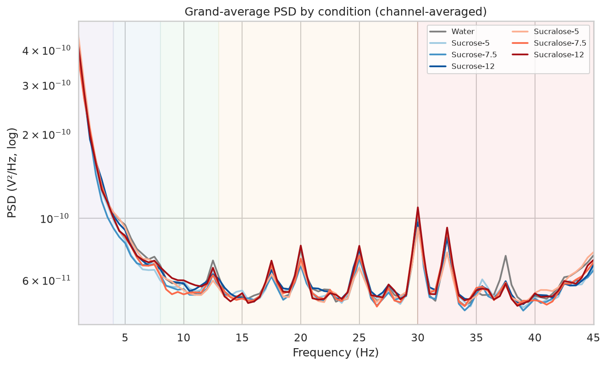

*PSD by condition*

## Band-power topographies

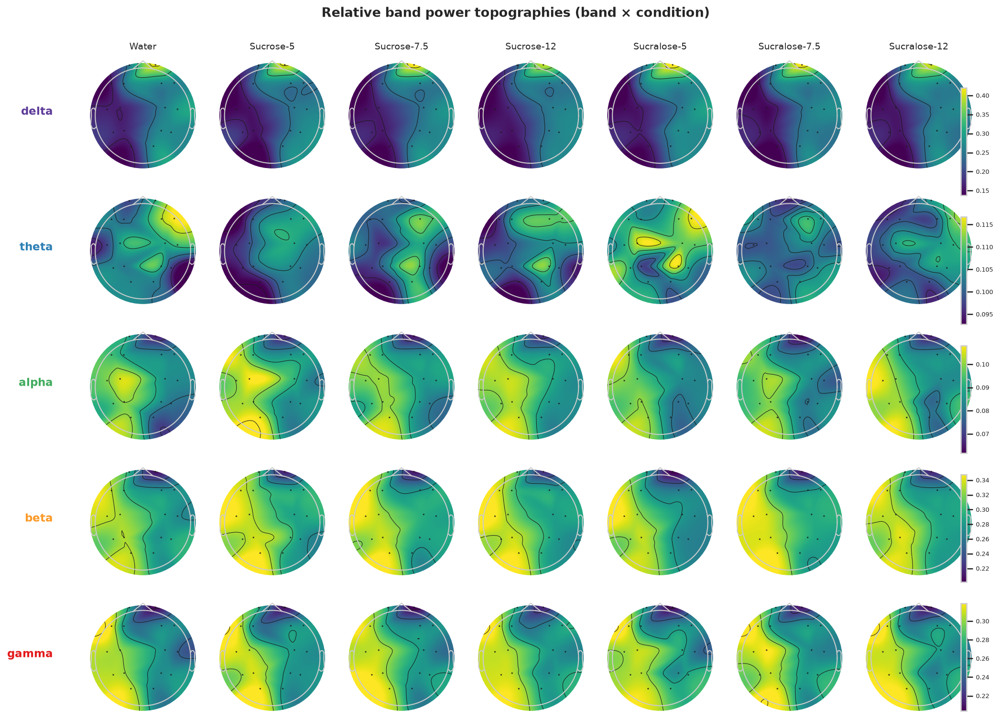

*Relative band power per band (rows) × condition (cols)*

### Sucrose vs sucralose contrast

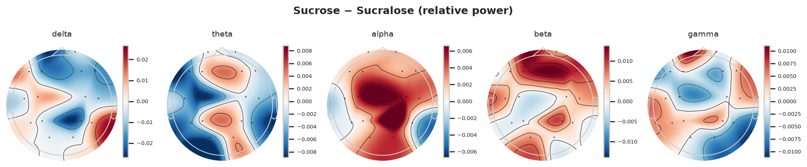

*Sucrose − Sucralose relative power (red = higher for sucrose)*

## Frontal & gustatory θ / α modulation

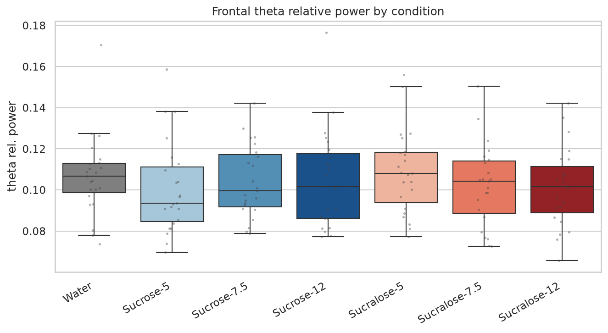

*Frontal theta relative power*

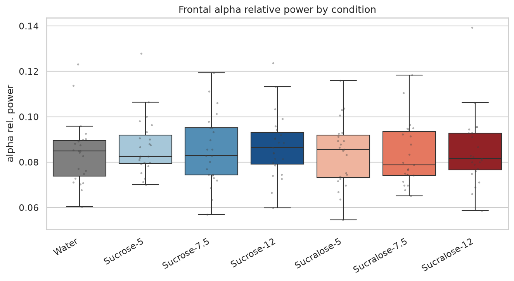

*Frontal alpha relative power*

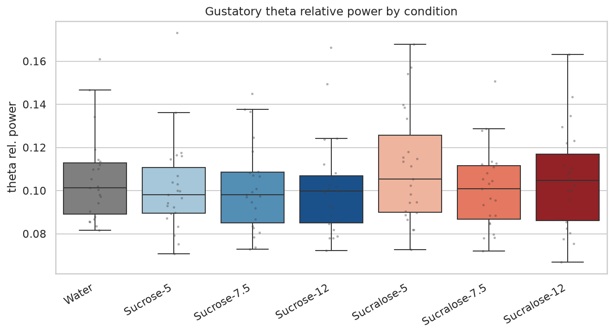

*Gustatory theta relative power*

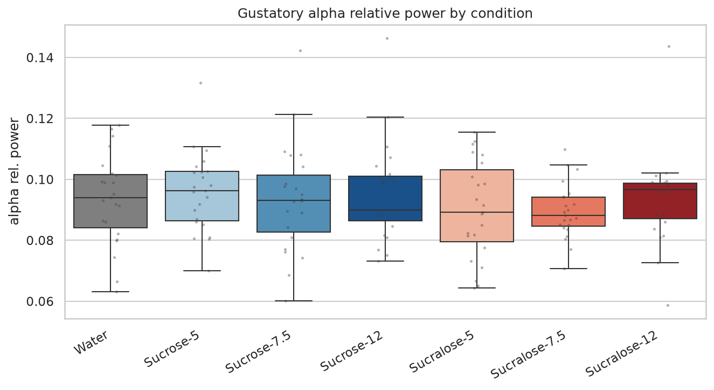

*Gustatory alpha relative power*

## Dose-response of frontal θ / α (reward/hedonic hypothesis)

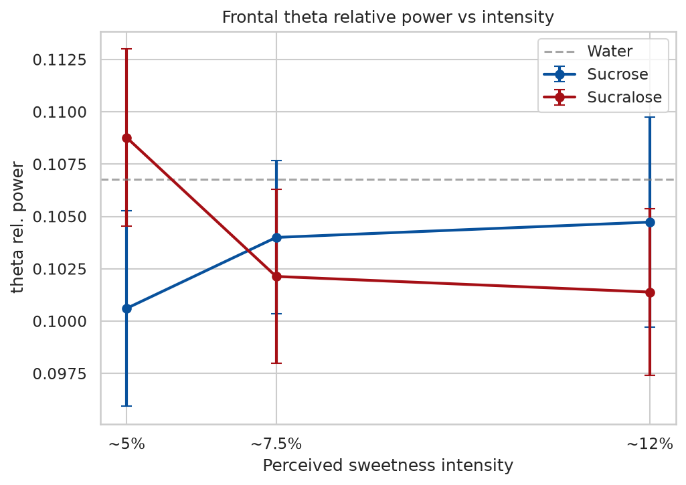

*Frontal theta vs intensity*

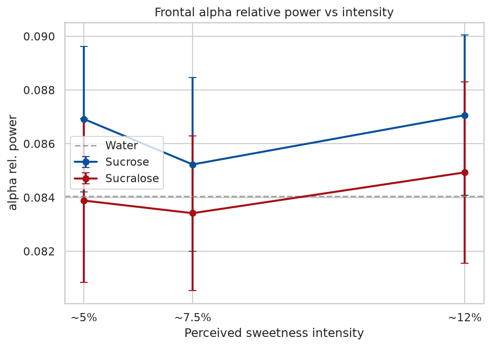

*Frontal alpha vs intensity*

## Relative band power by ROI × substance

| roi       | band   |   Water |   Sucrose |   Sucralose |
|:----------|:-------|--------:|----------:|------------:|
| Frontal   | alpha  |   0.084 |     0.086 |       0.084 |
| Frontal   | beta   |   0.281 |     0.291 |       0.281 |
| Frontal   | delta  |   0.267 |     0.256 |       0.268 |
| Frontal   | gamma  |   0.262 |     0.264 |       0.263 |
| Frontal   | theta  |   0.107 |     0.103 |       0.104 |
| Gustatory | alpha  |   0.093 |     0.095 |       0.091 |
| Gustatory | beta   |   0.305 |     0.313 |       0.31  |
| Gustatory | delta  |   0.22  |     0.206 |       0.21  |
| Gustatory | gamma  |   0.277 |     0.284 |       0.284 |
| Gustatory | theta  |   0.105 |     0.101 |       0.106 |

# Stage 04 — Temporal Dynamics & Time-Frequency

Time-resolved band power (1 s windows, 0.5 s step), early ([0.0, 3.0] s) vs late ([6.0, 9.99] s) contrasts in the Gustatory ROI, and Morlet TFR per substance. The late-window contrast probes the *prolonged activation* expected for sucralose's lingering aftertaste.

## Time-resolved band power

*Frontal theta over time*

*Frontal alpha over time*

*Frontal gamma over time*

*Gustatory theta over time*

*Gustatory alpha over time*

*Gustatory gamma over time*

## Aftertaste: late vs early window (Gustatory ROI)

*Late − early power by substance*

Sucrose vs sucralose paired contrasts on *late − early* power:

**theta**

|   intensity |   n |      t |     p |   mean_sucrose |   mean_sucralose |   mean_diff |   p_fdr |
|------------:|----:|-------:|------:|---------------:|-----------------:|------------:|--------:|
|           5 |  23 |  0.115 | 0.909 |      -4.14e-11 |        -4.62e-11 |    4.74e-12 |   0.909 |
|           7 |  23 | -0.351 | 0.729 |      -6.87e-11 |        -5.08e-11 |   -1.8e-11  |   0.909 |
|          12 |  23 | -1.269 | 0.218 |      -8.34e-11 |        -4.03e-11 |   -4.31e-11 |   0.653 |

**alpha**

|   intensity |   n |      t |     p |   mean_sucrose |   mean_sucralose |   mean_diff |   p_fdr |
|------------:|----:|-------:|------:|---------------:|-----------------:|------------:|--------:|
|           5 |  23 | -0.353 | 0.728 |      -1.25e-11 |         3.25e-12 |   -1.57e-11 |   0.868 |
|           7 |  23 |  1.081 | 0.292 |      -1.48e-11 |        -4.96e-11 |    3.48e-11 |   0.868 |
|          12 |  23 | -0.169 | 0.868 |      -3.99e-11 |        -3.45e-11 |   -5.39e-12 |   0.868 |

**gamma**

|   intensity |   n |      t |     p |   mean_sucrose |   mean_sucralose |   mean_diff |   p_fdr |
|------------:|----:|-------:|------:|---------------:|-----------------:|------------:|--------:|
|           5 |  23 |  0.623 | 0.54  |       1.92e-11 |        -4.32e-11 |    6.24e-11 |   0.991 |
|           7 |  23 |  0.012 | 0.991 |      -4.42e-11 |        -4.5e-11  |    7.61e-13 |   0.991 |
|          12 |  23 | -0.322 | 0.75  |       1.4e-11  |         3.53e-11 |   -2.13e-11 |   0.991 |

## Time-frequency (Frontal ROI)

*TFR per substance*

# Stage 05 — Statistics

Two-way repeated-measures ANOVA (substance × intensity, sweet conditions, subjects with complete cells), paired sucrose-vs-sucralose contrasts (FDR-corrected), condition-vs-water tests, and cluster permutation on the ROI PSD.

## rmANOVA p-values per band × ROI (relative power)

| roi       | band   | p_substance   | p_intensity   | p_substance*intensity   |
|:----------|:-------|:--------------|:--------------|:------------------------|
| Frontal   | delta  |               |               |                         |
| Frontal   | theta  |               |               |                         |
| Frontal   | alpha  |               |               |                         |
| Frontal   | beta   |               |               |                         |
| Frontal   | gamma  |               |               |                         |
| Gustatory | delta  |               |               |                         |
| Gustatory | theta  |               |               |                         |
| Gustatory | alpha  |               |               |                         |
| Gustatory | beta   |               |               |                         |
| Gustatory | gamma  |               |               |                         |
| Central   | delta  |               |               |                         |
| Central   | theta  |               |               |                         |
| Central   | alpha  |               |               |                         |
| Central   | beta   |               |               |                         |
| Central   | gamma  |               |               |                         |
| Temporal  | delta  |               |               |                         |
| Temporal  | theta  |               |               |                         |
| Temporal  | alpha  |               |               |                         |
| Temporal  | beta   |               |               |                         |
| Temporal  | gamma  |               |               |                         |
| Parietal  | delta  |               |               |                         |
| Parietal  | theta  |               |               |                         |
| Parietal  | alpha  |               |               |                         |
| Parietal  | beta   |               |               |                         |
| Parietal  | gamma  |               |               |                         |
| Occipital | delta  |               |               |                         |
| Occipital | theta  |               |               |                         |
| Occipital | alpha  |               |               |                         |
| Occipital | beta   |               |               |                         |
| Occipital | gamma  |               |               |                         |

## Sucrose vs sucralose contrasts (relative power)

| roi       | band   |   intensity |   n |      t |     p |   mean_sucrose |   mean_sucralose |   mean_diff |   p_fdr |
|:----------|:-------|------------:|----:|-------:|------:|---------------:|-----------------:|------------:|--------:|
| Frontal   | theta  |           5 |  23 | -2.139 | 0.044 |          0.101 |            0.109 |      -0.008 |   0.131 |
| Frontal   | theta  |           7 |  23 |  0.7   | 0.491 |          0.104 |            0.102 |       0.002 |   0.491 |
| Frontal   | theta  |          12 |  23 |  1.006 | 0.325 |          0.105 |            0.101 |       0.003 |   0.488 |
| Frontal   | alpha  |           5 |  23 |  1.051 | 0.305 |          0.087 |            0.084 |       0.003 |   0.506 |
| Frontal   | alpha  |           7 |  23 |  0.737 | 0.469 |          0.085 |            0.083 |       0.002 |   0.506 |
| Frontal   | alpha  |          12 |  23 |  0.676 | 0.506 |          0.087 |            0.085 |       0.002 |   0.506 |
| Frontal   | gamma  |           5 |  23 |  0.544 | 0.592 |          0.263 |            0.26  |       0.003 |   0.819 |
| Frontal   | gamma  |           7 |  23 | -0.232 | 0.819 |          0.264 |            0.265 |      -0.001 |   0.819 |
| Frontal   | gamma  |          12 |  23 |  0.56  | 0.581 |          0.265 |            0.263 |       0.003 |   0.819 |
| Gustatory | theta  |           5 |  23 | -2.253 | 0.035 |          0.102 |            0.111 |      -0.009 |   0.104 |
| Gustatory | theta  |           7 |  23 |  0.161 | 0.874 |          0.101 |            0.101 |       0.001 |   0.874 |
| Gustatory | theta  |          12 |  23 | -1.233 | 0.231 |          0.101 |            0.105 |      -0.004 |   0.346 |
| Gustatory | alpha  |           5 |  23 |  2.178 | 0.04  |          0.096 |            0.09  |       0.006 |   0.121 |
| Gustatory | alpha  |           7 |  23 |  1.308 | 0.204 |          0.094 |            0.09  |       0.004 |   0.306 |
| Gustatory | alpha  |          12 |  23 |  0.822 | 0.42  |          0.095 |            0.093 |       0.002 |   0.42  |
| Gustatory | gamma  |           5 |  23 |  1.03  | 0.314 |          0.287 |            0.282 |       0.005 |   0.909 |
| Gustatory | gamma  |           7 |  23 | -0.523 | 0.606 |          0.283 |            0.286 |      -0.003 |   0.909 |
| Gustatory | gamma  |          12 |  23 | -0.047 | 0.963 |          0.284 |            0.284 |      -0     |   0.963 |

## Sweet conditions vs water

| roi       | band   | condition   |   n |      t |     p |   mean_diff |   p_fdr |
|:----------|:-------|:------------|----:|-------:|------:|------------:|--------:|
| Frontal   | theta  | S1_5        |  23 | -1.583 | 0.128 |      -0.006 |   0.32  |
| Frontal   | theta  | S1_7        |  23 | -0.7   | 0.491 |      -0.003 |   0.586 |
| Frontal   | theta  | S1_12       |  23 | -0.553 | 0.586 |      -0.002 |   0.586 |
| Frontal   | theta  | S2_5        |  23 |  0.619 | 0.542 |       0.002 |   0.586 |
| Frontal   | theta  | S2_7        |  23 | -1.455 | 0.16  |      -0.005 |   0.32  |
| Frontal   | theta  | S2_12       |  23 | -1.918 | 0.068 |      -0.005 |   0.32  |
| Frontal   | alpha  | S1_5        |  23 |  0.999 | 0.329 |       0.003 |   0.935 |
| Frontal   | alpha  | S1_7        |  23 |  0.37  | 0.715 |       0.001 |   0.935 |
| Frontal   | alpha  | S1_12       |  23 |  1.038 | 0.311 |       0.003 |   0.935 |
| Frontal   | alpha  | S2_5        |  23 | -0.082 | 0.935 |      -0     |   0.935 |
| Frontal   | alpha  | S2_7        |  23 | -0.276 | 0.785 |      -0.001 |   0.935 |
| Frontal   | alpha  | S2_12       |  23 |  0.355 | 0.726 |       0.001 |   0.935 |
| Gustatory | theta  | S1_5        |  23 | -0.787 | 0.44  |      -0.004 |   0.528 |
| Gustatory | theta  | S1_7        |  23 | -0.836 | 0.412 |      -0.004 |   0.528 |
| Gustatory | theta  | S1_12       |  23 | -0.84  | 0.41  |      -0.004 |   0.528 |
| Gustatory | theta  | S2_5        |  23 |  1.699 | 0.103 |       0.006 |   0.528 |
| Gustatory | theta  | S2_7        |  23 | -1.285 | 0.212 |      -0.004 |   0.528 |
| Gustatory | theta  | S2_12       |  23 | -0.026 | 0.979 |      -0     |   0.979 |
| Gustatory | alpha  | S1_5        |  23 |  0.755 | 0.458 |       0.002 |   0.776 |
| Gustatory | alpha  | S1_7        |  23 |  0.063 | 0.95  |       0     |   0.995 |
| Gustatory | alpha  | S1_12       |  23 |  0.658 | 0.517 |       0.002 |   0.776 |
| Gustatory | alpha  | S2_5        |  23 | -1.44  | 0.164 |      -0.003 |   0.492 |
| Gustatory | alpha  | S2_7        |  23 | -1.829 | 0.081 |      -0.004 |   0.486 |
| Gustatory | alpha  | S2_12       |  23 | -0.007 | 0.995 |      -0     |   0.995 |

## Cluster-based permutation tests on PSD

**Frontal** — no significant clusters

*Frontal cluster test*

**Gustatory** — no significant clusters

*Gustatory cluster test*

# Stage 06 — Onset-locked ERP (supplementary)

Epochs −0.5 to +2.0 s around cup-delivery onset, baseline [−0.5, −0.2] s. Interpret cautiously: the 10 s tasting paradigm lacks a sharp sensory trigger, so ERP components are not the primary readout.

## ROI waveforms by substance

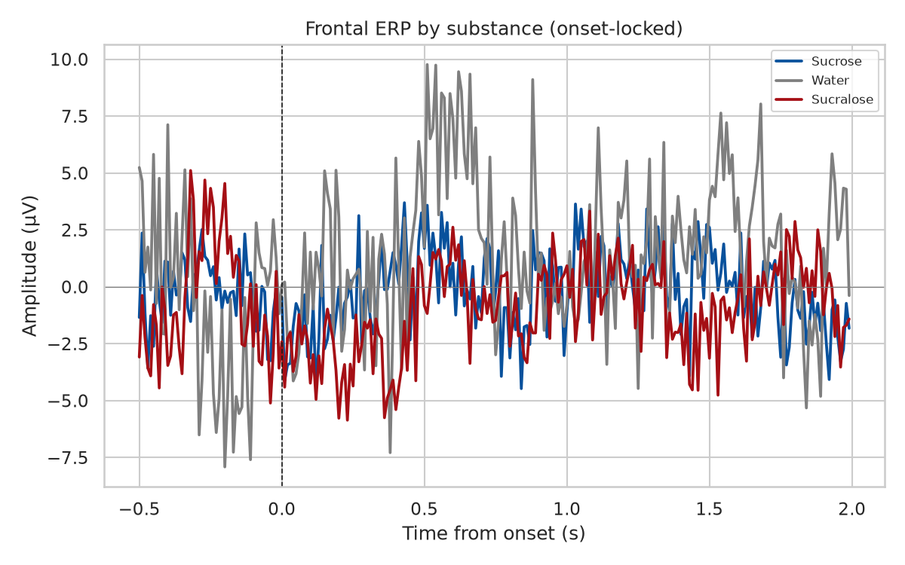

*Frontal ERP by substance*

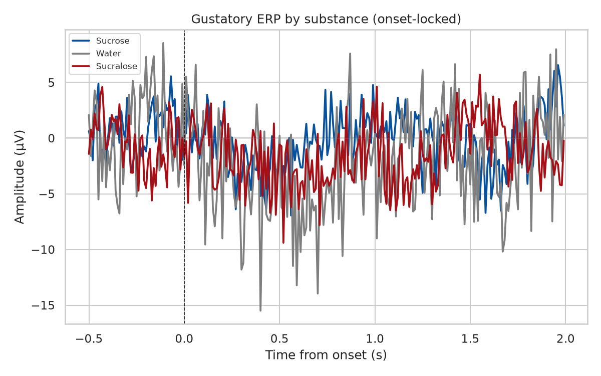

*Gustatory ERP by substance*

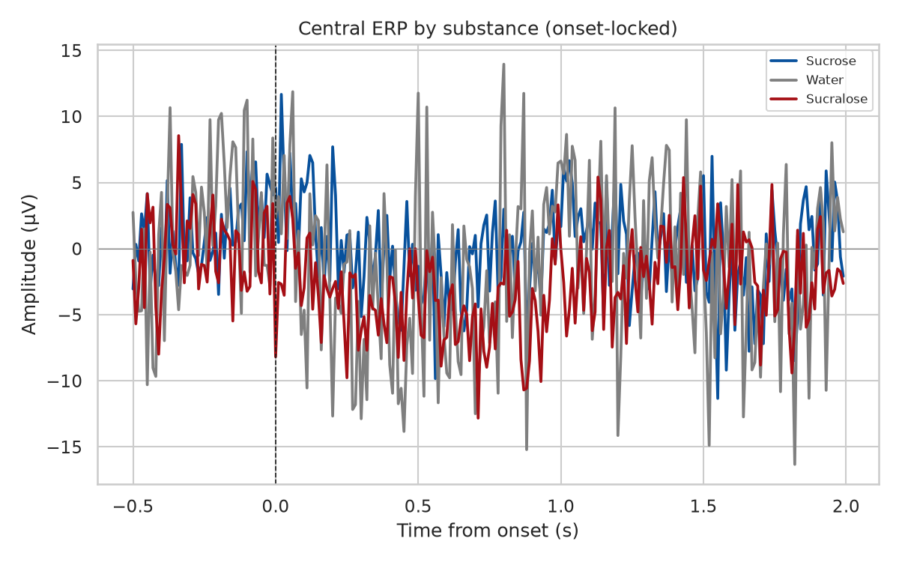

*Central ERP by substance*

## Frontal ERP by condition

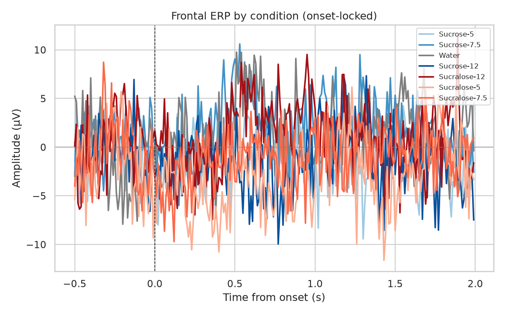

*Frontal ERP per condition*

## ERP difference topographies

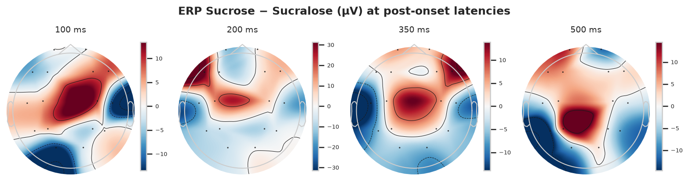

*Sucrose − Sucralose ERP topographies*

# Stage 07 — Frontal–Gustatory Connectivity (supplementary)

Magnitude-squared coherence between the Frontal ROI (reward/hedonic) and the Gustatory ROI (insular/opercular scalp proxy), per band, sucrose vs sucralose.

*Coherence by band & substance*

## Sucrose vs sucralose coherence contrasts (FDR-corrected)

| band   |   intensity |   n |      t |     p |   mean_sucrose |   mean_sucralose |   mean_diff |   p_fdr |
|:-------|------------:|----:|-------:|------:|---------------:|-----------------:|------------:|--------:|
| delta  |           5 |  23 |  0.394 | 0.697 |          0.324 |            0.315 |       0.009 |   0.719 |
| delta  |           7 |  23 | -0.365 | 0.719 |          0.313 |            0.321 |      -0.008 |   0.719 |
| delta  |          12 |  23 |  0.991 | 0.332 |          0.348 |            0.323 |       0.025 |   0.719 |
| theta  |           5 |  23 | -0.429 | 0.672 |          0.272 |            0.28  |      -0.008 |   0.672 |
| theta  |           7 |  23 | -0.87  | 0.394 |          0.285 |            0.304 |      -0.02  |   0.672 |
| theta  |          12 |  23 | -0.444 | 0.661 |          0.283 |            0.291 |      -0.008 |   0.672 |
| alpha  |           5 |  23 |  3.162 | 0.005 |          0.296 |            0.249 |       0.047 |   0.014 |
| alpha  |           7 |  23 |  0.229 | 0.821 |          0.285 |            0.281 |       0.004 |   0.821 |
| alpha  |          12 |  23 |  0.864 | 0.397 |          0.277 |            0.267 |       0.01  |   0.595 |
| beta   |           5 |  23 |  1.751 | 0.094 |          0.281 |            0.26  |       0.021 |   0.282 |
| beta   |           7 |  23 | -1.18  | 0.251 |          0.271 |            0.286 |      -0.015 |   0.376 |
| beta   |          12 |  23 | -0.469 | 0.644 |          0.272 |            0.276 |      -0.004 |   0.644 |
| gamma  |           5 |  23 |  1.082 | 0.291 |          0.268 |            0.258 |       0.011 |   0.436 |
| gamma  |           7 |  23 | -1.638 | 0.116 |          0.272 |            0.291 |      -0.019 |   0.347 |
| gamma  |          12 |  23 | -0.769 | 0.45  |          0.274 |            0.282 |      -0.008 |   0.45  |

# Stage 08 — Machine-Learning Classification (LOSO)

Features: per-trial relative band power (per channel) + ROI absolute/relative band power. Leave-One-Subject-Out cross-validation; class-balanced models. Chance = 1/n_classes.

## Summary

| task      | model   |   accuracy |   f1_macro |   mean_fold_acc |   std_fold_acc |   chance |
|:----------|:--------|-----------:|-----------:|----------------:|---------------:|---------:|
| substance | logreg  |      0.555 |      0.554 |           0.555 |          0.135 |    0.5   |
| substance | svm     |      0.504 |      0.5   |           0.503 |          0.113 |    0.5   |
| substance | rf      |      0.493 |      0.493 |           0.493 |          0.142 |    0.5   |
| substance | xgboost |      0.518 |      0.518 |           0.518 |          0.145 |    0.5   |
| intensity | logreg  |      0.321 |      0.322 |           0.321 |          0.111 |    0.333 |
| intensity | svm     |      0.328 |      0.327 |           0.328 |          0.114 |    0.333 |
| intensity | rf      |      0.318 |      0.316 |           0.317 |          0.08  |    0.333 |
| intensity | xgboost |      0.277 |      0.278 |           0.278 |          0.093 |    0.333 |

## Task: substance  (classes = ['Sucralose', 'Sucrose'], n_trials = 274, chance = 0.50)

*substance model accuracy*

*Best model (logreg) confusion matrix*

## Task: intensity  (classes = ['12', '5', '7'], n_trials = 274, chance = 0.33)

*intensity model accuracy*

*Best model (svm) confusion matrix*

# Stage 09 — Deep-Learning Classification (LOSO)

Input: raw 10 s epochs (16 channels × 1000 samples), per-fold channel standardisation, early stopping on a held-out validation split. Models: EEGNet, ShallowConvNet.

## Summary

| task      | model          |   accuracy |   f1_macro |   mean_fold_acc |   std_fold_acc |   chance |
|:----------|:---------------|-----------:|-----------:|----------------:|---------------:|---------:|
| substance | eegnet         |      0.511 |      0.507 |           0.512 |          0.122 |    0.5   |
| substance | shallowconvnet |      0.533 |      0.532 |           0.533 |          0.116 |    0.5   |
| intensity | eegnet         |      0.321 |      0.321 |           0.322 |          0.153 |    0.333 |
| intensity | shallowconvnet |      0.365 |      0.365 |           0.366 |          0.111 |    0.333 |

## substance — eegnet (acc=0.511, chance=0.50)

*Confusion matrix*

*Learning curves*

## substance — shallowconvnet (acc=0.533, chance=0.50)

*Confusion matrix*

*Learning curves*

## intensity — eegnet (acc=0.321, chance=0.33)

*Confusion matrix*

*Learning curves*

## intensity — shallowconvnet (acc=0.365, chance=0.33)

*Confusion matrix*

*Learning curves*

# Stage 10 — EEG ↔ Behavior Correlation

Frontal θ/α and gustatory γ relative power linked to liking, sweetness JAR and sweet aftertaste. EEG↔behavior join: PXXX ↔ Excel id XXX. Joined **23/23** EEG subjects.

## Correlation table

| eeg_metric      | behavior      | level           |   n |      r |     p |
|:----------------|:--------------|:----------------|----:|-------:|------:|
| Frontal_theta   | liking        | within_subject  | 161 | -0.009 | 0.91  |
| Frontal_theta   | sweetness_jar | within_subject  | 161 | -0.071 | 0.37  |
| Frontal_theta   | aftertaste    | within_subject  | 161 | -0.076 | 0.336 |
| Frontal_alpha   | liking        | within_subject  | 161 |  0.007 | 0.927 |
| Frontal_alpha   | sweetness_jar | within_subject  | 161 | -0.028 | 0.725 |
| Frontal_alpha   | aftertaste    | within_subject  | 161 | -0.003 | 0.972 |
| Gustatory_gamma | liking        | within_subject  | 161 |  0.14  | 0.077 |
| Gustatory_gamma | sweetness_jar | within_subject  | 161 | -0.05  | 0.533 |
| Gustatory_gamma | aftertaste    | within_subject  | 161 | -0.031 | 0.693 |
| Frontal_theta   | liking        | group_condition |   7 | -0.626 | 0.133 |
| Frontal_theta   | sweetness_jar | group_condition |   7 | -0.594 | 0.159 |
| Frontal_theta   | aftertaste    | group_condition |   7 | -0.573 | 0.178 |
| Frontal_alpha   | liking        | group_condition |   7 |  0.246 | 0.595 |
| Frontal_alpha   | sweetness_jar | group_condition |   7 |  0.544 | 0.207 |
| Frontal_alpha   | aftertaste    | group_condition |   7 |  0.442 | 0.321 |
| Gustatory_gamma | liking        | group_condition |   7 |  0.825 | 0.022 |
| Gustatory_gamma | sweetness_jar | group_condition |   7 |  0.67  | 0.1   |
| Gustatory_gamma | aftertaste    | group_condition |   7 |  0.638 | 0.123 |

## Headline scatter plots

*Frontal_theta vs liking*

*Frontal_alpha vs liking*

*Frontal_theta vs sweetness_jar*

*Gustatory_gamma vs aftertaste*

# Stage 11 — Per-channel, within-substance dose-response

Unlike Stage 05 (sucrose **vs** sucralose, pooled into Frontal/Gustatory ROIs), this stage analyses **each substance on its own** and resolves the **individual channels** (all 16 electrodes). For every substance × band × channel we test how relative band power changes across the three perceived intensities (~5 / 7.5 / 12 %):

- **rmANOVA** over intensity — omnibus "is there any dose effect?" (F, p).
- **Per-subject linear slope** of rel-power vs intensity, one-sample t-test vs 0 — the *direction* (positive ⇒ power rises with concentration).

p-values are **FDR-corrected across the 16 channels within each band**. Channels surviving FDR are circled on the topographies / starred in the heatmaps.

## Dose slope topographies (direction of the effect)

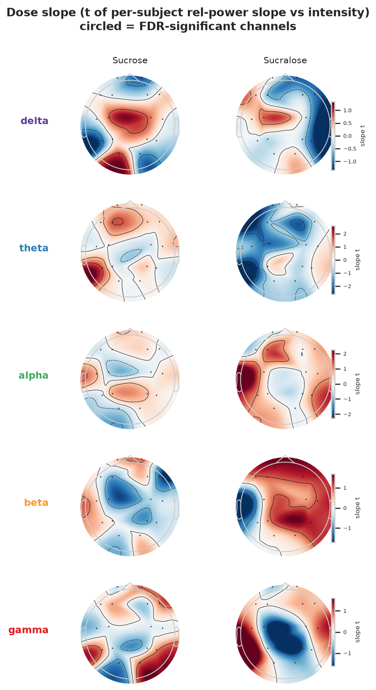

*Per-subject slope t-value of relative band power vs intensity — rows = bands, cols = substance. Red = power increases with concentration, blue = decreases. Circled = FDR p<0.05.*

## Omnibus dose effect (rmANOVA F)

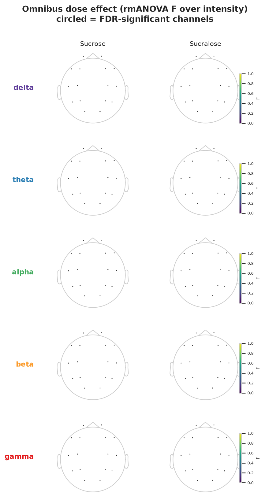

*rmANOVA F-statistic for the intensity main effect per channel (circled = FDR p<0.05).*

## Channel × band slope heatmaps

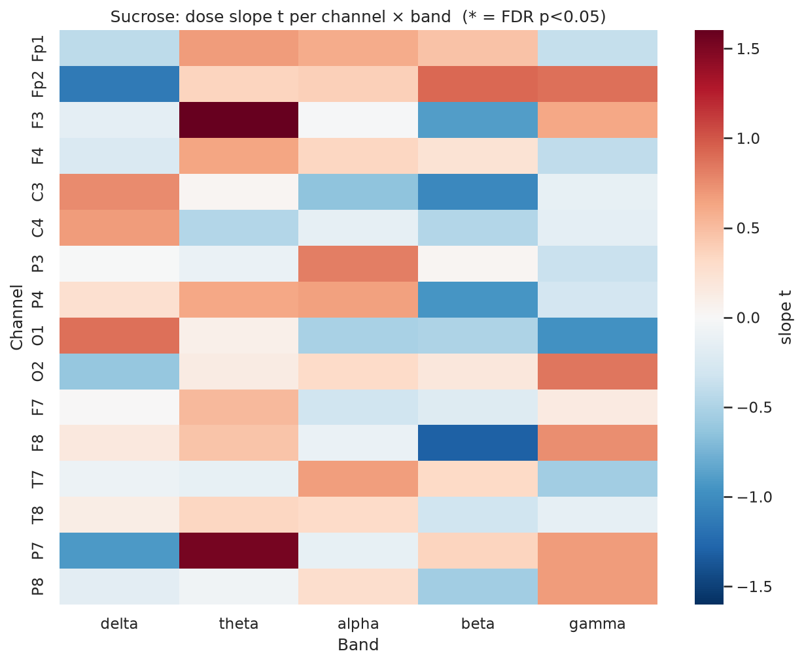

*Sucrose: dose slope t per channel × band*

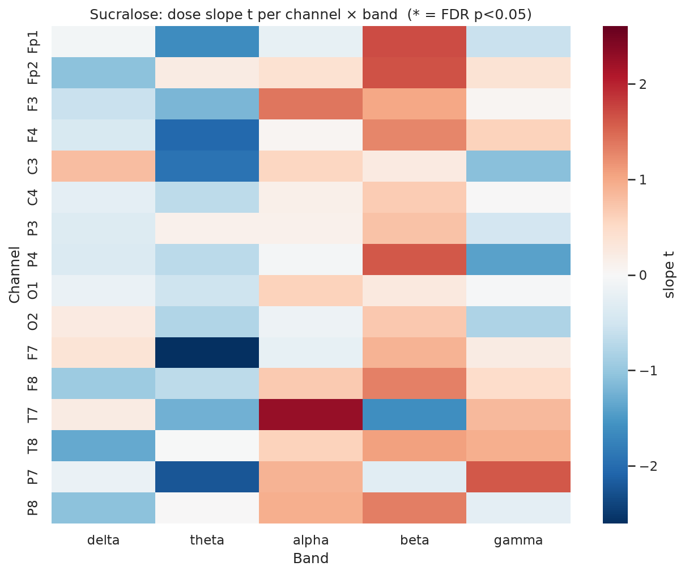

*Sucralose: dose slope t per channel × band*

## Strongest channel-level dose effects

Top channel × band combinations by raw slope p-value (both substances shown for context).

| substance   | band   | channel   |   n | F   | p_anova   |   p_anova_fdr |   slope |   t_slope |   p_slope |   p_slope_fdr |
|:------------|:-------|:----------|----:|:----|:----------|--------------:|--------:|----------:|----------:|--------------:|
| Sucralose   | theta  | F7        |  23 |     |           |             1 |  -0.001 |    -2.603 |     0.016 |         0.26  |
| Sucralose   | alpha  | T7        |  23 |     |           |             1 |   0.001 |     2.259 |     0.034 |         0.546 |
| Sucralose   | theta  | P7        |  23 |     |           |             1 |  -0.001 |    -2.222 |     0.037 |         0.268 |
| Sucralose   | theta  | F4        |  23 |     |           |             1 |  -0.002 |    -2.051 |     0.052 |         0.268 |
| Sucralose   | theta  | C3        |  23 |     |           |             1 |  -0.001 |    -1.927 |     0.067 |         0.268 |
| Sucralose   | beta   | Fp1       |  23 |     |           |             1 |   0.002 |     1.698 |     0.104 |         0.483 |
| Sucralose   | beta   | Fp2       |  23 |     |           |             1 |   0.002 |     1.65  |     0.113 |         0.483 |
| Sucralose   | theta  | Fp1       |  23 |     |           |             1 |  -0.001 |    -1.647 |     0.114 |         0.364 |

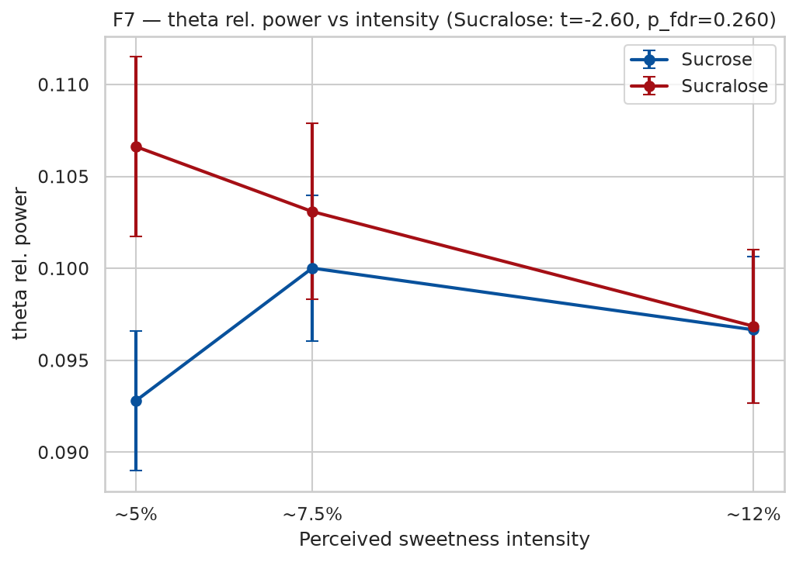

*F7 theta (Sucralose)*

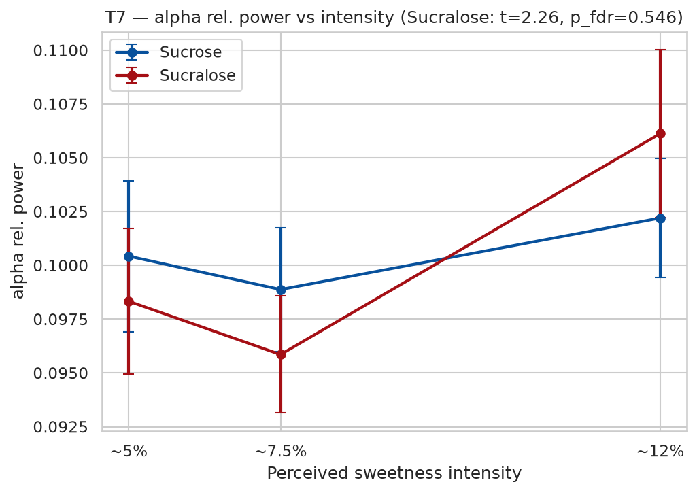

*T7 alpha (Sucralose)*

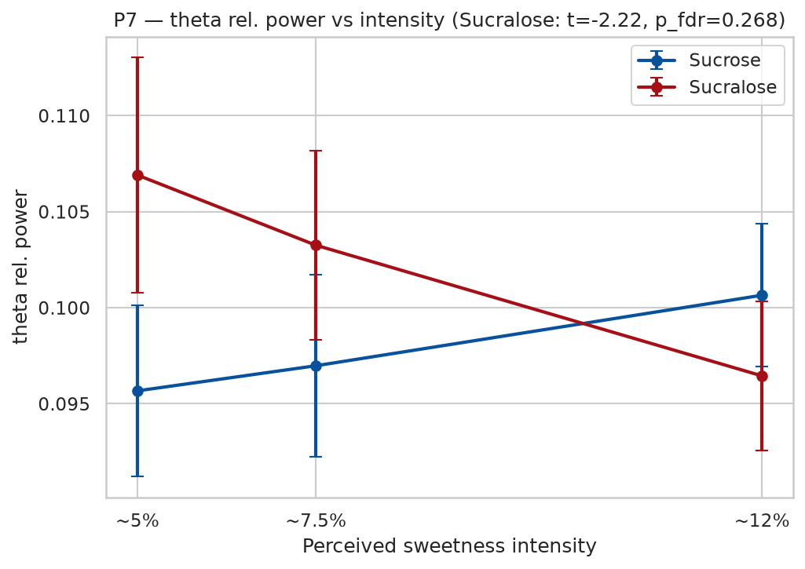

*P7 theta (Sucralose)*

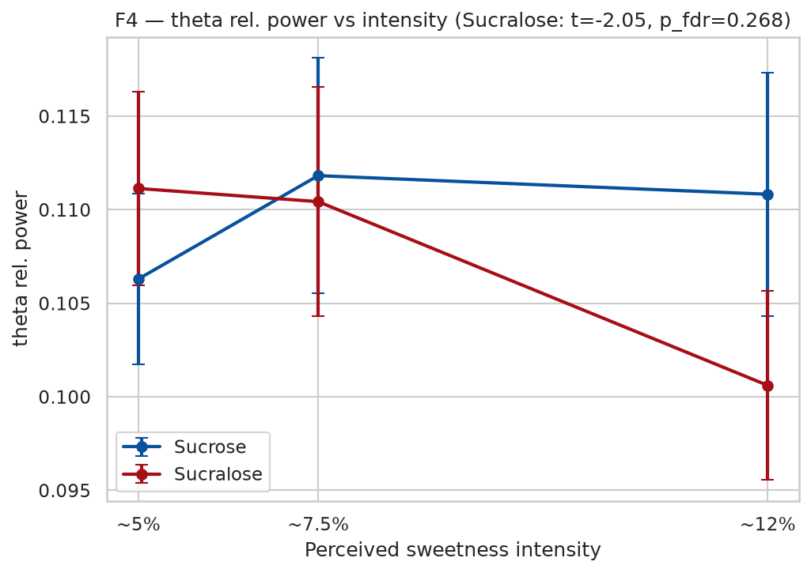

*F4 theta (Sucralose)*

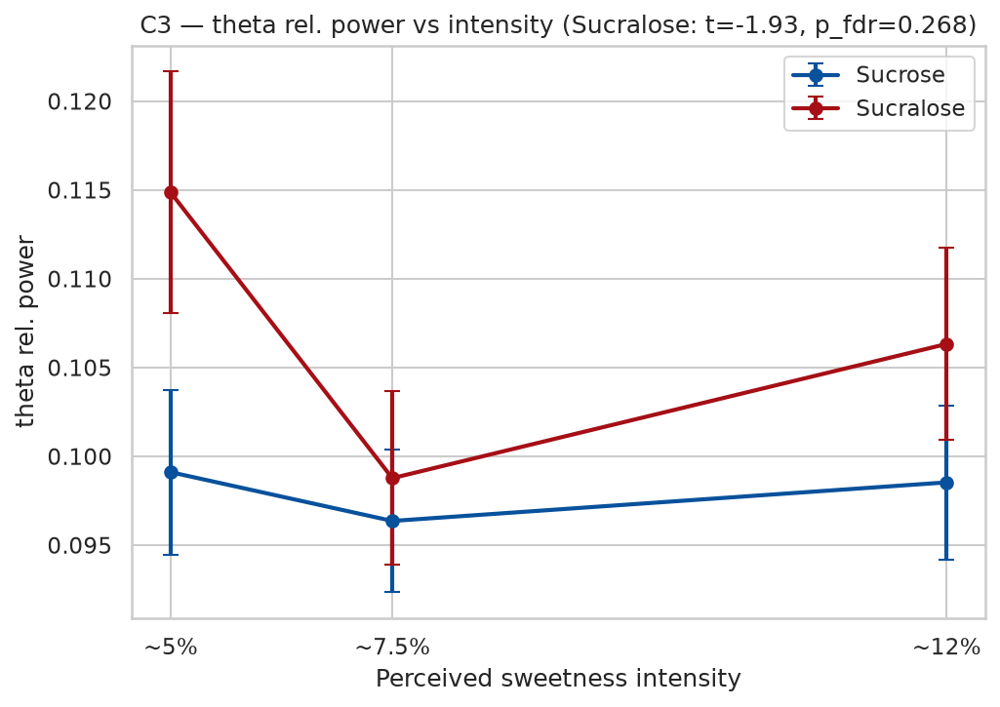

*C3 theta (Sucralose)*

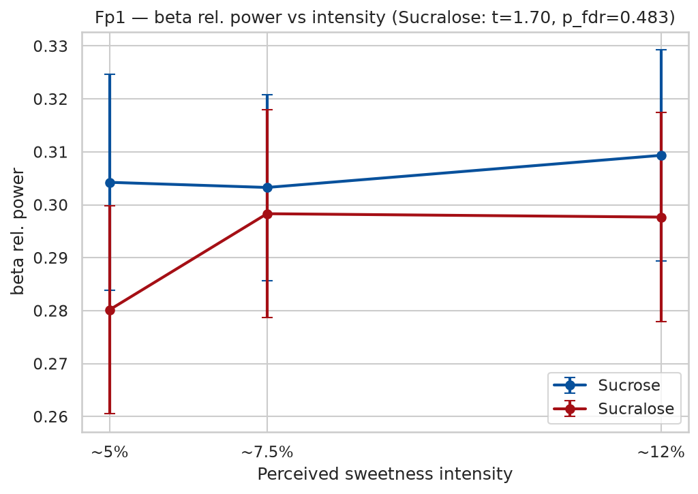

*Fp1 beta (Sucralose)*

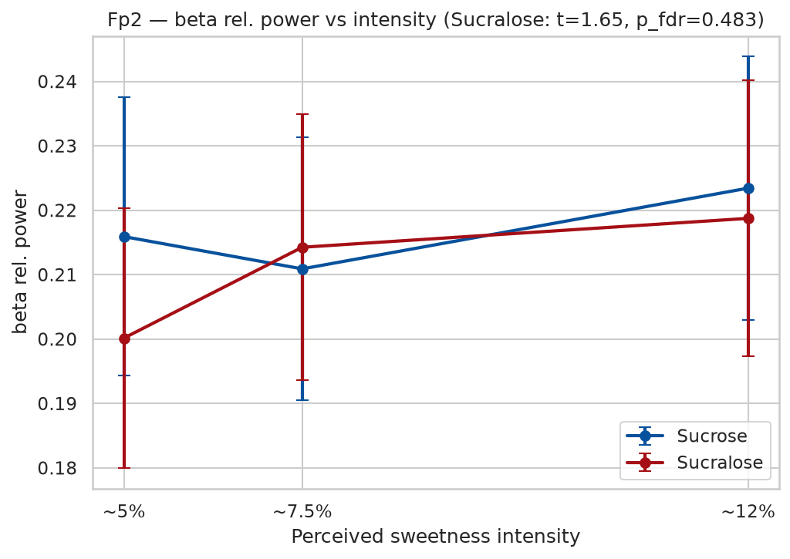

*Fp2 beta (Sucralose)*

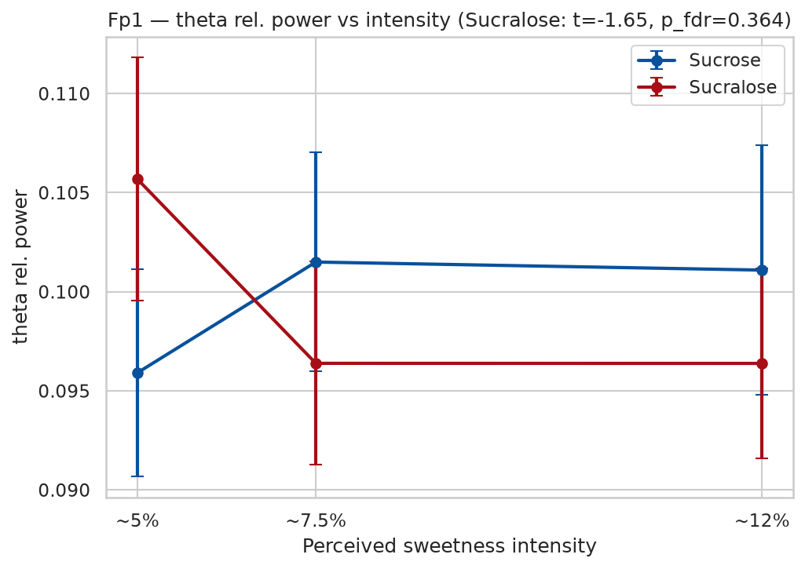

*Fp1 theta (Sucralose)*

## FDR-significant dose channels (summary)

*No channel survived FDR correction for a linear dose effect in either substance — dose modulation of band power is weak at the single-channel level (consistent with the weak ROI-level contrasts in Stage 05).*

# Stage 12 — Individual (per-subject) analysis & insights

Group means hide individual variability. Here every subject stays visible: individual dose trajectories, the spread of per-subject dose slopes, responder sub-groups, individual substance preference, and whether a person's EEG dose response tracks their own ratings.

## Key insights

- **23 subjects** analysed individually; each contributes one dose slope per ROI × band × substance.

- **Frontal theta, Sucrose**: 17/23 subjects rise with concentration (6 opposite); mean slope +5.04e-04 (one-sample t=0.91, p=0.371). Direction is *not* consistent across people — the group effect is driven by a subset / cancels out.

- **Frontal theta, Sucralose**: 19/23 subjects fall with concentration (4 opposite); mean slope -8.80e-04 (one-sample t=-2.11, p=0.046). **Consistent across subjects.**

- **Frontal alpha, Sucrose**: 12/23 subjects rise with concentration (11 opposite); mean slope +8.67e-05 (one-sample t=0.19, p=0.850). Direction is *not* consistent across people — the group effect is driven by a subset / cancels out.

- **Frontal alpha, Sucralose**: 13/23 subjects rise with concentration (10 opposite); mean slope +1.79e-04 (one-sample t=0.51, p=0.612). Direction is *not* consistent across people — the group effect is driven by a subset / cancels out.

- **Strongest Frontal-θ Sucralose responders**: P022 (-6.09e-03), P017 (+3.27e-03), P015 (+2.71e-03).

- **Substance preference (Frontal θ)**: 10/23 subjects show higher θ for sucrose, 13 for sucralose — no single substance dominates at the individual level.

- **Individual EEG↔behaviour**: strongest link is frontal_theta_slope vs liking (r=+0.41, p=0.050, n=23) — not significant. Subjects whose frontal θ responds more to dose do tend to differ in their ratings.

## Individual dose trajectories (frontal θ / α)

Each thin line is one subject (red = power rises with dose, blue = falls); the black line is the group mean.

*Sucrose — Frontal theta per-subject trajectories*

*Sucralose — Frontal theta per-subject trajectories*

*Sucrose — Frontal alpha per-subject trajectories*

*Sucralose — Frontal alpha per-subject trajectories*

## Distribution of individual dose slopes

*Each dot = one subject. Spread crossing zero ⇒ subjects disagree in direction.*

## Responder sub-groups (subject × band slope)

*Sucrose: per-subject Frontal dose slope by band*

*Sucralose: per-subject Frontal dose slope by band*

## Individual substance preference (Frontal θ)

*Sucrose − Sucralose frontal θ per subject (sorted)*

## Individual EEG ↔ behaviour

| eeg_metric          | behavior      |   n |      r |     p |
|:--------------------|:--------------|----:|-------:|------:|
| frontal_theta_slope | liking        |  23 |  0.413 | 0.05  |
| frontal_theta_slope | sweetness_jar |  23 | -0.122 | 0.58  |
| frontal_theta_slope | aftertaste    |  23 | -0.088 | 0.689 |
| frontal_theta_pref  | liking        |  23 |  0.108 | 0.625 |
| frontal_theta_pref  | sweetness_jar |  23 | -0.247 | 0.256 |
| frontal_theta_pref  | aftertaste    |  23 | -0.101 | 0.646 |

*Strongest per-subject EEG↔behaviour link*

---

## Discussion (auto-generated scaffold)

The sections above map directly onto the reference paper's aims:

1. **PSD of five bands across frontal & gustatory regions** — Stage 03 (spectra,
   topographies, ROI band power) and Stage 05 (rmANOVA, cluster tests).
2. **Time + frequency domains** — Stage 03 (frequency) and Stage 04 (time-resolved
   power, TFR).
3. **EEG topographies differentiating sucralose from sucrose** — Stage 03
   sucrose−sucralose difference maps and Stage 05 contrasts/cluster tests.
4. **Frontal θ/α modulation by intensity (reward/hedonic)** — Stage 03 dose-response
   and Stage 10 correlation of frontal θ/α with liking/JAR.
5. **Prolonged activation / lingering aftertaste of sucralose** — Stage 01 residual
   aftertaste, Stage 04 late-vs-early window contrast.

**Additional analyses**: fronto-gustatory connectivity (Stage 07), ML/DL decoding of
substance and intensity (Stages 08–09), and the EEG↔behaviour bridge (Stage 10).

Quantitative conclusions should be read off the per-stage tables (effect sizes,
FDR-corrected p-values, decoding accuracy vs chance). Caveats: 23 subjects, a
consumer-grade 16-channel montage at 100 Hz (γ band and true insular activity are
only partially captured), and a continuous 10 s tasting window without a sharp
sensory trigger (ERP in Stage 06 is exploratory).

## Stage status

- Stage 01: ok (cached from previous run)
- Stage 02: ok (cached from previous run)
- Stage 03: ok (cached from previous run)
- Stage 04: ok (cached from previous run)
- Stage 05: ok (cached from previous run)
- Stage 06: ok (cached from previous run)
- Stage 07: ok (cached from previous run)
- Stage 08: ok (cached from previous run)
- Stage 09: ok (cached from previous run)
- Stage 10: ok (cached from previous run)
